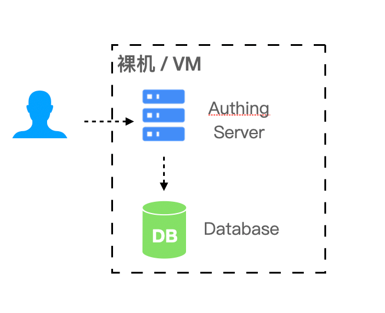
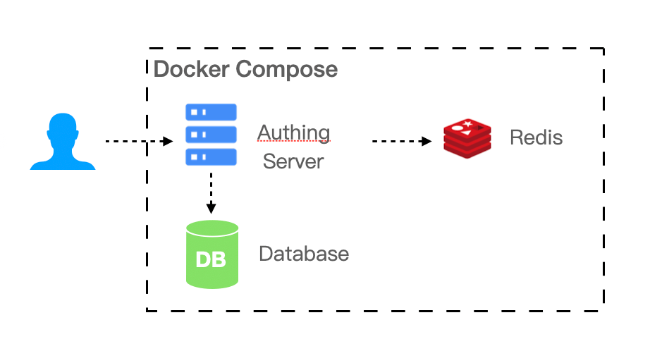
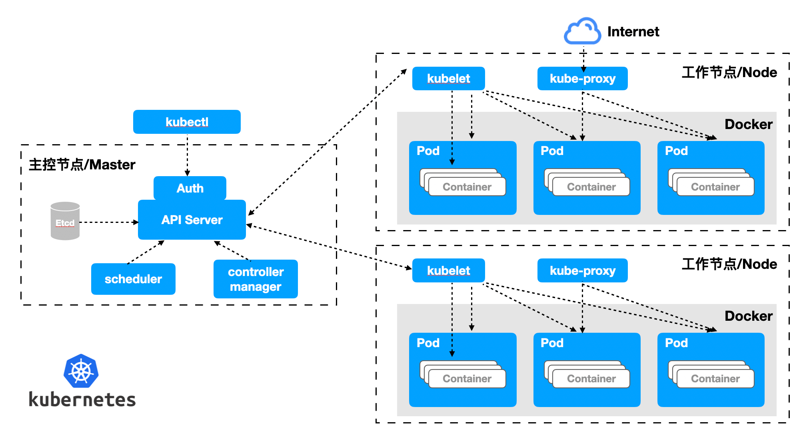

# Private deployment solution

<LastUpdated/>

::: description
GenAuth has provided identity authentication and user directory management solutions for many well-known companies at home and abroad, and can provide a variety of cloud environment deployment solutions for public cloud, private cloud and hybrid cloud. Among them, the private deployment solution can be deployed on the customer's intranet server, with encrypted data storage and exclusive cloud resources, which is safer, more stable and faster.
:::

### Advantages of private deployment

#### Data privacy and security

Data privatization isolation; disaster recovery backup mechanism; algorithm and key double insurance, data security and reliability; exclusive cloud resources, faster speed and better performance.

#### Enterprise autonomy

Enterprises can fully control themselves and easily implement member management, authentication configuration, and identity source management; user information and key information are stored locally.

#### High availability performance architecture

Supports high availability architecture and horizontal expansion, and can autonomously scale capacity based on your business scenarios.

#### Customizable

You can configure an independent secondary domain name, corporate logo, brand color, etc. for your IDaaS service to highlight the brand characteristics.

### Private deployment service content

1. Understand the business scenarios of the enterprise and customize exclusive solutions.
2. Technical experts are responsible for the whole process, provide a complete deployment plan, and complete high-quality delivery.
3. Efficient operation team use support, and after-sales service responds in time.

### Supported platform

#### Bare metal or VM virtual machine

In simple (non-high availability) scenarios, bare metal or VM virtual machine can be used for deployment.

- Required environment: Windows or Linux operating system, Node.js version 12 and above.
- Recommended operating system: CentOS 7.2 and above Ubuntu 18.04 and above.

#### Docker Compose

If your business scenario has a certain scale of 20 to 2000 users, the IDaaS platform needs multiple components to support your business scenario. You can use Docker Compose to simplify your deployment process.

- Required environment: Linux operating system, Docker 17.04.
- Recommended operating system: CentOS 7.2 and above Ubuntu 18.04 and above.

#### Kubernetes

If your business scenario carries a large number of users, with a scale of 2000 or more, you need to consider performance and reliability when deploying privately. We recommend that you use the Kubernetes cloud-native model to operate and maintain your IDaaS platform.

- Required environment: Kubernetes 1.16 and above.
- Recommended operating system: CentOS 7.2 and above, Ubuntu 18.04 and above.

### Resource Planning

| Number of people supported | Scenarios | Servers | Databases | Cache Redis | ElasticSearch |
| ---------------- | ---------------- | ------------------ | ------------- | ------------ | ------------------------- |
| 20 people or less | Small teams and POCs | 4 cores 8G memory \* 1 | - | - | - |
| 20 people - 2000 people | Small and medium-sized enterprise scenarios | 4 cores 16G memory \* 1 | 2 cores 8G \* 1 | 1 core 2G \* 1 | 4 cores 8G \* 1 + 500G storage |
| 2000 people - 20000 people | Large-scale enterprise scenarios | 4 cores 16G memory \* 1 | 4 Core 16G \* 1 | 1 Core 4G \* 1 | 4 Core 8G \* 1 + 500G Storage |
| More than 20,000 people | Large-scale enterprise scenarios | 4 Core 16G Memory \* 3 | 8 Core 32G \* 1 | 2 Core 8G \* 1 | 8 Core 16G \* 1 + 500G Storage |

### Notes

1. Servers can access each other through the intranet.
2. Provide wildcard domain names (or single domain names if there are a small number) and corresponding certificates.
3. Provide an intranet domain name resolution server, which needs to resolve both the intranet and the intranet domain names. Cluster deployment is recommended.
