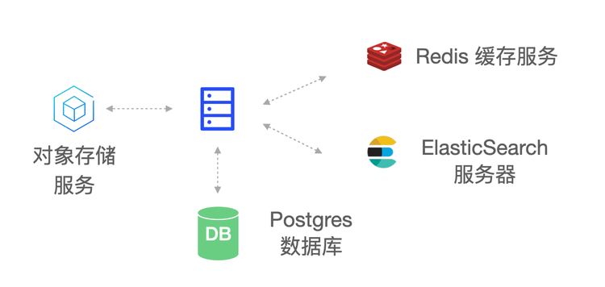

# Basic deployment mode

<LastUpdated/>

## Overview

Orchestration-based containerized deployment and operation and maintenance have gradually become the mainstream method. Whether it is based on Kubernetes or Docker infrastructure environment, business components can be quickly built through orchestration, and operation and maintenance management can also be efficient. Here we recommend that you use container-based deployment solutions.

[Kubernetes deployment mode](./kubernetes.md) or [Docker deployment solution](./docker-compose.md)

Of course, we also provide a traditional physical machine-based GenAuth deployment solution. The advantage of physical machine deployment is that it can make full use of physical machine resources and can finely control the deployment process.

This article describes the basic deployment solution of the GenAuth IDaaS platform and specific operation instructions.

## Overall architecture

The main components of the GenAuth IDaaS platform architecture include: object storage service, Redis, ElasticSearch, Postgres and GenAuth Server. As the main service of the GenAuth IDaaS platform, GenAuth Server receives requests from clients; object storage is used as a service for storing static resources; Redis stores session information, data cache, etc.; Postgres is used to store core business data; ElasticSearch is used for data statistics analysis and log collection analysis.

## Deployment plan

**1. Component planning**

|                         Server                         |                      Component package                       |                       Functional description                        |
| :----------------------------------------------------: | :----------------------------------------------------------: | :-----------------------------------------------------------------: |
| ElasticSearch | elasticsearch-7.7.0 | Search engine, log service |
|                     GenAuth Server                     |                     authing-server-1.2.0                     |                        GenAuth main service                         |
|                         Redis                          |                         redis-4.0.0                          |                            Cache service                            |
|                       PostgreSQL                       |                        postgres-12.5                         |                          Database service                           |
|                        Logstash                        |                        logstash-7.7.0                        |                  Log collection, analysis service                   |
|                       JDBC-River                       |                  jdbc-logstash-river:1.0.0                   |                        Backend data service                         |
|                      Staticfiles                       |                  authing-staticfiles:1.0.0                   |                       Static resource service                       |

**2. System environment requirements**

Server configuration:

| Project  | Minimum configuration  | Recommended configuration  |
| :-----------------------------------------------: | :-------------------------------------------------------------: | :-----------------------------------------------------------------: |
|                        CPU                        |                       X86 64-bit 8 cores                        |                         X86 64-bit 16 cores                         |
|                      Memory                       |                              32 GB                              |                           64 GB and above                           |
|                     Hard disk                     |                             500 GB                              |                                2 TB                                 |
|                Intranet bandwidth                 |                            100 Mbps                             |                               1 Gbps                                |

Operating system environment requirements:
| Project  | Minimum configuration  | Recommended configuration  |
| :----: | :----: | :----: |
| Operating system platform | linux/amd64 | - |
| Kernel version | linux 3.10.0 and above | - |

**3. Related documents**

|         Name          |     Description       |
| :------------------------------------------------------------: | :------------------------------------------------------------: |
|      《GenAuth IDaaS Platform User Guide Version 1.2.0》       |      Introduction GenAuth IDaaS Platform Operation Guide       |
| 《GenAuth IDaaS Platform Product Documentation Version 1.2.0》 | Introducing the product features of the GenAuth IDaaS platform |

**Note: Please contact <a href="mailto:sales@genauth.ai">GenAuth pre-sales staff</a> to obtain the above resources. **

**4. Installation package**

| Name  | Description  |
| :--------------------------------------------: | :---------------------------------------------------: |
|    authing-jdbc-logstash-river-1.0.0.tar.gz    |   GenAuth backend data service installation package   |
|          authing-server-1.2.0.tar.gz           |         GenAuth service installation package          |
|        authing-staticfiles-1.0.0.tar.gz        |     Static resource service installation package      |
|    elasticsearch-7.7.0-linux-x86_64.tar.gz     |      ElasticSearch service installation package       |
|       logstash-7.7.0-linux-x86_64.tar.gz       |         Logstash service installation package         |
|       postgres-12.5-linux-x86_64.tar.gz        |        PostgreSQL service installation package        |
|        redis-4.0.0-linux-x86_64.tar.gz         |          Redis service installation package           |

**Note: Please contact <a href="mailto:sales@genauth.ai">GenAuth pre-sales staff</a> to obtain the above resources. **
