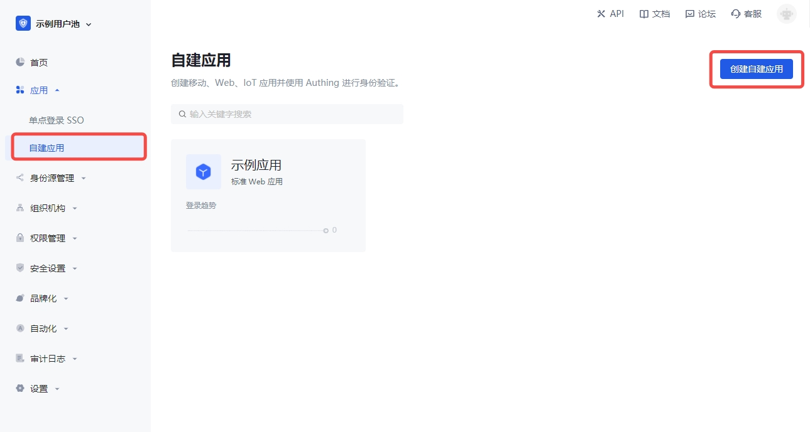
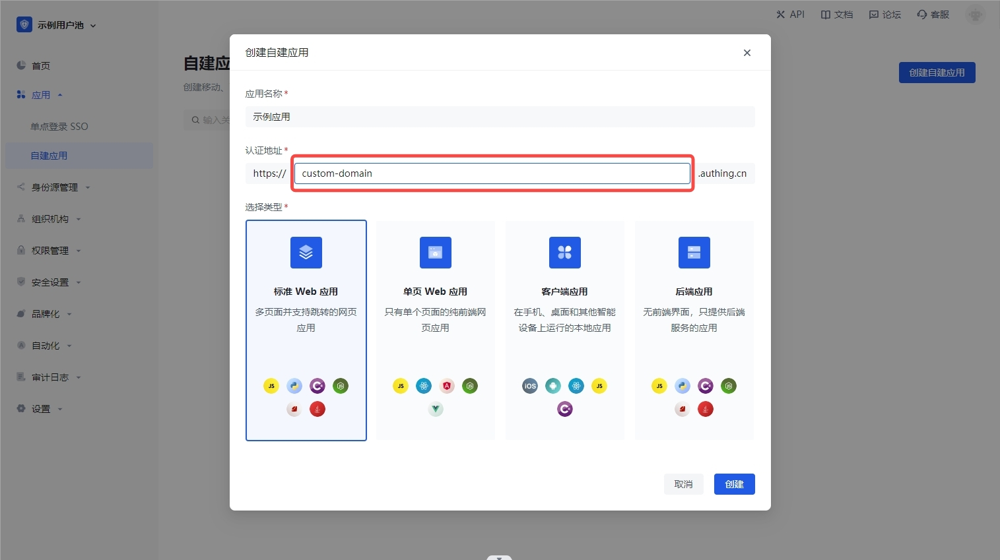
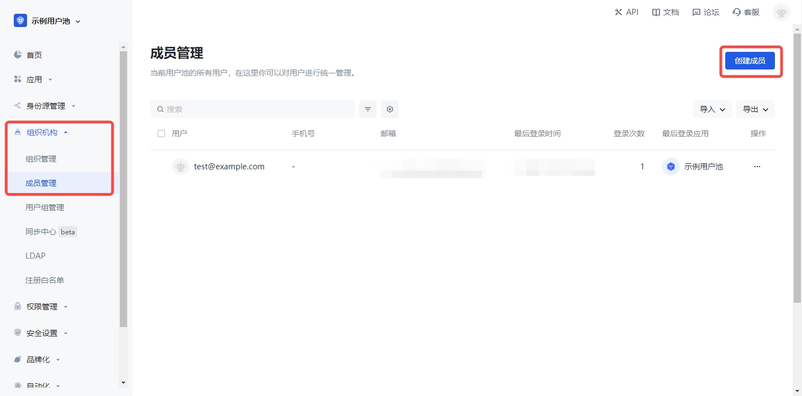
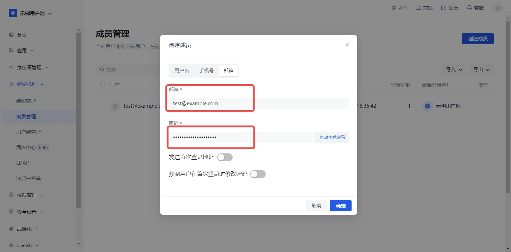
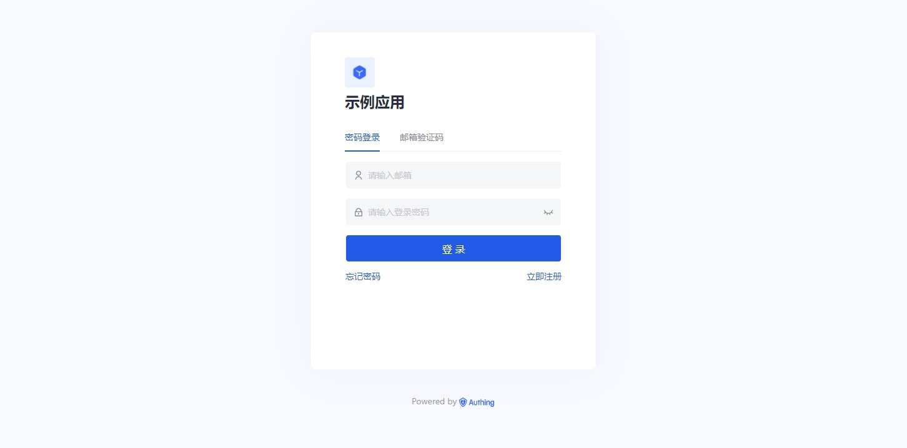
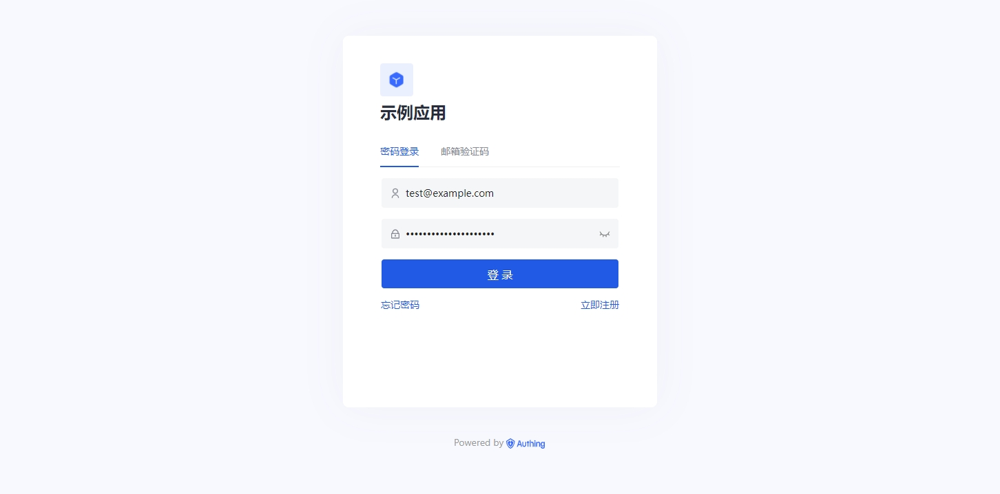
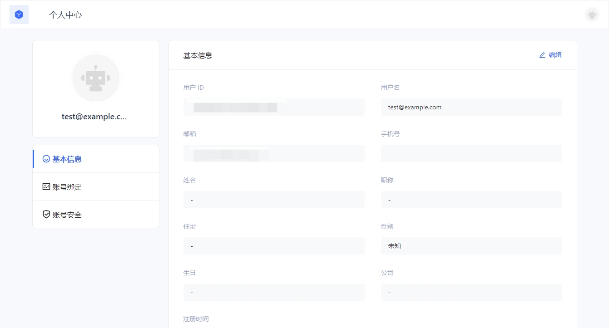

# Custom domain name configuration scheme

<LastUpdated/>

## Overview

Currently, {{$localeConfig.brandName}} uses the **domain name hosting mode**, which uses the second-level domain name of {{$localeConfig.brandName}} (such as: `https://my-app.{{$themeConfig.officeSiteDomain}}`).

In the **domain name hosting mode**, users can only access and log in to the application through the second-level domain name of {{$localeConfig.brandName}}. For users who want to use a custom domain name, {{$localeConfig.brandName}} provides a custom domain name solution based on the Nginx reverse proxy mode.

This article will describe in detail how users configure a custom domain name, so as to log in and register {{$localeConfig.brandName}} through a custom domain name.

## Preparation

1. Users need to register the required domain name, HTTPS certificate, and DNS resolution by themselves.

2. Configure the registered domain name and HTTPS certificate in the Nginx reverse proxy service.

3. Create a {{$localeConfig.brandName}} application and configure the domain name of the {{$localeConfig.brandName}} application in the Nginx reverse proxy service.

## Operation process

:::hint-success
Before proceeding to this step, make sure you have completed the first two steps in the preparation.
:::

**1. Log in to the {{$localeConfig.brandName}} console, create a new application, and specify the application domain name. **





As shown above, we created a {{$localeConfig.brandName}} application and configured the application domain name as: **`https://custom-domain.{{$themeConfig.officeSiteDomain}}`**.

Next, we need to reverse proxy the user's custom domain name to **`https://custom-domain.{{$themeConfig.officeSiteDomain}}`**.

This application and domain name are just examples. You can create your own {{$localeConfig.brandName}} application and domain name.

**2. Create a user to log in to the {{$localeConfig.brandName}} application. **





**3. Configure the {{$localeConfig.brandName}} application domain name created above in the Nginx reverse proxy. **

```nginx
upstream custom_domain {
    # Application domain name configured above
    server custom-domain.genauth.ai:443;
    keepalive 64;
}

server {
    listen 443;
    # Custom domain name in the example
    server_name custom-domain.littleimp.cn;

    ssl                         on;
    # HTTPS certificate for custom domain name
    ssl_certificate             /etc/nginx/certificate/fullchain.cer;
    # HTTPS private key for custom domain name
    ssl_certificate_key         /etc/nginx/certificate/littleimp.cn.key;
    ssl_session_cache           shared:SSL:1m;
    ssl_session_timeout         5m;
    ssl_ciphers                 ECDHE-RSA-AES128-GCM-SHA256:ECDHE:ECDH:AES:HIGH:!NULL:!aNULL:!MD5:!ADH:!RC4;
    ssl_protocols               TLSv1 TLSv1.1 TLSv1.2;
    ssl_prefer_server_ciphers   on;
    proxy_ssl_session_reuse     off;

    location / {
        # Redirect the application domain name to the custom domain name
        proxy_redirect https://custom-domain.genauth.ai https://custom-domain.littleimp.cn;
        # The application domain name configured above
        proxy_set_header Host custom-domain.genauth.ai;
        proxy_set_header X-Real-IP $remote_addr;
        proxy_set_header User-Agent $http_user_agent;
        proxy_set_header X-Forwarded-For $proxy_add_x_forwarded_for;
        proxy_set_header X-Forwarded-Proto $scheme;
        proxy_set_header X-Forwarded-Host $host;
        proxy_ssl_server_name on;
        # proxy_pass configuration is consistent with upstream configuration
        proxy_pass https://custom_domain;
        index index.html index.htm;
        client_max_body_size 256m;
        client_body_buffer_size 128k;
        proxy_connect_timeout 7d;
        proxy_send_timeout 7d;
        proxy_read_timeout 7d;
        proxy_buffers 32 4k;
    }
}
```

**4. Access the {{$localeConfig.brandName}} application through the example custom domain name `https://custom-domain.littleimp.cn`. **



**5. Enter the user and password created above to log in to the {{$localeConfig.brandName}} application. **



**6. Successfully log in to the {{$localeConfig.brandName}} application through the custom domain name and access the personal center. **


