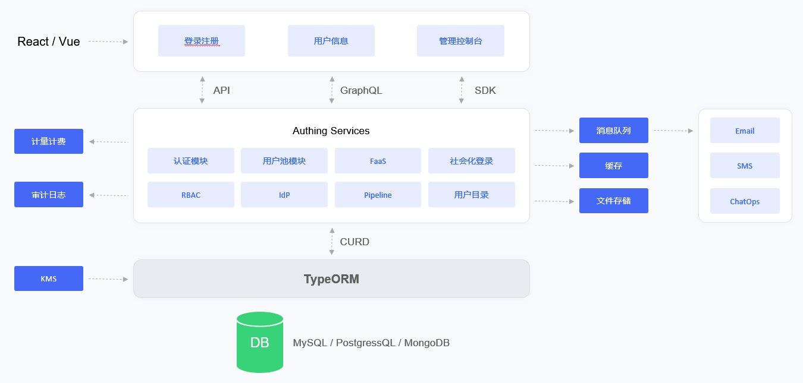

# Docker deployment mode

<LastUpdated/>

## Overview

Docker-Compose is a set of orchestration tools based on the Docker engine. You can use Docker-Compose to quickly deploy the GenAuth IDaaS platform with one click.
GenAuth under the Docker deployment solution is a stand-alone environment deployment. If you want to deploy a high-availability version of GenAuth, please refer to: [Kubernetes deployment mode](./kubernetes.md)

This article describes the deployment solution of the GenAuth IDaaS platform based on Docker-Compose and specific operation instructions.

## Overall architecture

The main components in the GenAuth IDaaS platform architecture include: object storage service, Redis, ElasticSearch, Postgres and GenAuth Server. As the main service of the GenAuth IDaaS platform, GenAuth Server receives requests from clients; object storage is used as a service for storing static resources; Redis stores session information, data cache, etc.; Postgres is used to store core business data; ElasticSearch is used for data statistics analysis and log collection and analysis.

In terms of the log system, the GenAuth IDaaS platform uses the ELK architecture. GenAuth Server writes logs to the Log File, and Logstash writes log information to the ElasticSearch service by reading the Log File. This ensures that multiple IDaaS clusters follow a unified collection -> transmission -> storage -> analysis process, and then Kibana is used as a graphical UI management interface for operation and maintenance management, which greatly reduces the complexity and error rate of operation and maintenance work and improves the work efficiency of operation and maintenance personnel.

## Deployment plan

**1. Component planning**

|                         Server                         |                      Component package                       |                       Functional description                        |
| :----------------------------------------------------: | :----------------------------------------------------------: | :-----------------------------------------------------------------: |
| ElasticSearch | elasticsearch-7.7.0 | Search engine, log service |
|                     GenAuth Server                     |                     authing-server-1.2.0                     |                        GenAuth main service                         |
|                         Redis                          |                         redis-4.0.0                          |                            Cache service                            |
|                       PostgreSQL                       |                        postgres-12.5                         |                          Database service                           |
|                        Logstash                        |                        logstash-7.7.0                        |                  Log collection, analysis service                   |
|                       JDBC-River                       |                  jdbc-logstash-river:1.0.0                   |                        Backend data service                         |
|                      Staticfiles                       |                  authing-staticfiles:1.0.0                   |                       Static resource service                       |

**2. System environment requirements**

Docker version requirements:

| Project  | Version  |
| :-----------------------------------------------: | :-----------------------------------------------: |
|                      Client                       |                19.03.14 and above                 |
|                      Server                       |                19.03.14 and above                 |

Operating system environment requirements:
| Project  | Minimum configuration  | Recommended configuration  |
| :----: | :----: | :----: |
| Operating system platform | linux/amd64 | - |
| Kernel version | linux 3.10.0 and above | - |

Server configuration:

| Project  | Minimum Configuration  | Recommended Configuration  |
| :-----------------------------------------------: | :-------------------------------------------------------------: | :-----------------------------------------------------------------: |
|                        CPU                        |                       X86 64-bit 8 cores                        |                         X86 64-bit 16 cores                         |
|                      Memory                       |                              32 GB                              |                           64 GB and above                           |
|                     Hard disk                     |                             500 GB                              |                                2 TB                                 |
|                Intranet bandwidth                 |                            100 Mbps                             |                               1 Gbps                                |

**3. Related documents**

|         Name          |  Description    |
| :------------------------------------------------------------: | :------------------------------------------------------: |
|      《GenAuth IDaaS Platform User Guide Version 1.2.0》       |  Introducing the GenAuth IDaaS Platform Operation Guide  |
| 《GenAuth IDaaS Platform Product Documentation Version 1.2.0》 | Introducing the GenAuth IDaaS Platform Product Functions |

**Note: Please contact <a href="mailto:sales@genauth.ai">GenAuth Pre-sales Staff</a> to obtain the above resources. **

**4. Image installation package**

|   Name    | Description  |
| :------------------------------------------------: | :---------------------------------------------------: |
| authing-jdbc-logstash-river-1.0.0-90875fa84d87.tar |      GenAuth backend data service image package       |
|       authing-server-1.2.0-32d8b4130bae.tar        |          GenAuth main service image package           |
|     authing-staticfiles-1.0.0-a70a58e3c115.tar     |         Static resource service image package         |
|        elasticsearch-7.7.0-7ec4f35ab452.tar        |     Search, data statistics service image package     |
|          logstash-7.7.0-30dcca1db5e9.tar           |   Log collection and analysis service image package   |
|           postgres-12.5-386fd8c60839.tar           |            Database service image package             |
|            redis-4.0.0-3189e099eb0f.tar            |              Cache service image package              |

**Note: Please contact <a href="mailto:sales@genauth.ai">GenAuth pre-sales staff</a> to obtain the above resources. **

**5. Orchestration file**

| Name  | Description  |
| :--------------------------------------------: | :---------------------------------------------------: |
|              `docker-compose.yml`              |  GenAuth Docker Compose one-click orchestration file  |

**Note: Please contact <a href="mailto:sales@genauth.ai">GenAuth pre-sales staff</a> to obtain the above resources. **
