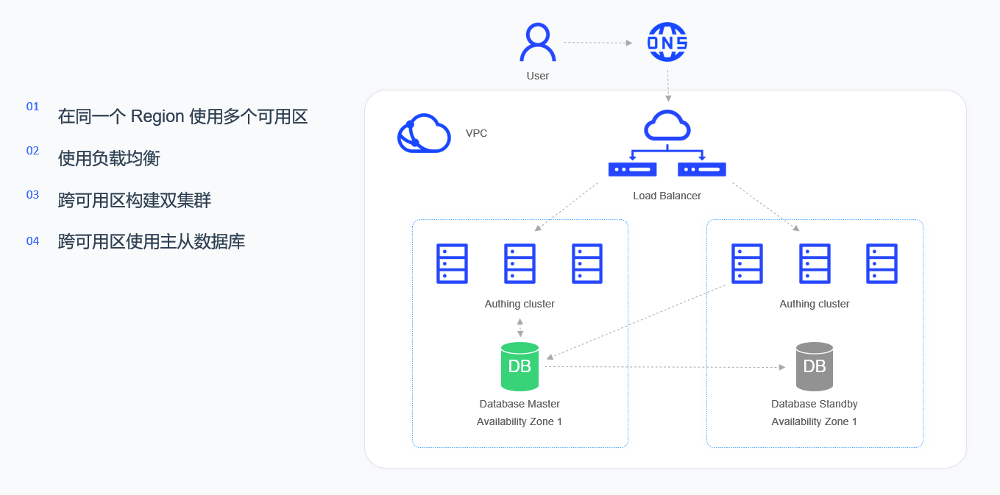
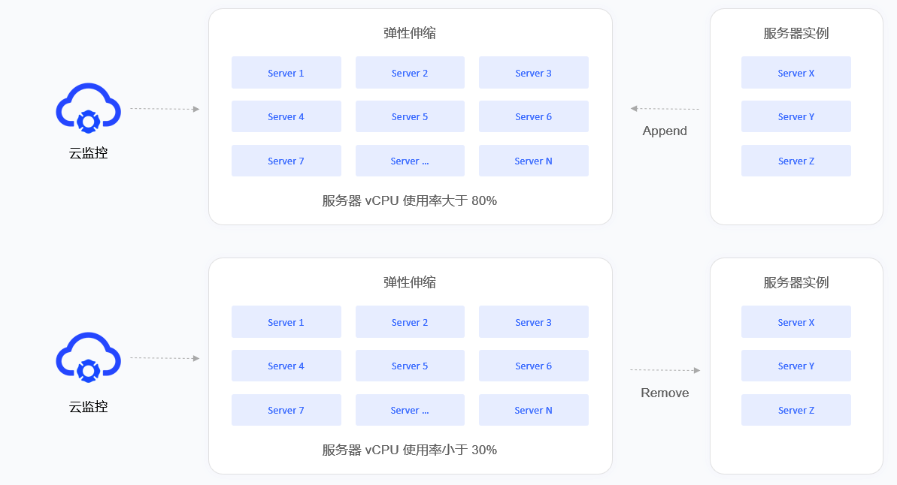

# Kubernetes deployment mode

<LastUpdated/>

## Overview

GenAuth will not change the user's existing cloud infrastructure. GenAuth will only be compatible with the user's cloud environment to the greatest extent. Therefore, GenAuth proposed the concepts of "cloud neutrality" and "GenAuth Inside". In a multi-cloud environment, GenAuth can maintain its neutrality and can be deployed in AWS, Tencent Cloud, Alibaba Cloud or private cloud environments. In a hybrid cloud or private cloud environment, GenAuth will be integrated into the customer's IT system like Intel.

This article will introduce the deployment solution of the GenAuth IDaaS platform based on Kubernetes and specific operation instructions.

## Overall architecture

The high-availability architecture of the GenAuth IDaaS platform runs in VPC (virtual private cloud). Through LB (load balancing), the added multiple availability zones in the same region are virtualized into a high-performance and high-availability service pool, and the requests from the client are distributed to the availability zones in the service pool according to the load balancing rules.

Each availability zone consists of a group of Kubernetes Nodes, and each availability zone is equipped with a complete set of GenAuth IDaaS platform. The IDaaS cluster is a stateless service, and the database cluster is a stateful master-slave synchronization architecture. If a service failure or unavailable service occurs in a certain availability zone, LB will transfer the traffic to another available availability zone, which will assume the role of Master.

Load balancing will detect the health status of each availability zone in real time and automatically isolate the availability zone in abnormal state, thereby improving the overall service capability of the application.

## Deployment plan

**1. Component planning**

|                         Server                         |                      Component package                       |                       Functional description                        |
| :----------------------------------------------------: | :----------------------------------------------------------: | :-----------------------------------------------------------------: |
| ElasticSearch | elasticsearch-7.7.0 | Search engine, log service |
|                     GenAuth Server                     |                     authing-server-1.2.0                     |                        GenAuth main service                         |
|                         Redis                          |                         redis-4.0.0                          |                            Cache service                            |
|                       PostgreSQL                       |                        postgres-12.5                         |                          Database service                           |
|                        Logstash                        |                        logstash-7.7.0                        |                  Log collection, analysis service                   |
|                       JDBC-River                       |                  jdbc-logstash-river:1.0.0                   |                        Backend data service                         |
|                      Staticfiles                       |                  authing-staticfiles:1.0.0                   |                       Static resource service                       |

**2. System environment requirements**

During software installation, configuration, and debugging, you need to prepare a Kubernetes cluster. The cluster requirements are as follows:

Kubernetes version requirements:

| Project  | Version  |
| :-----------------------------------------------: | :-----------------------------------------------: |
|                  Client Version                   |                 v1.19.4 and above                 |
|                  Server Version                   |                 v1.18.3 and above                 |

Docker version requirements:

| Project  | Version  |
| :-----------------------------------------------: | :-----------------------------------------------: |
|                      Client                       |                19.03.14 and above                 |
|                      Server                       |                19.03.14 and above                 |

Operating system environment requirements:
| Project  | Minimum configuration  | Recommended configuration  |
| :----: | :----: | :----: |
| Operating system platform | linux/amd64 | - |
| Kernel version | linux 3.10.0 and above | - |

Kubernetes Master node configuration requirements:
| Project  | Minimum configuration  | Recommended configuration  |
| :----: | :----: | :----: |
| CPU | X86 64-bit 2 cores | X86 64-bit 4 cores
| Memory | 8 GB and above | 16 GB and above
| Hard disk | 500 GB | 1 TB
| Intranet bandwidth | 1 Gbps | 10 Gbps

Kubernetes Worker node configuration requirements:
| Project  | Minimum configuration  | Recommended configuration  |
| :----: | :----: | :----: |
| CPU | X86 64-bit 4 cores | X86 64-bit 8 cores
| Memory | 16 GB and above | 32 GB and above
| Hard disk | 1 TB | 5 TB
| Intranet bandwidth | 1 Gbps | 10 Gbps

**3. Related documents**

|         Name          | Description   |
| :------------------------------------------------------------: | :----------------------------------------------------: |
|      《GenAuth IDaaS Platform User Guide Version 1.2.0》       | Introduces the GenAuth IDaaS platform operation guide  |
| 《GenAuth IDaaS Platform Product Documentation Version 1.2.0》 | Introduces the GenAuth IDaaS platform product features |

**Note: Please contact <a href="mailto:sales@genauth.ai">GenAuth pre-sales staff</a> to obtain the above resources. **

**4. Image installation package**

|   Name    | Description  |
| :------------------------------------------------: | :---------------------------------------------------: |
| authing-jdbc-logstash-river-1.0.0-90875fa84d87.tar |      GenAuth backend data service image package       |
|       authing-server-1.2.0-32d8b4130bae.tar        |          GenAuth main service image package           |
|     authing-staticfiles-1.0.0-a70a58e3c115.tar     |         Static resource service image package         |
|        elasticsearch-7.7.0-7ec4f35ab452.tar        |     Search, data statistics service image package     |
|          logstash-7.7.0-30dcca1db5e9.tar           |   Log collection and analysis service image package   |
|           postgres-12.5-386fd8c60839.tar           |            Database service image package             |
|            redis-4.0.0-3189e099eb0f.tar            |              Cache service image package              |

**Note: Please contact <a href="mailto:sales@genauth.ai">GenAuth pre-sales staff</a> to obtain the above resources. **

**5. Orchestration file**

| Name  | Description  |
| :--------------------------------------------: | :---------------------------------------------------: |
|                 namespace.yaml                 |             Namespace orchestration file              |
|  GenAuth-jdbc-logstash-river-deployment.yaml   |    GenAuth backend data service orchestration file    |
|        authing-server--deployment.yaml         |        GenAuth main service orchestration file        |
|      GenAuth-staticfiles-deployment.yaml       |      Static resource service orchestration file       |
|         elasticsearch-deployment.yaml          |  Search, data statistics service orchestration file   |
|            logstash-deployment.yaml            |  Log collection, analysis service orchestration file  |
|            postgres-deployment.yaml            |          Database service orchestration file          |
|             redis-deployment.yaml              |           Cache service orchestration file            |

**Note: Please contact <a href="mailto:sales@genauth.ai">GenAuth pre-sales staff</a> to obtain the above resources. **
