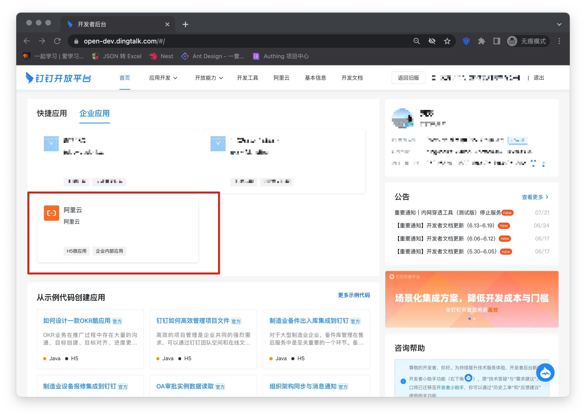
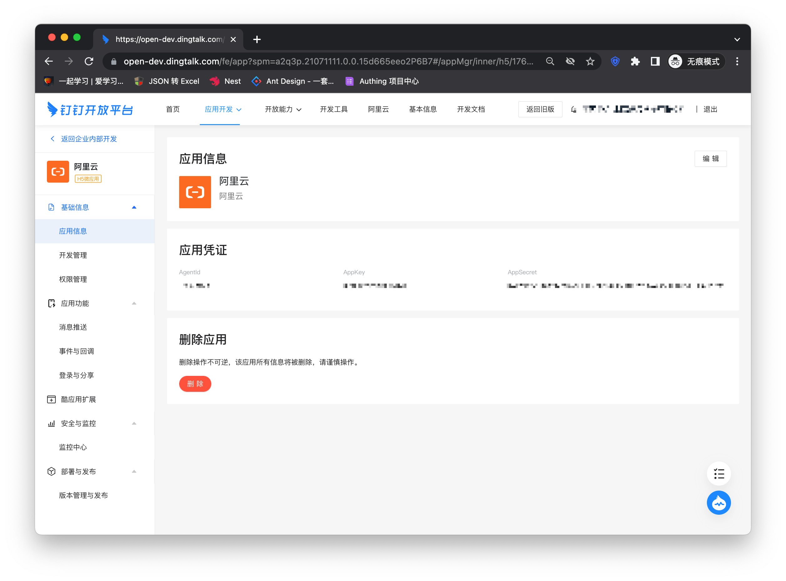
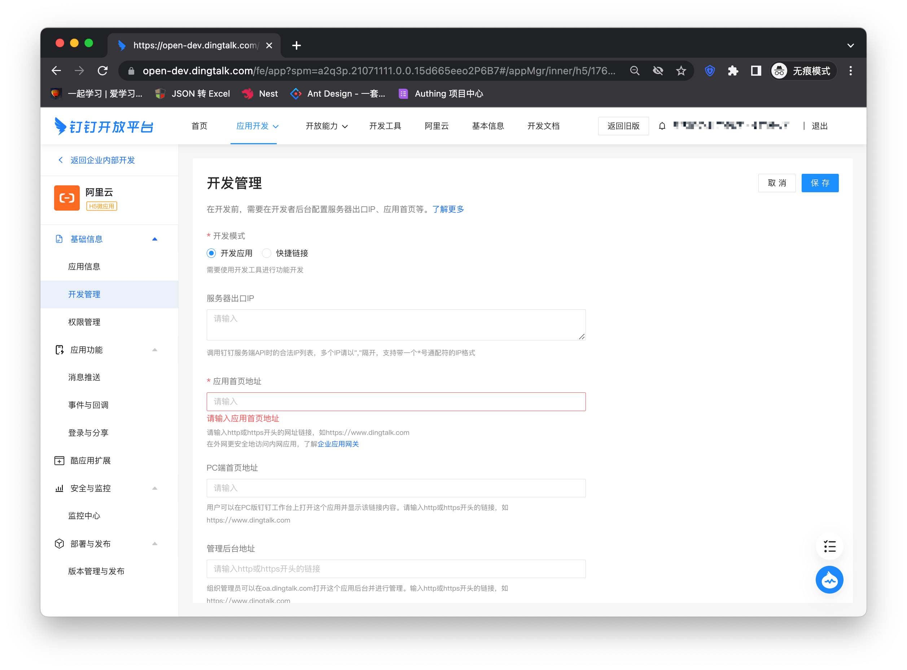
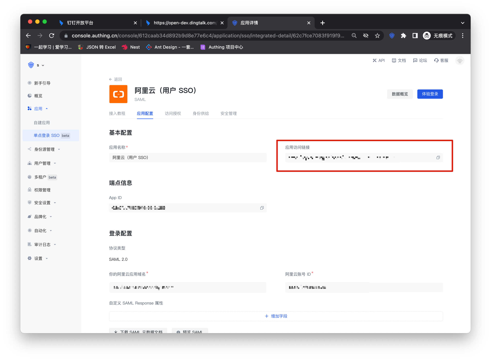
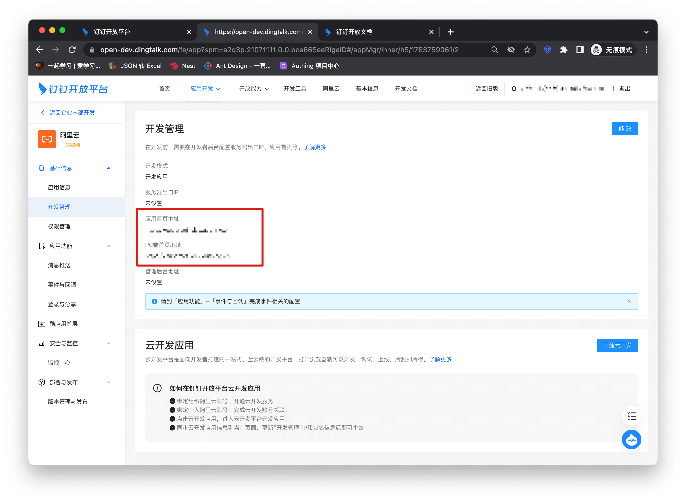
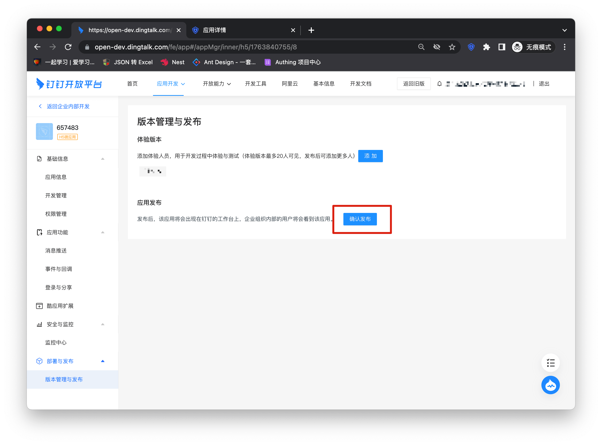
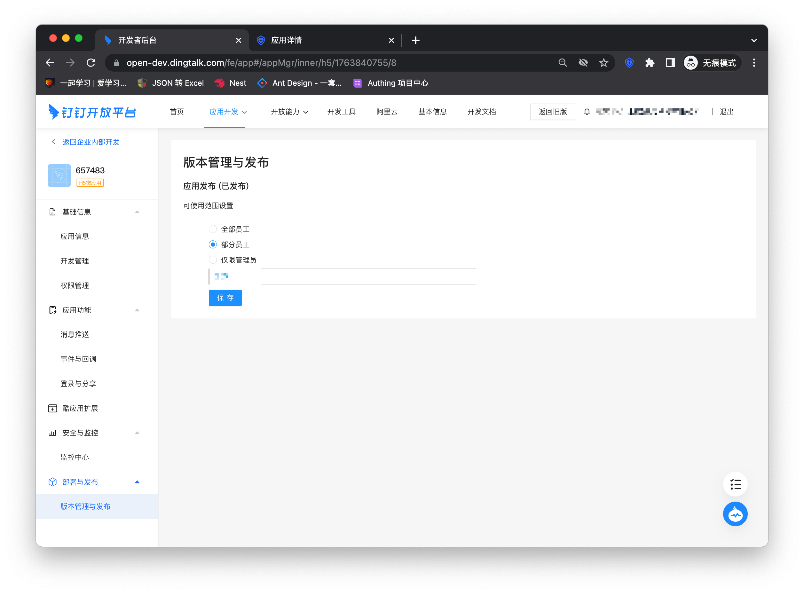
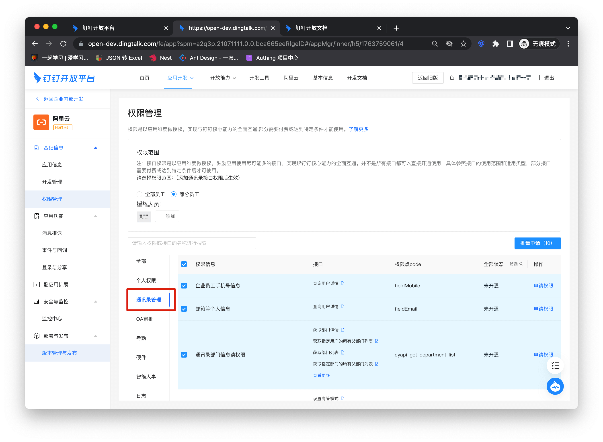
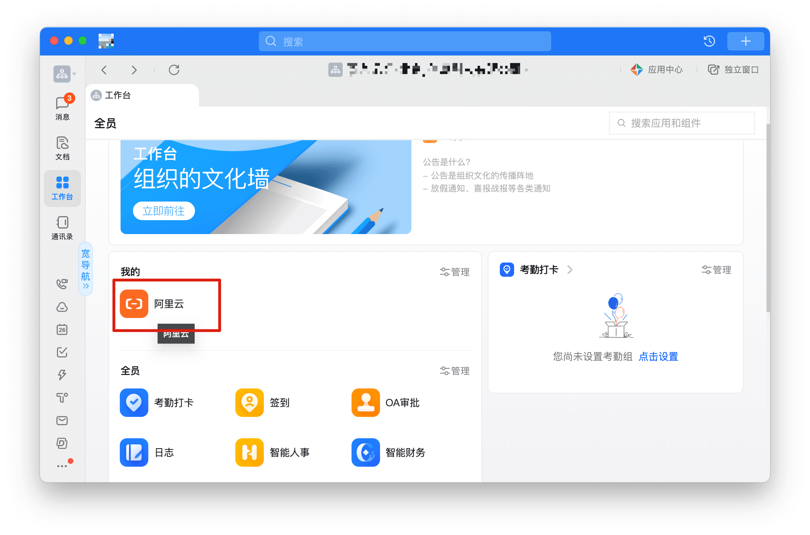
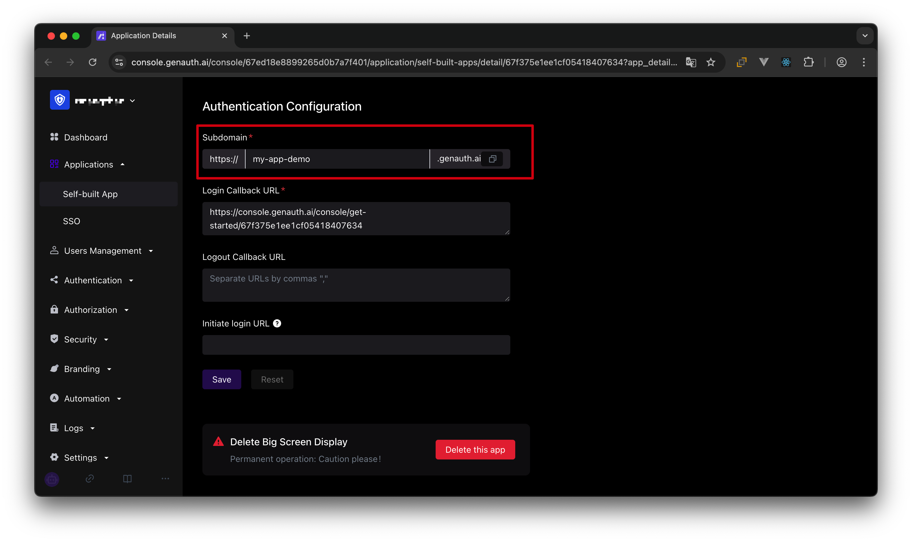

# DingTalk SSO Solution

<LastUpdated/>

Traditional identity systems are often pieced together from various solutions, and "identity data" is separated from each other. The need for unified account management is becoming more frequent and necessary. By using a centralized identity management platform, the user login experience and IT office efficiency can be greatly improved, and access security can be effectively improved.

We are often asked by developers how to log in to all applications through a single identity source and the same platform, and uniformly perform fine-grained permission management. Taking DingTalk as an enterprise's single identity source to quickly add Alibaba Cloud as an example, we provide everyone with a very simple solution to the problem of unified account management.

## Design ideas

## How to implement

### Step 1: Configure DingTalk as a GenAuth identity source

For specific DingTalk identity source configuration operations, see the document, [DingTalk H5 Micro Application (Enterprise Internal Development)](https://docs.genauth.ai/guides/connections/enterprise/dingtalk/)

### Step 2: Use DingTalk to single-point sign-on to Alibaba Cloud

### Integrate applications

1. Enter [DingTalk Open Platform Backstage](https://open-dev.dingtalk.com/), click the top Type to switch to "Enterprise Application", click the application (Alibaba Cloud) card created in step 1 or create a new application.

2. Enter the application details page, click "Development Management" on the left column, and click the "Modify" button

3. Enter the Alibaba Cloud configuration details page and copy the application access link

4. Copy the link to the application homepage address and PC homepage address
   

5. Click Version Management and Release on the left column and select Confirm Release
   

6. Select the scope of application
   

7. Add address book interface permissions
   

8. Click Complete Login in the workbench
   

### Self-built application

For self-built applications, you need to perform the following operations:

1. Create a self-built application

> First, you need to create a self-built application and complete the configuration. To create an application, refer to [How to create a self-built application](/guides/app-new/create-app/create-app.md)

2. Users need to enter the configured self-built application details page and copy its authentication address

3. Enter the enterprise application details page created in DingTalk, click "Development Management" on the left column, click the "Modify" button, and fill in the URL of the application homepage. The subsequent steps are the same as the integrated application to publish the application.

