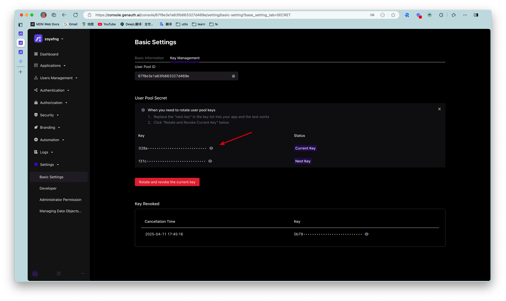

# How to get the UserPool ID and UserPool Secret?

<LastUpdated/>

In the **Settings** -> **Basic Settings** -> **Key Management** page of the console, you can get the UserPool ID and UserPool Secret, as shown in the following figure:

