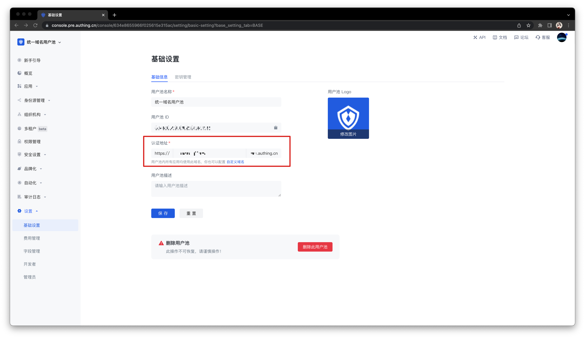
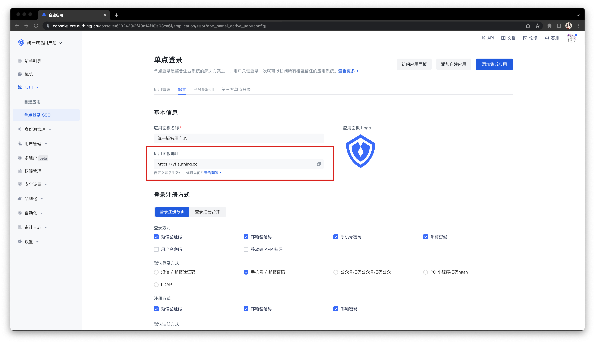
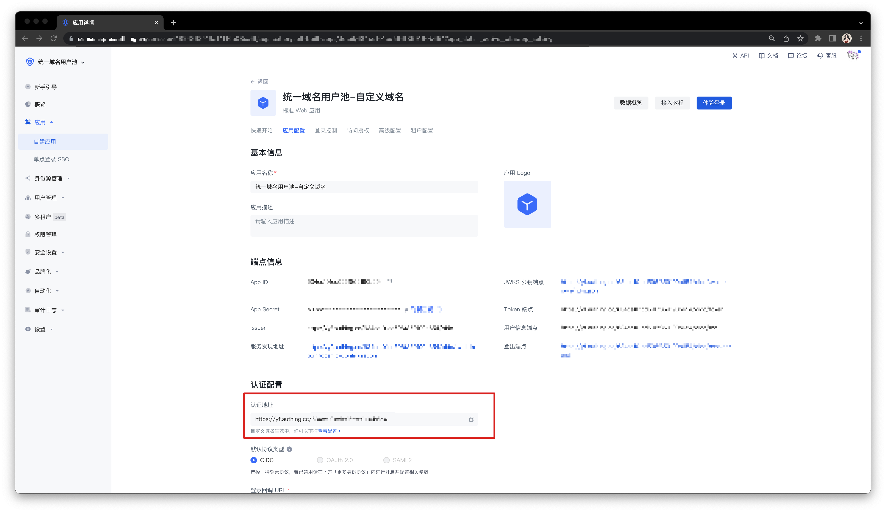
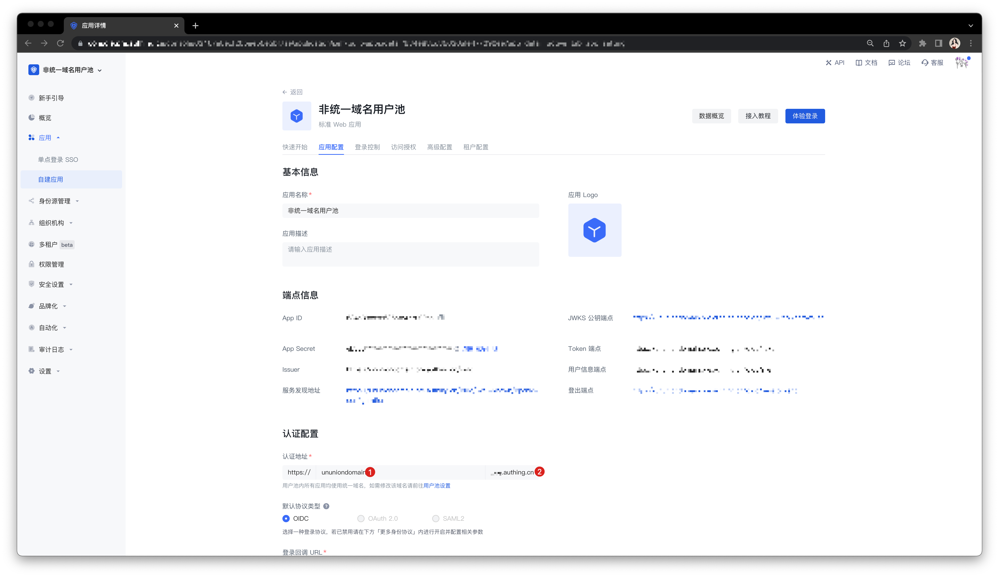
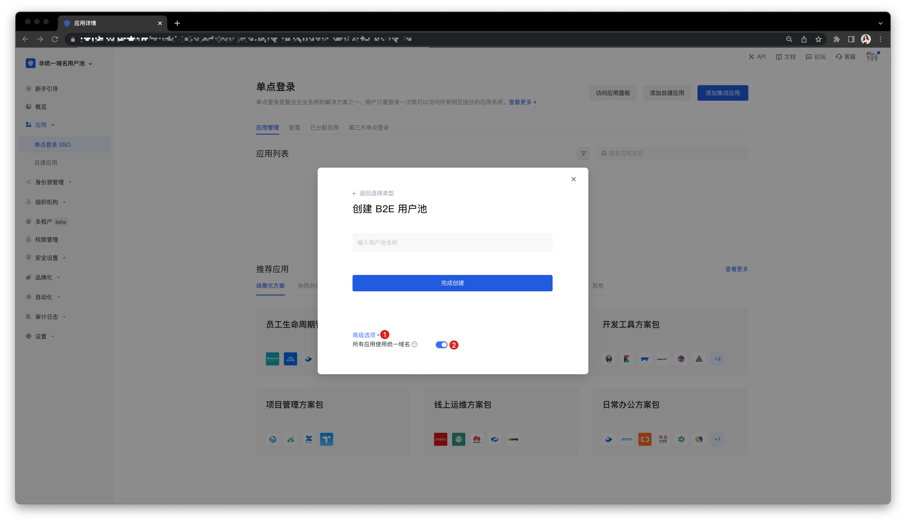

# User pool with unified domain name

<LastUpdated/>

By default, the user pool created in {{$localeConfig.brandName}} does not use a unified third-level domain name. However, in some special scenarios, you may need to use a unified domain name for the entire user pool (that is, all applications in the user pool use a unified, user pool-level domain name).

To clarify the actual needs of this feature, please follow the steps below to compare your usage scenarios and make a choice:

## Step 1: Understand what a unified domain name is

There are many types of applications in the user pool of {{$localeConfig.brandName}}, including: self-built applications, integrated applications, and application panels that can accommodate these two types of applications for [single sign-on (SSO)](/guides/app-new/sso/README.md). By default, the above types of applications in the {{$localeConfig.brandName}} user pool use independent third-level domain names (`xxx.authig.cn`). You can independently modify the authentication address of any self-built application and application panel.

In contrast, a unified domain name means that all types of applications in the same user pool use the same third-level domain name. After creating such a user pool, you can modify the unified third-level domain name of this user pool in the User Pool **Settings->Basic Settings->Basic Information** tab. Your changes will take effect on all applications in the user pool at the same time, and different applications will be distinguished by splicing **App ID** after the authentication address (`xxx.genauth.ai/APP_ID`).

## Step 2: Determine whether you need to use a unified domain name

### When do you need to use a unified domain name?

- You want the third-level domain names of all applications in the user pool to be modified uniformly.

- You want to use the custom domain name function in the entire user pool.

  - Use a custom domain name in the application panel.

  

  - Use a custom domain name for self-built applications.

### When is it not recommended to use a unified domain name?

- You want the third-level domain name of each application to be customized.

- You accept the use of the default second-level domain name of GenAuth (i.e. `.genauth.ai`).

## Step 3: Create a user pool with a unified domain name

1. Open **Advanced options** when creating a user pool.

2. Turn on the **Use unified domain name for all applications** switch.

## Step 4: Common operations for user pools with unified domain names

- Configure a custom domain name in the newly created user pool with a unified domain name:

  - Configuration method: Follow the instructions in [Customize domain name](/guides/customize/domain/customized-domain.md) to complete the configuration.

  - Implementation effect: All self-built and integrated applications in the application panel and user pool use a unified custom domain name.

- Switch the existing user pool to use a unified domain name:

  - Create a new user pool with a unified domain name and migrate existing data.

  - Contact <a href="mailto:csm@genauth.ai">GenAuth after-sales service staff</a> for technical support, or [submit a ticket](https://app.treelab.com/share/view/shr3wyakgz14SQDnZof781JGj/0x128330/viwddWVILK0EbeJ?).
