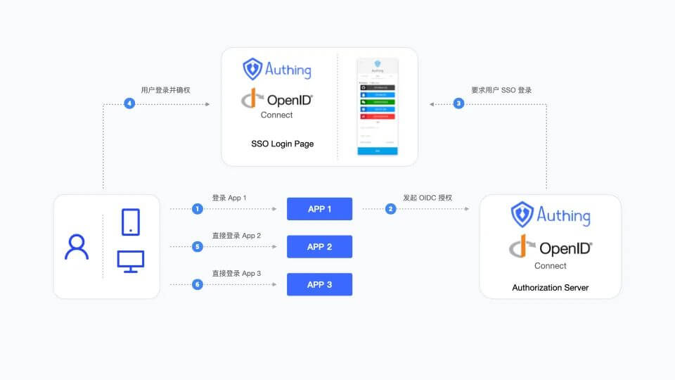

# Feishu Workbench SSO Solution

<LastUpdated/>

Traditional identity systems are often pieced together from various solutions, and "identity data" is separated from each other. The need for unified account management is becoming more frequent and necessary. By using a centralized identity management platform, the user's login experience and IT office efficiency can be greatly improved, and access security can be effectively improved.

We are often asked by developers how to log in to all applications through a single identity source and the same platform, and uniformly perform fine-grained permission management. Today, we take Feishu as an example to quickly add Gitlab as a single identity source for enterprises, and provide you with a very simple solution to the problem of unified account management.

## Design idea

## How to implement

### Step 1: Take Feishu as an example and configure Feishu as a single identity source

1. Configure Feishu address book in GenAuth and fill in the following information as required.

- Feishu application App ID
- Feishu application App Secret;
- Event subscription Encrypt Key (optional), if you do not need to keep in real-time synchronization with Feishu organization, you can leave it blank;
- Event subscription Verification Token (optional), if you do not need to keep in real-time synchronization with Feishu organization, you can leave it blank.

2. Synchronize the organization from Feishu address book to GenAuth.

In the GenAuth console **User Management->Organization** page, click **Organization Import->Sync Center Synchronization** in the upper right corner to create Feishu upstream synchronization. After that, Feishu's addition, deletion, and modification operations will be synchronized to the console's organization in real time.

### Step 2: Take GitLab as an example and use Feishu account to single sign-on GitLab

### Integrate applications

1. Enter [Feishu Open Platform](https://open.feishu.cn/app) and click "Create Enterprise Self-built Application".

2. Fill in the pop-up window information and click "Confirm to create".

3. Enter the GenAuth console **Application->Single Sign-On SSO**, click **Add Integrated Application** in the upper right corner of the page, and get GitLab. Copy the **Application Access Link** under **Application Configuration**.

4. Enter the Lark Open Platform **Application Function->Web Page**, turn on the **Enable Web Page** switch, paste the link to **Web Page Configuration**, and click **Save**.

5. Enter **Version Management and Release**, and click **Create Version**.

6. Fill in the version details and save.

7. Click **Apply for online release**.

8. In the GenAuth console **Application->Single Sign-On SSO->Application List**, enter GitLab and set the users who can access GitLab under **Access Authorization**.

9. All users who have access to this application can see the newly added application on the Lark workbench. As long as the user logs in to one application, they can single-sign on all applications.

### Self-built applications

For self-built applications, you need to do the following:

1. Create a self-built application.

::: hint-info
For creating an application, refer to [How to create a self-built application](/guides/app-new/create-app/create-app.md).

You can also use an existing application.
:::

2. The user goes to **Application->Single Sign-On SSO** and clicks **Add a self-built application** in the upper right corner of the page.

::: hint-info
After adding, log in to any application (self-built or integrated application) in the SSO list page to sign in to all applications on the panel.
:::

3. The user returns to the application list, clicks to enter the self-built application, and copies the **Authentication address** under **Application configuration**.

4. Repeat the above "Integrated application" solution, and the user pastes the address in the Feishu Open Platform **Application function->Web configuration**.
