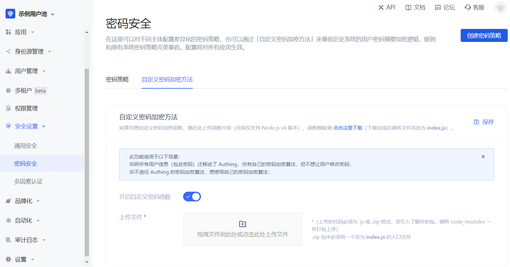

---
meta:
  - name: description
    content: Custom password encryption method
---

# Custom password encryption method

<LastUpdated/>

If you want to customize the password encryption function, please upload the function snippet here (currently only supports Node.js), and the function template please [click here to download](https://console.genauth.ai/api/password/template/download) (GenAuth will not store the original password of the user).

This function is suitable for the following scenarios:

1. You have migrated all users to GenAuth, but do not want users to change their passwords.
2. You do not trust the password encryption algorithm of {{$localeConfig.brandName}} and want to use your own password encryption algorithm.

This document describes how to configure the password encryption function.

## Configuration steps

Enter the user pool and click **Security Settings->Password Security->Custom Password Encryption Method**, as shown below:



::: img-description
Custom Password Encryption Method
:::

### Download Template

Click [Download Template](https://console.genauth.ai/console/62c6aac05fc4c051820a41e1/safety-management/password?password_policy=custom_password) on the page to download the Node.js code template. The template code is as follows:

```js
var getRawBody = require("raw-body");

const encryptPassword = (password) => {
  // Write a password encryption function here

  return password;
};

/**
 *
 * @param {String} password plain text password
 * @param {String} encryptedPassword cipher text password
 */
const comparePassword = (password, encryptedPassword) => {
  // Write a password verification function here

  return password === encryptedPassword;
};

module.exports.encrypt = function (request, response, context) {
  // get request body
  getRawBody(request, function (err, body) {
    const queries = request.queries;
    const password = queries.password;

    if (!password) {
      response.setStatusCode(500);
      response.setHeader("content-type", "application/json");
      response.send(
        JSON.stringify(
          {
            message: "Please provide password via url query",
          },
          null,
          4
        )
      );
    }

    const respBody = {
      password: encryptPassword(password), // Encrypt password here
    };

    response.setStatusCode(200);
    response.setHeader("content-type", "application/json");
    response.send(JSON.stringify(respBody, null, 4));
  });
};

module.exports.validate = function (request, response, context) {
  // get request body
  getRawBody(request, function (err, body) {
    const queries = request.queries;
    const password = queries.password;
    const encryptedPassword = queries.encryptedPassword;
    if (!password) {
      response.setStatusCode(500);
      response.setHeader("content-type", "application/json");
      response.send(
        JSON.stringify(
          {
            message: "Please provide password via url query",
          },
          null,
          4
        )
      );
    }

    const respBody = {
      isValid: comparePassword(password, encryptedPassword), // Verify password here
    };

    response.setStatusCode(200);
    response.setHeader("content-type", "application/json");
    response.send(JSON.stringify(respBody, null, 4));
  });
};
```

### Write code

You need to write the corresponding password encryption method in the `encryptPassword` function, and write the corresponding verification password encryption method in the `vlidatePassword` function.

If the developer needs to introduce a third-party NPM package, please use NPM to install it directly.

::: hint-info
NPM is a package management tool for the Node.js ecosystem.
:::

Here is a code example for importing the `bcrypt` package (switch to your project folder first):

```haskell
$ npm install bcrypt
```

After the installation is complete, there will be an additional node_modules folder in the folder, and then write the code:

```js
var getRawBody = require("raw-body");

const encryptPassword = (password) => {
  // Implement your login here.
  // Your can use bcrypt for example
  // more info here: https://github.com/kelektiv/node.bcrypt.js
  const bcrypt = require('bcrypt');
  return await bcrypt.hash(plainText, await bcrypt.genSalt(10));
};

const vlidatePassword = (plainText, encrypted) => {
  // plainText is the plainText password use provide to be validate.
  // encrypted is user's password encryped in database.

  // Implement your login here.
  // Your can use bcrypt for example
  // more info here: https://github.com/kelektiv/node.bcrypt.js
  const bcrypt = require('bcrypt');
  return await bcrypt.compare(plainText, encrypted);
}

```

### Upload function to server

::: hint-info
{{$localeConfig.brandName}} supports code packages in .js or .zip formats only.
:::

If you have not imported any packages, you can directly upload the template file in .js format; if you have imported a package, please package it with node_modules in .zip format and upload it in the {{$localeConfig.brandName}} console.


### Test password encryption function

After successful upload, developers can test the password encryption effect. As shown below, enter the original password in the input box and click "Encryption Test" to see the encrypted password (if no encryption function is uploaded, the default password encryption result of {{$localeConfig.brandName}} will be displayed).


## Notes

::: hint-info
The password encryption function will take effect after uploading, which will affect the original users. It is recommended to use this function in a completely new user pool.

If you need to modify the password encryption function in the old user pool, please contact <a href="mailto:csm@genauth.ai">GenAuth after-sales service personnel</a>.
:::
