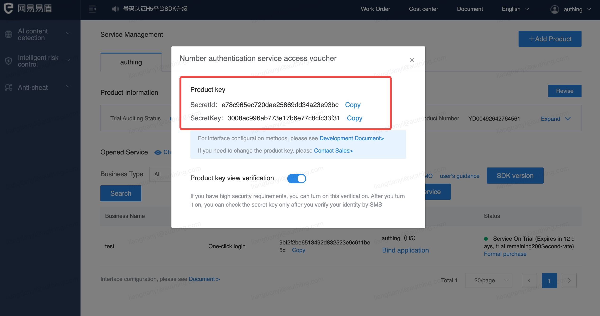

# One-click login with mobile phone number

<LastUpdated/>

One-click login with mobile phone number is an extremely convenient authentication method provided by the three major operators.

Currently GenAuth supports access to this capability through NetEase Yidun, which integrates the one-click login SDK of the three major operators and provides a unified mobile application interface. You can quickly complete the access in the following three steps.

 

## STEP1: Yidun backend configuration

Refer to [Yidun Document](https://support.dun.163.com/documents/287305921855672320?docId=424413790996844544) to create an application, set the package name, and upload the signature

Copy business ID, SecretId, SecretKey

## STEP2: GenAuth backend configuration

Create a social identity source

Select NetEase Yidun

Fill in the Yidun backend information into the GenAuth console

## STEP3: Mobile integration

With the SDK we provide, developers only need one line of code to integrate the one-click login function. Please refer to:

[Android Integration Guide](/reference/sdk-for-android/social/oneauth.md)

[iOS Integration Guide](/reference/sdk-for-ios/social/oneauth.md)

The effect after successful integration is as follows

