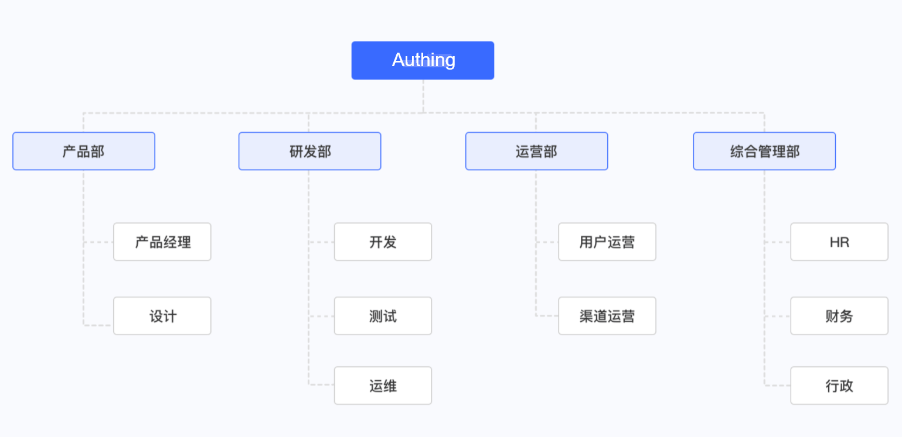

# Organization Overview

<LastUpdated/>

::: hint-info
For information about the {{$localeConfig.brandName}} user pool version that supports the various benefits of the "Organization" function, please check the [official website "Pricing" page](https://www.genauth.ai/pricing). If your version does not support this benefit and you want to try it, you can activate the trial period. For an introduction to the trial period and how to activate it, please check the [trial period](/guides/basics/trial/README.md).
:::

With {{$localeConfig.brandName}}, you can quickly [implement role-based access control (RBAC)](/guides/access-control/rbac.md). Simply put, RBAC refers to authorizing users to relevant permissions through their roles, which is more flexible, efficient, and scalable than directly granting user permissions.

In real life, groups and roles are often hierarchically nested in a tree-like structure. The most common ones are organizations, such as companies, schools, etc.

A common organizational structure is as follows:

- The first-level departments include product department, R&D department, operation department, and general management department
- There are second-level departments under the first-level departments, such as product managers and designers in the product department.

The above figure is a typical tree structure, in which there is only one root node. Generally speaking, the root node is a company or an organization. Each node corresponds to a hierarchical department.

In {{$localeConfig.brandName}}, you can [import organizations from third-party user directories such as WeChat Enterprise, DingTalk, LDAP, Active Directory, etc.](./create-or-import-org/README.md#Import organizations). We also provide [console and SDK methods for managing organizations](./manage-org/README.md). You can easily [manage member life cycles](./staff-life-cycle-management/README.md) and [use LDAP protocol to open organizational data to the outside world](./ldap-user-directory/README.md).
