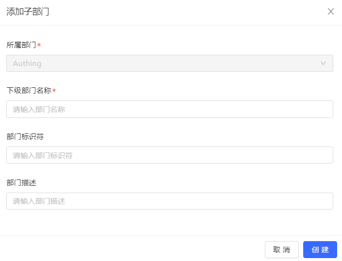
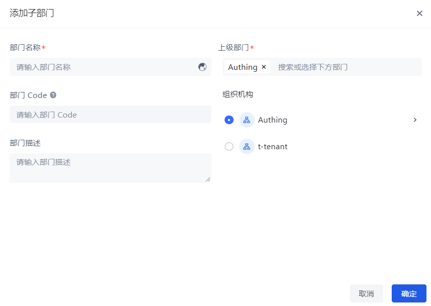

You can manually create an organization in **User Management->Organization** of the console:

::: img-description
Add sub-department-old version
:::

::: img-description
Add sub-department-new version
:::

Enter the department name, department identifier (old version)/department Code (new version) (must be a unique legal English identifier), and department description information.