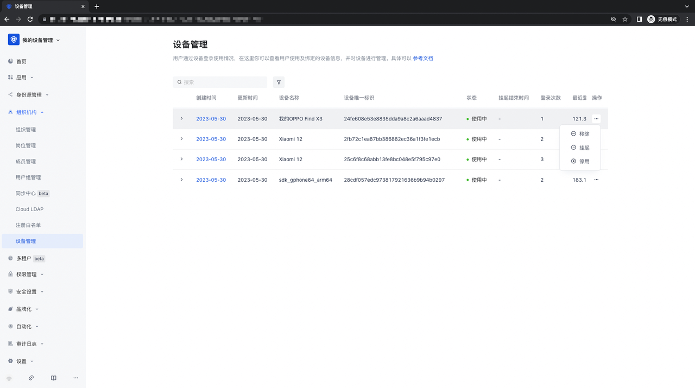
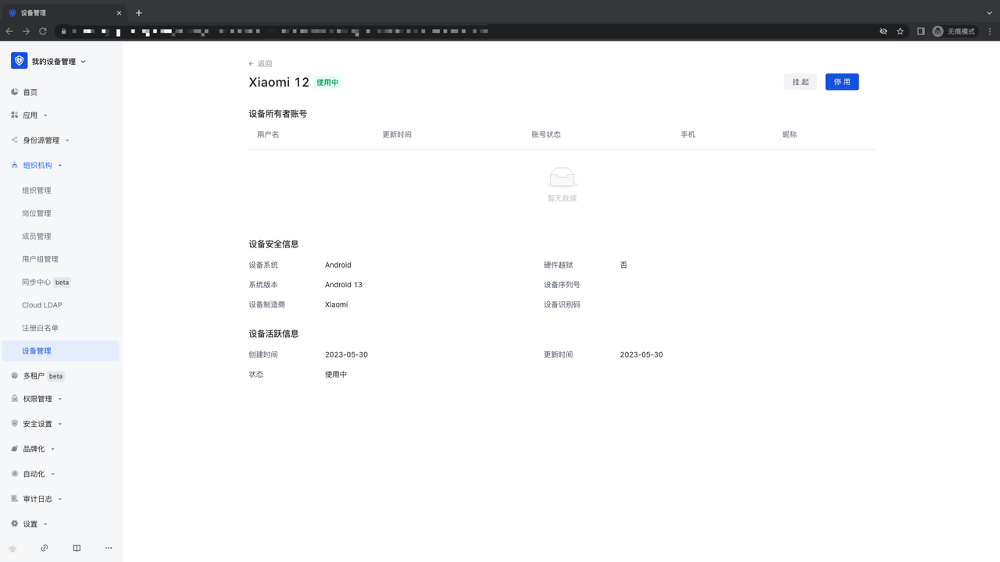
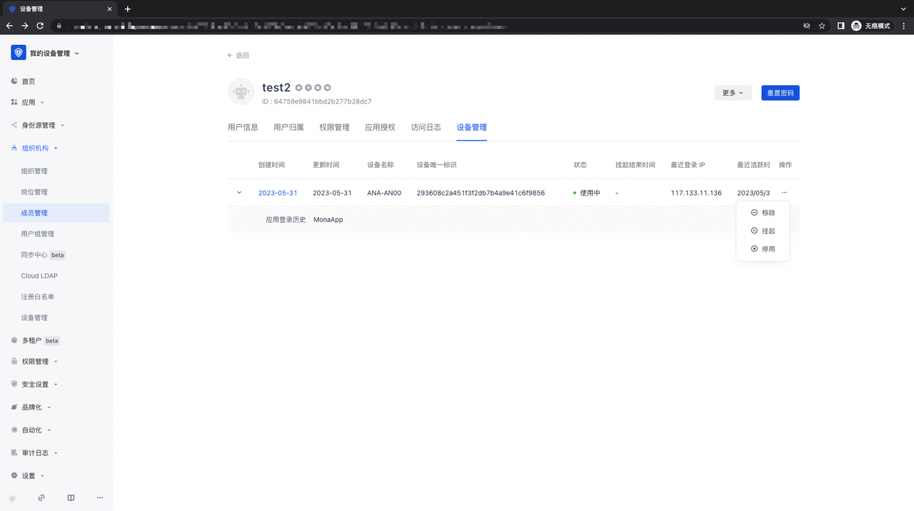
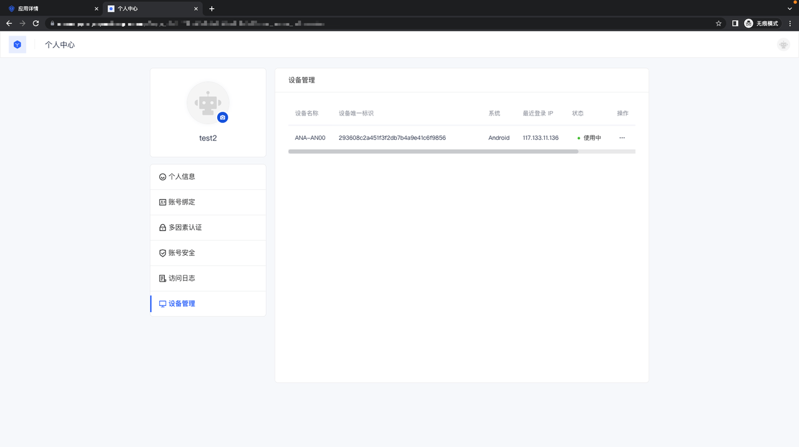
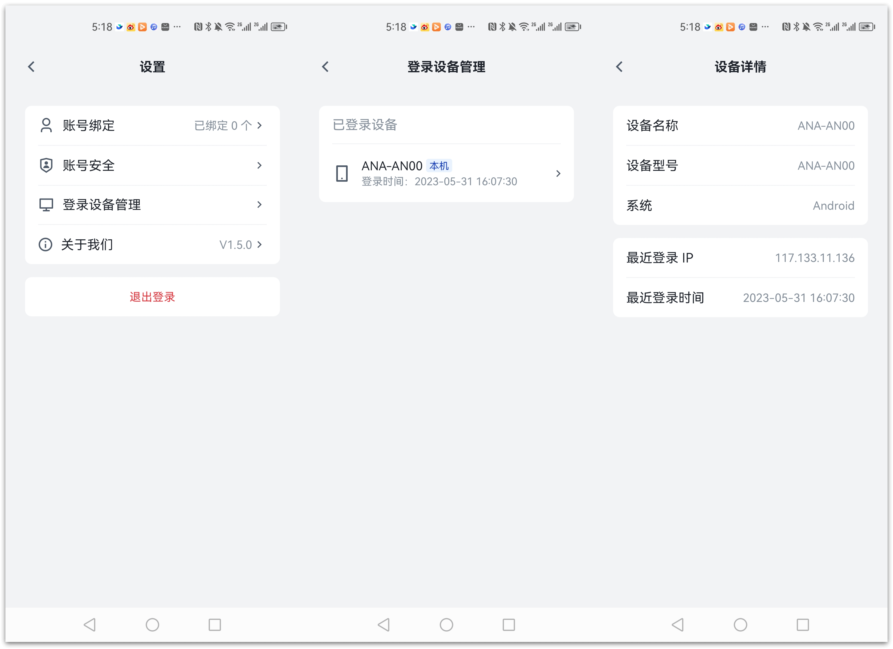
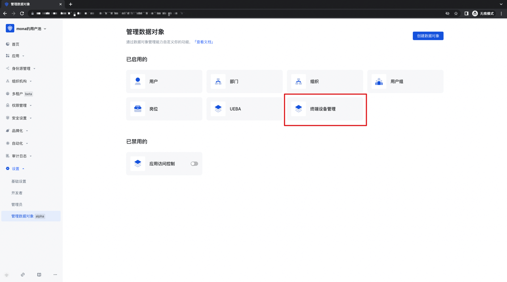
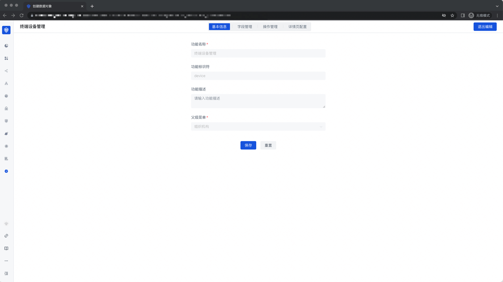
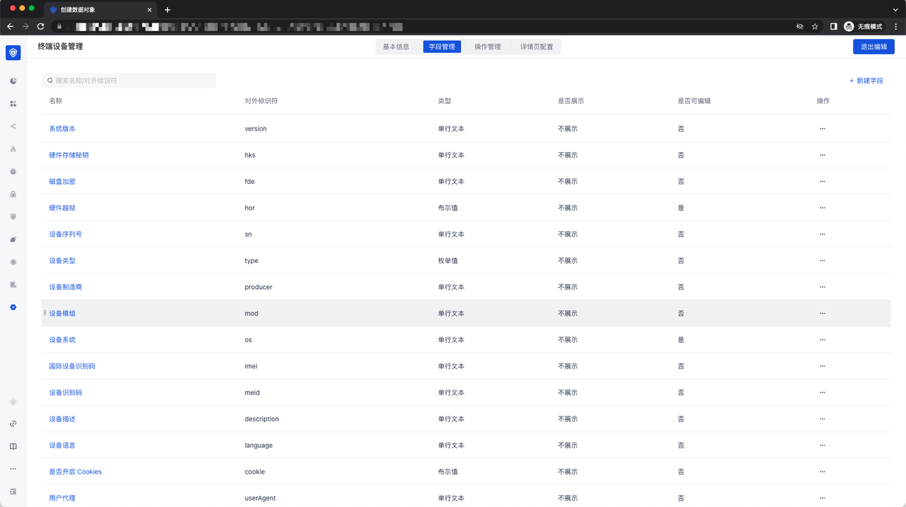
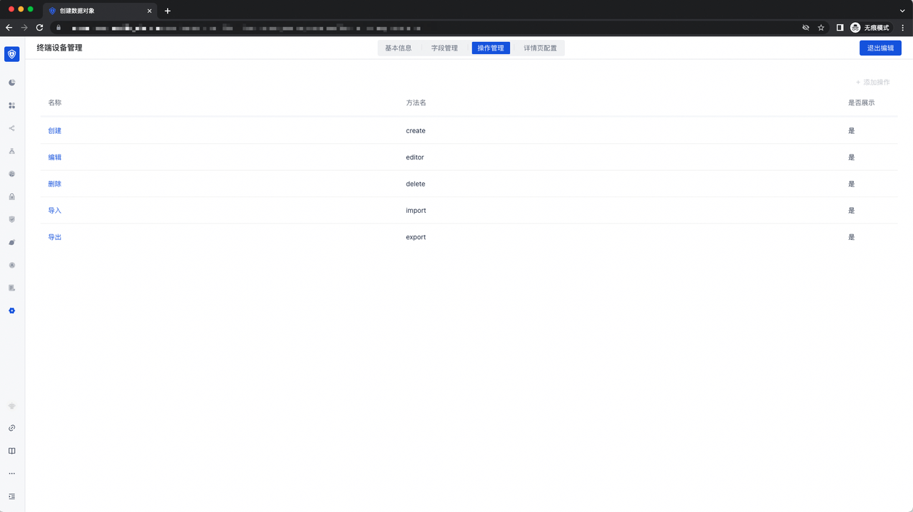
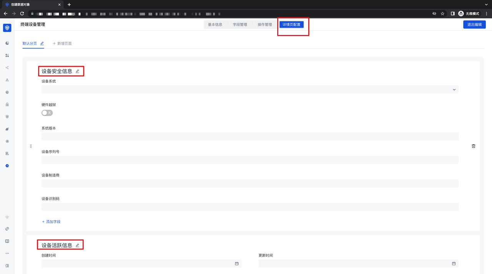

# Manage terminal devices

<LastUpdated/>

### Device management

The device management function is designed to manage all web, mobile, and PC devices that log in to the user pool application; by logging in to the user pool application, the terminal device actively reports the device information to the user pool, and the ultimate management capability of the device is achieved by removing, suspending, and deactivating the device.

### Device management on the administrator side

1. Click the "Organization"-"Device Management" module to enter the device list, where you can see the basic and usage information of all devices, and can remove/suspend/deactivate the device. Enabled operations;

2. In the device management list, click on a device information to enter the device information details page, where you can see all account information, device security information and active information of the device;

3. Click "Organization" - "Member Management" - "Member Details" page, users can see all device information logged in with the account, and can remove, suspend, and deactivate operations;

### User-side device management

1. Web-side application personal center: In the Web-side application personal center, you can see all devices logged in to the application under the user;

2. GenAuth token mobile app: Open the GenAuth token app, enter the mobile app corresponding to the user pool, and log in. After logging in, you can see the "Device Management" module in the personal center. After clicking to enter, you can manage the devices logged in by the account under the app:

### Manage devices through "Manage Data Objects"

1. First, in a user pool with the "Manage Data Objects" function turned on, open the "Settings"-"Manage Data Objects" page, click the "Terminal Device Management" module, and enter the terminal device management module:

2. In the basic information of the "Terminal Device Management" function, the defined function name, function identifier, function description and parent menu are displayed and cannot be modified:

3. Field Management: Displays all fields related to the device management function, and you can choose whether to display and edit them:

4. Operation Management: Displays the general form operation capabilities for device management, including "Create", "Edit", "Delete", "Import", and "Export" capabilities;

5. Details Page Configuration: Displays the configuration of a device details page, and you can modify the details page. Tab and the corresponding fields for configuration;

### Device management API call

Device management API call requires the use of the API provided by the business side. The specific API location is: [Management terminal device API](https://console.genauth.ai/openapi/v3/management/#tag/%E7%AE%A1%E7%90%86%E7%BB%88%E7%AB%AF%E8%AE%BE%E5%A4%87/API%20%E5%88%97%E8%A1%A8)
