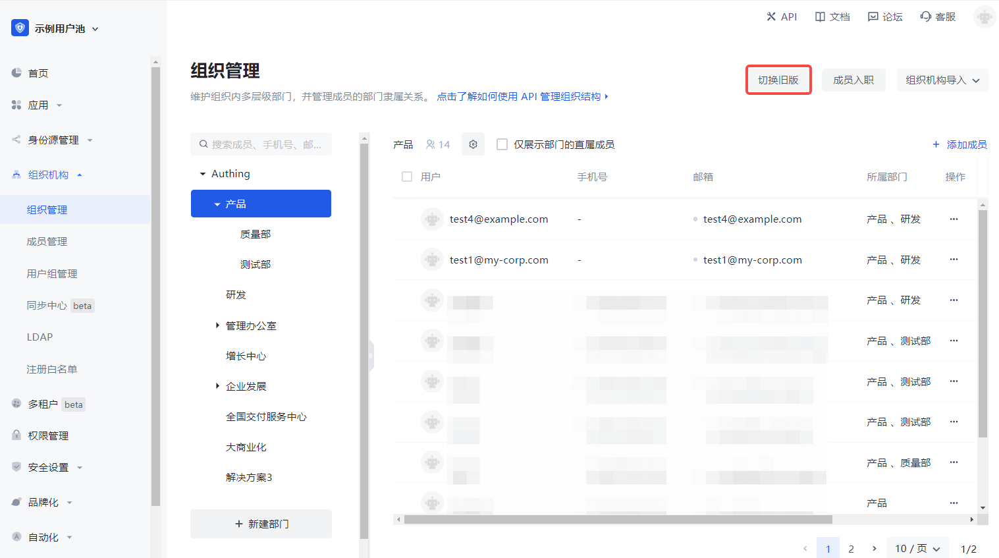

# Manage Organization

<LastUpdated/>

Organization management includes operations such as adding sub-departments, modifying departments, deleting sub-departments, moving sub-departments, obtaining sub-department lists, adding members, deleting members, obtaining member lists, etc. GenAuth supports two operation modes: console and API & SDK.

::: hint-info

- For B2E scenarios, you can see the **Organization->Organization Management** menu in the left navigation bar of the console, where you can manage the organizational structure and members under the corresponding hierarchical organization. For B2B and B2C scenarios, you can manage it in **User Management->Organization**.
- Currently, the new and old versions of the organization function in parallel, and you can choose according to your needs. To switch between the old and new versions, you can click the **Switch Old Version / Switch New Version** button in the upper right corner of the page on the **Organization->Organization Management** page.
  :::

## Add sub-department

<StackSelector snippet="add-node" selectLabel="Selection method" :order="['dashboard', 'java', 'javascript']"/>

## Modify department

<StackSelector snippet="update-node" selectLabel="Selection method" :order="['dashboard', 'java', 'javascript']"/>

## Delete sub-department

<StackSelector snippet="delete-node" selectLabel="Selection method" :order="['dashboard', 'java', 'javascript']"/>

## Move sub-department

<StackSelector snippet="move-node" selectLabel="Selection method" :order="['dashboard', 'java', 'javascript']"/>

## Get the list of sub-departments

<StackSelector snippet="list-children" selectLabel="Selection method" :order="['dashboard', 'java', 'javascript']"/>

## Add members

<StackSelector snippet="add-member" selectLabel="Selection method" :order="['dashboard', 'java', 'javascript']"/>

## Delete members

<StackSelector snippet="remove-member" selectLabel="Selection method" :order="['dashboard', 'java', 'javascript']"/>

## Get the list of members

<StackSelector snippet="list-members" selectLabel="Selection method" :order="['dashboard', 'java', 'javascript']"/>
