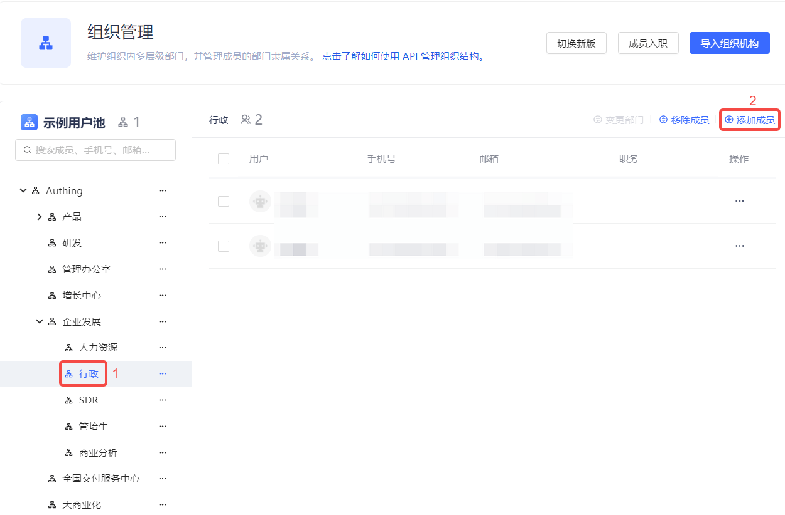
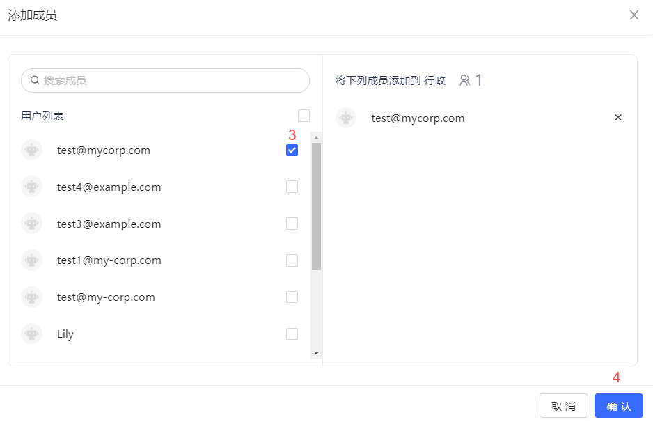
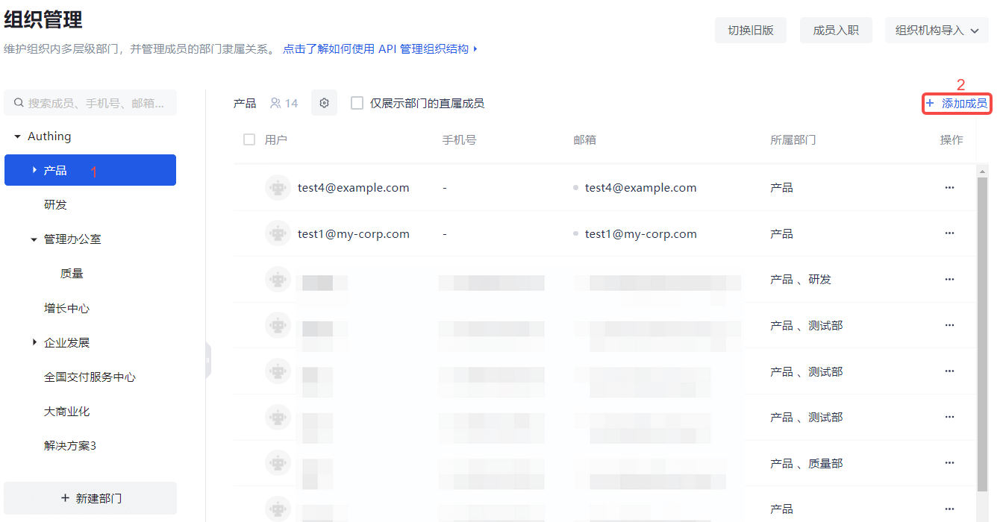
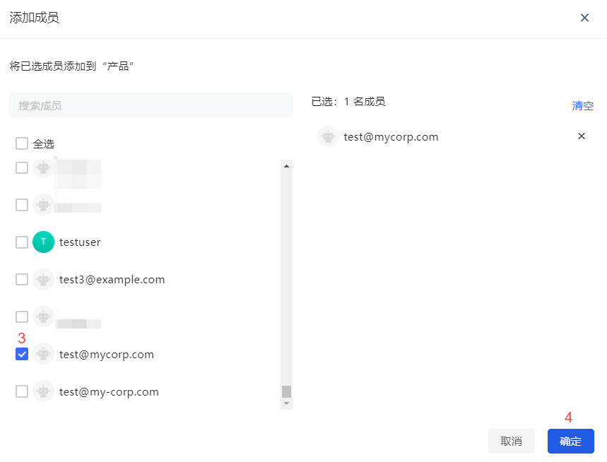

This function is designed to add new members under the current organization/department.

::: hint-info
Only existing members in **Member Management** (**User List** for B2B and B2C scenarios) can be added.
:::

#### Old Version

To add new members, perform the following steps:

1. Select the organization/department in the organization list on the left.

2. Click the **Add Member** button above the user list.

3. Check the target user in the **User List** on the left side of the pop-up window (you can also search by keyword).  The selected user is automatically added to the list on the right.

4. Click the **Confirm** button.

#### New Version

To add a new member, follow these steps:

1. Select the organization/department in the organization list on the left.

2. Click the **Add Member** button above the user list.

3. Select the target user in the **User List** on the left side of the pop-up window (you can also search by keyword).  The selected user is automatically added to the list on the right.

4. Click the **OK** button.

