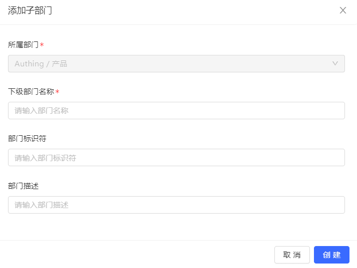

#### Old version

You can click on one of the departments and select **Add sub-department**:

Enter **Sub-department name**, **Department identifier** (optional) and **Department description** (optional):

#### New version

You can click on one of the departments and select **Add sub-department**:

Enter **Department name** and **Department Code** (optional), or change the current sub-department on the right side of the window **Superior department**:

