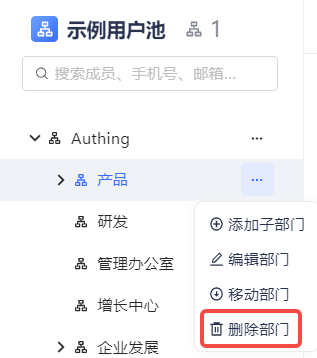
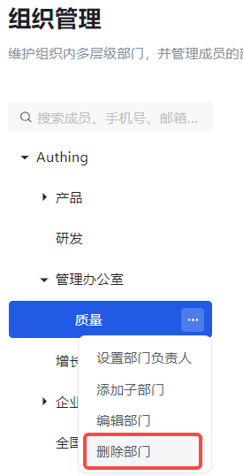

::: hint-info
* It should be noted that if there are sub-departments under the department to be deleted or there are members under the department/sub-department, the department cannot be deleted directly. All members must be cleared first and all sub-departments deleted.
* When removing members from a department, it should be noted that only members who are directly affiliated with multiple departments and the current department can be removed. If a member only belongs to the current department, it cannot be removed; in this case, the member can only be removed from the current department by resigning.
* The root node of the organization cannot be deleted.
::: 

Select the department to be deleted and click the **Delete Department** button.

::: img-description
Delete department-old version
:::

::: img-description
Delete department-new version
:::