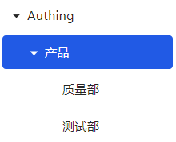

You can click the collapse button in front of a node to expand the current node and display all child nodes under it.

::: img-description
Before expansion
:::

::: img-description
After expansion
:::
