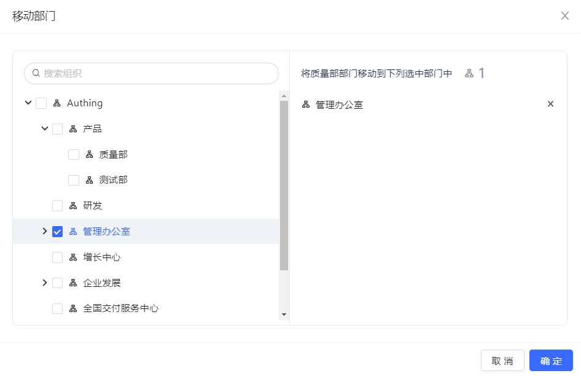

#### Old version

1. Click the **Move Department** button behind the department to be moved in the organization tree.

2. Select the new parent department to move to in the pop-up window:

3. Click **OK**.

#### New version

Stay tuned!