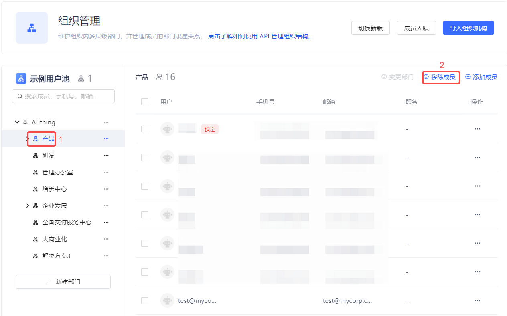
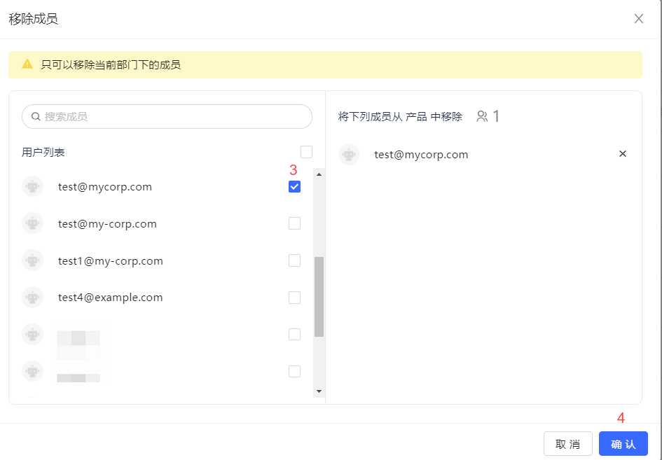
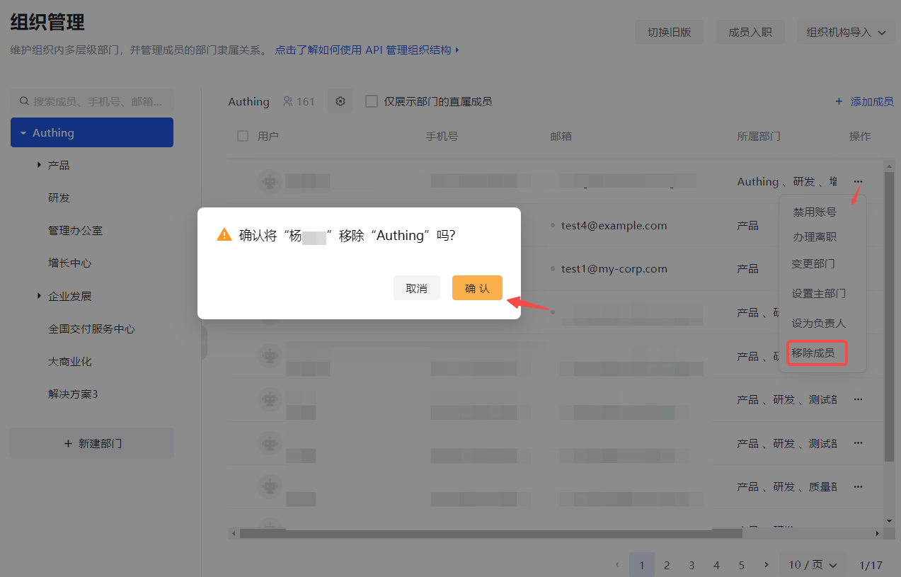

::: hint-info
* Only members who belong to multiple departments and the current department can be removed. If the member to be removed belongs to only one department, it cannot be removed.

* You can remove in batches by checking the user first and then clicking **Remove Member**.
:::

#### Old version

To remove a member from the current organization/department, perform the following steps:

1. Select the organization/department in the organization list on the left.

2. Click the **Remove Member** button above the user list.

3. Check the member to be removed in the **Remove Member** pop-up window (you can also search by keyword).

4. Click the **Confirm** button.

#### New version

To remove a member from the current organization/department, follow these steps:

1. Select the organization/department in the list of organizations on the left.

2. In the user list of the current organization/department on the right, click the row of the corresponding member to **Remove Member**.