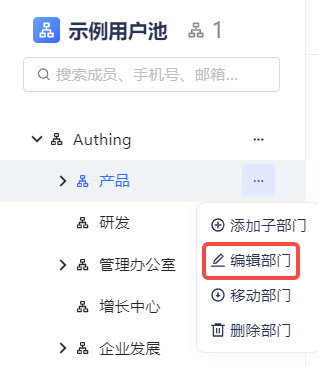
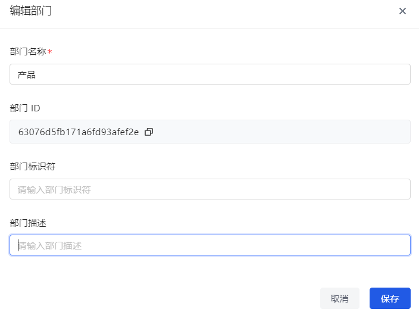
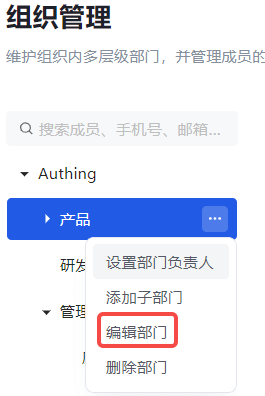
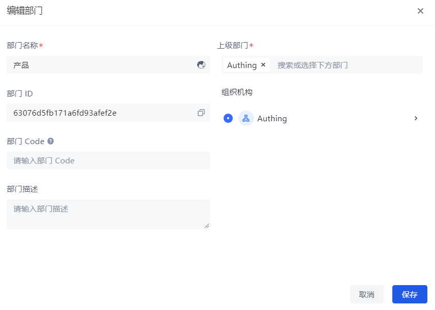

#### Old version

1. Click the **Edit Department** button behind the department to be edited in the organization tree.

2. Update the fields.

3. Click **Confirm**.

#### New version

1. Click the **Edit Department** button behind the department to be edited in the organization tree.

2. Update the fields.

::: hint-info
In addition to modifying the **department name**, **department code**, and **department description**, you can also change the **superior department**.
:::

3. Click **Save**.