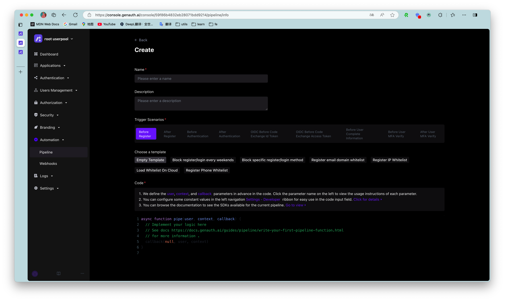
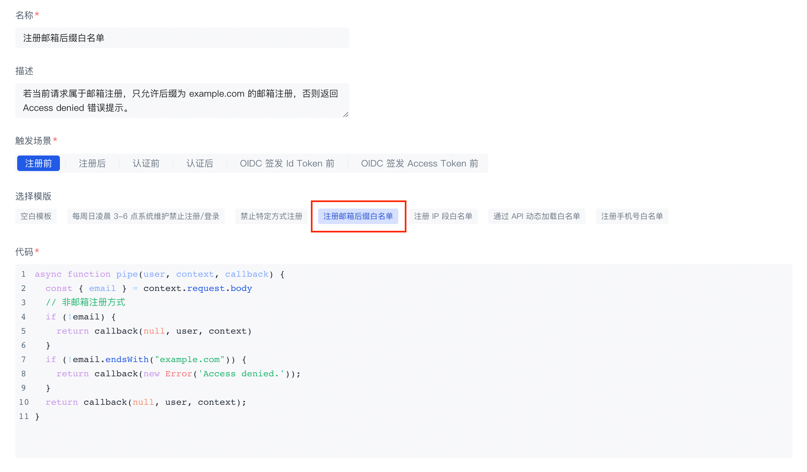
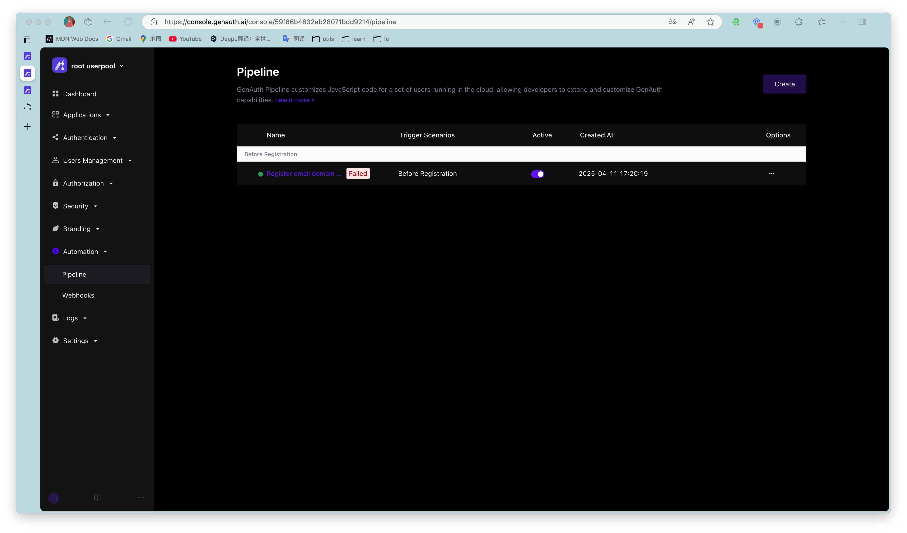
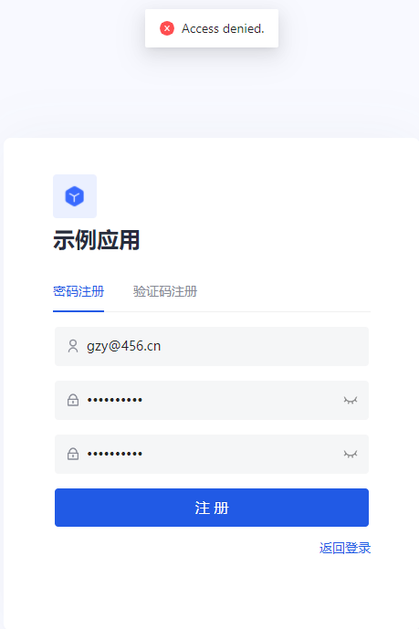
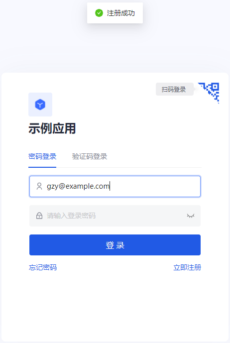

---
meta:
  - name: description
    content: Create your first Pipeline function
---

# Create your first Pipeline function

<LastUpdated/>

Pipeline functions are custom JavaScript code executed during the {{$localeConfig.brandName}} authentication process. With Pipeline, developers can easily customize and extend the capabilities of
{{$localeConfig.brandName}}.

## Step 1: Choose a Pipeline template

{{$localeConfig.brandName}} provides many out-of-the-box templates to help you get started quickly.

::: hint-success
You can also view the list of Pipeline template functions here: [https://github.com/authing/pipeline](https://github.com/authing/pipeline). At the same time, you are welcome to use your talents and contribute Pipeline template functions to us.
:::

1. Select a trigger scene:

2. Select **Register email suffix whitelist** in access control.

## Step 2: Create a Pipeline function

1. Here we set the domain name whitelist to `example.com`, you can also customize it.

2. Click the **Create** button in the lower left corner. We will deploy this function to the cloud. It will take some time, please be patient.

The page returns to the Pipeline function list page, and you can see the Pipeline function we just added.

::: hint-success
If you have multiple Pipeline functions, you can drag the leftmost button to sort them.
:::

## Step 3: Verify whether the whitelist is valid

1. First, register with an email address that does not have the suffix `example.com`. The system prompts "Access Denied." This is the prompt message we specified in the custom Pipeline function.

2. Then register with an email address with the suffix `example.com`. Registration is successful!

## Step 4: You may also need to

- Read the [Pipeline Function Development Guide](pipeline-function-api-doc.md) in detail.
- Learn what request information you can get in the pipe function: [user object](user-object.md) and [context object](context-object.md).
- Learn how to [use environment variables in Pipeline](env.md).
- Learn about the [available Node Modules](available-node-modules.md) in the Pipeline function. You can use [Node.js/JavaScript](/reference/sdk-for-node/) directly!
- We provide a lot of rich [Pipeline function templates](https://github.com/authing/pipeline).
- We also provide convenient [online debugging methods](./how-to-debug.md) to facilitate developers to debug online.
