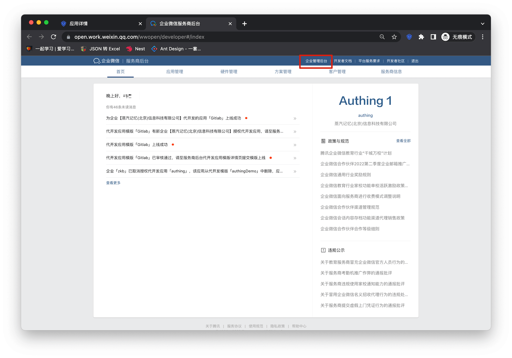
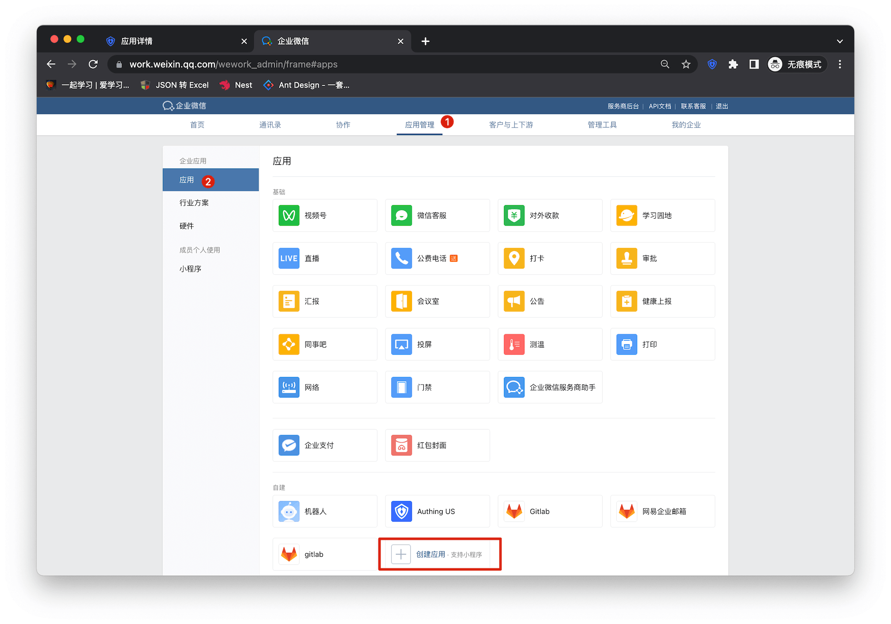
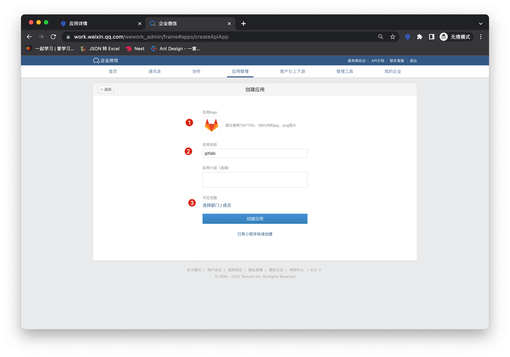
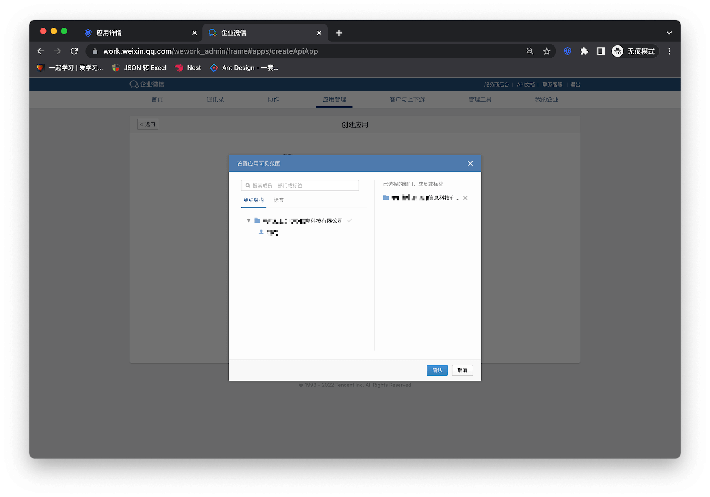
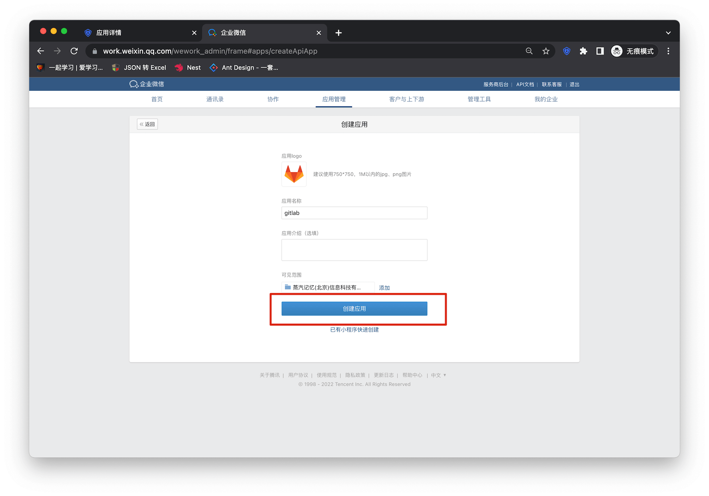
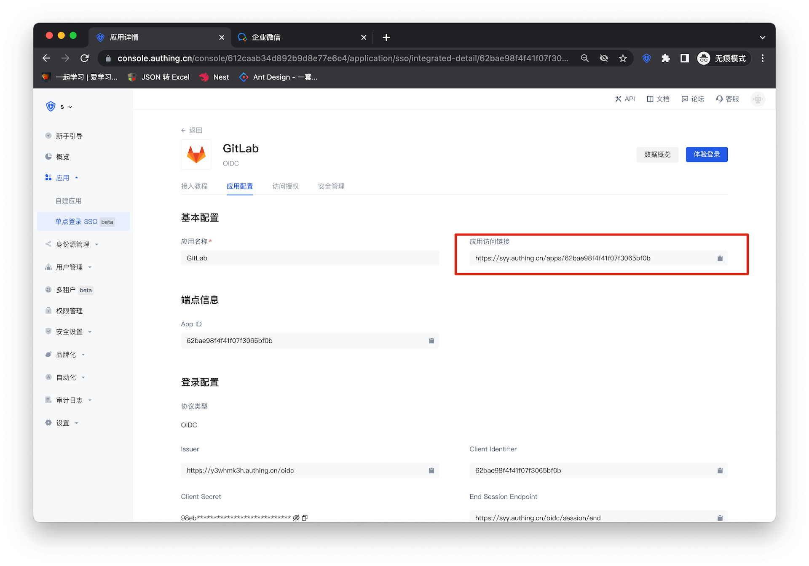
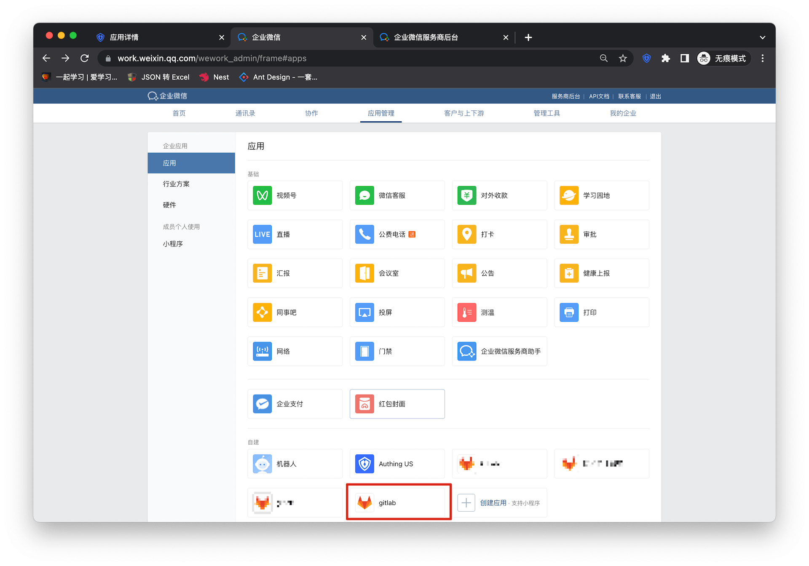
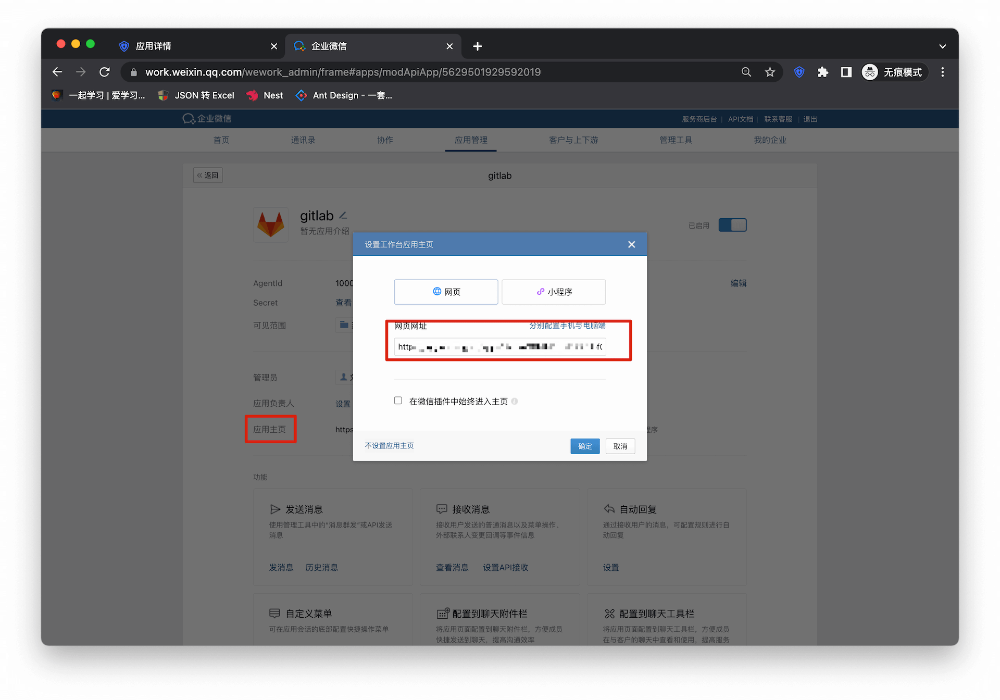
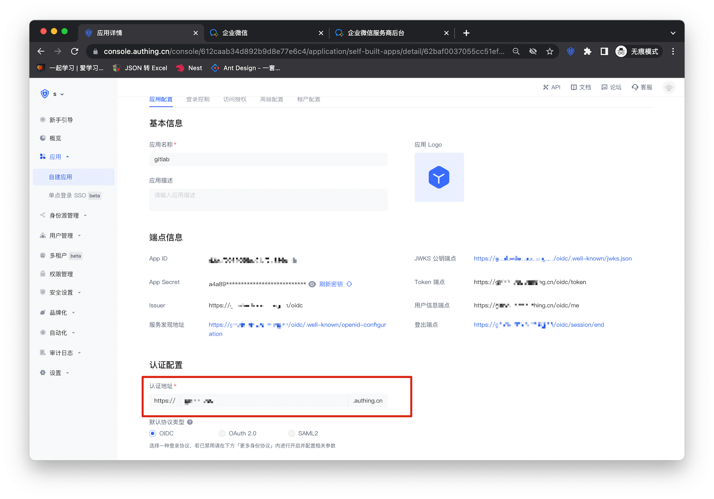

# Enterprise WeChat SSO Solution

<LastUpdated/>

Traditional identity systems are often pieced together from various solutions, and "identity data" is separated from each other. The need for unified account management is becoming more frequent and necessary. By using a centralized identity management platform, the user login experience and IT office efficiency can be greatly improved, and access security can be effectively improved.

We are often asked by developers how to log in to all applications through a single identity source and the same platform, and uniformly perform fine-grained permission management. Taking Enterprise WeChat as the enterprise's single identity source to quickly add Gitlab as an example, we provide everyone with a very simple solution to the problem of unified account management.

## Design ideas

## How to implement

### Step 1: Configure WeChat for Enterprise as GenAuth identity source

For specific WeChat for Enterprise identity source configuration operations, see the document [Scanning QR code for WeChat for Enterprise Self-built Applications (Development Mode)](https://docs.genauth.ai/guides/connections/enterprise/wecom-agency-qrconnect/)

### Step 2: Taking GitLab as an example, use WeChat for Enterprise account to log in to GitLab

### Integrated application

1. Enter [WeChat for Enterprise Service Provider Backstage](https://open.work.weixin.qq.com/wwopen/login), click "Enterprise Management Backstage"

2. Click "Create Application"

3. Fill in the application name and other basic configuration information in the form
   

4. Select the visible range of the application
   

5. Click "Create Application" to complete the application creation
   

6. Enter the Gitlab configuration details page and copy the application access link
   

7. Go back to the enterprise micro-management backend and enter the details page of the newly created application
   

8. Fill in the URL of the application homepage
   

### Self-built application

For self-built applications, you need to perform the following operations:

1. Create a self-built application

> First, you need to create a self-built application and complete the configuration. To create an application, refer to [How to create a self-built application](/guides/app-new/create-app/create-app.md)

2. Users need to enter the configured self-built application details page and copy its authentication address

3. Fill in the URL of the application homepage, and the rest can be consistent with the integrated application

