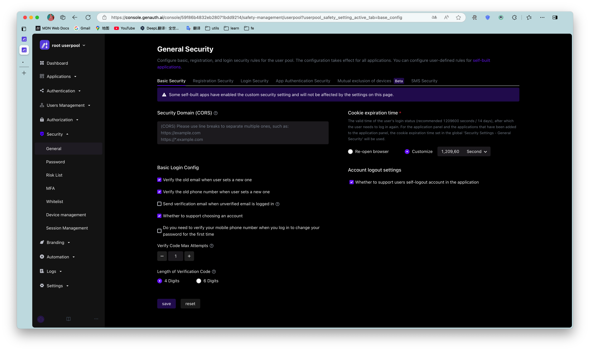

# Configure Web security domain

<LastUpdated/>

Path: **Security Settings->General Security->Basic Security**

::: hint-info
This feature is not currently supported in the free version.
:::

For Web applications, there is a risk of userPoolId/secret being stolen, so we need to take some special defensive measures. The key point is that we must be able to ensure that others cannot directly use your server resources even if they obtain your userPoolId. The Web side can limit the request source through the Web security domain name, which can simply prevent the theft of Web server resources.

After setting **Security Domain (CORS)**, server resources can only be called through the JavaScript SDK under this domain name. Note: The domain name configuration strategy is consistent with the browser domain security strategy, requiring the domain name protocol, domain and port number to be strictly consistent. Subdomains and wildcards are not supported, otherwise access will be prohibited. Let's take an example to illustrate the difference between domain names:

```
// Cross-domain
www.a.com:8080
www.a.com

// Cross-domain
www.a.com:8080
www.a.com:80

// Cross-domain
a.com
www.a.com

// Cross-domain
xxx.a.com
www.a.com

// Different protocols, cross-domain
http:
https:

```

This can prevent others from stealing your server resources through other addresses on the external network. However, it should be noted that the purpose of the Web security domain name is to defend against malicious deployment, not to defend against forged dirty data (malicious users may still access the application data by binding the host), so if you want to have more fine-grained control over the data, you need to use it with ACL.

When used in WebView, it is recommended to load a deployed Web with a domain name through WebView, and then cache it locally, so that you can restrict it through the Web security domain name.

If you use JavaScript SDK on the front end, please be sure to configure the web security domain name when you plan to officially release it.


