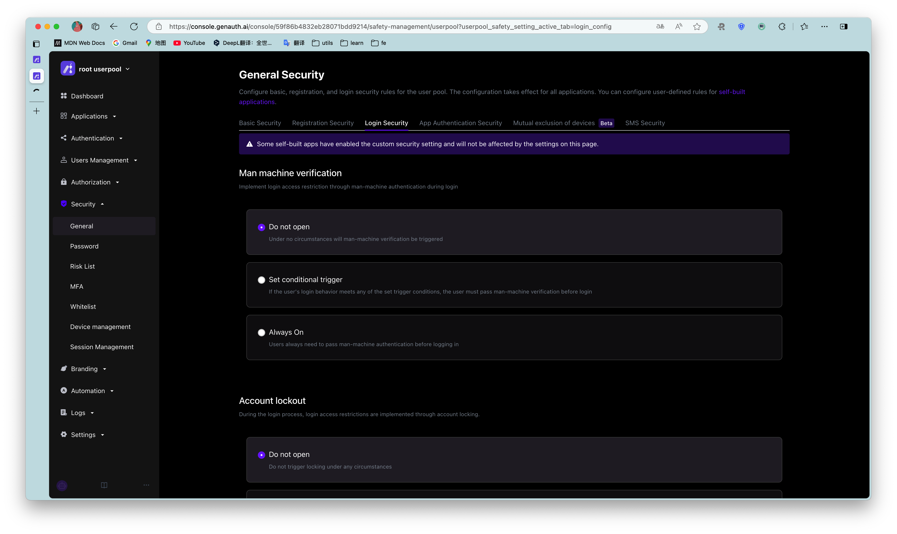
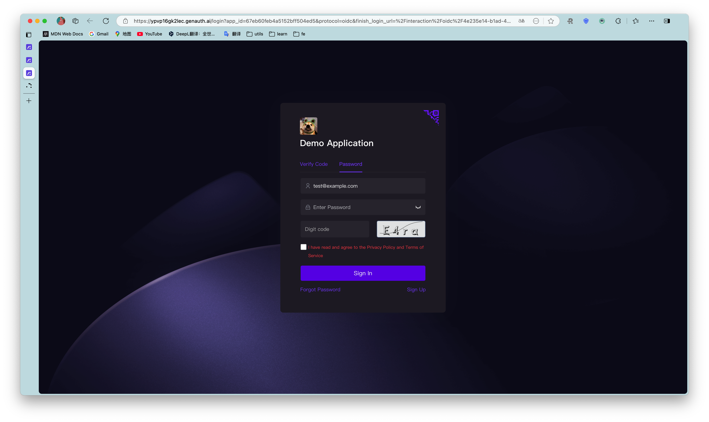

# Configure login failure limit

<LastUpdated/>

Path: **Security Settings->General Security->Login Security**

::: hint-info
The free version does not support this feature yet.
::: 

You can turn on the **Login Failure Limit** switch in the console to limit the number of failed logins for the same account within a certain number of seconds:

If the number of failed logins exceeds the specified time, the user needs to enter a graphic verification code to log in again:

