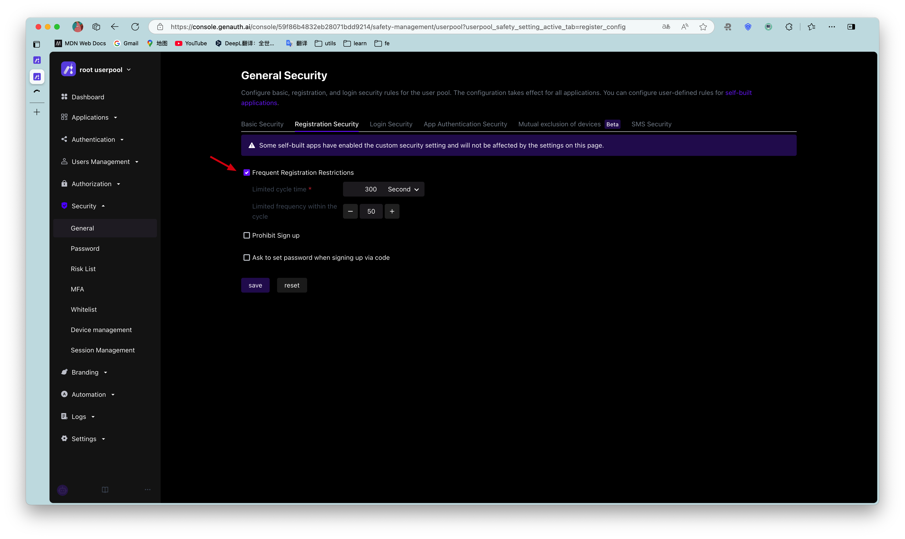

# Configure registration frequency limit

<LastUpdated/>

Path: **Security Settings->General Security->Registration Security**

::: hint-info
The free version does not support this feature yet.
::: 

You can turn on the **Frequent Registration Limit** switch in the console to limit the number of registrations per IP within a certain number of seconds:

