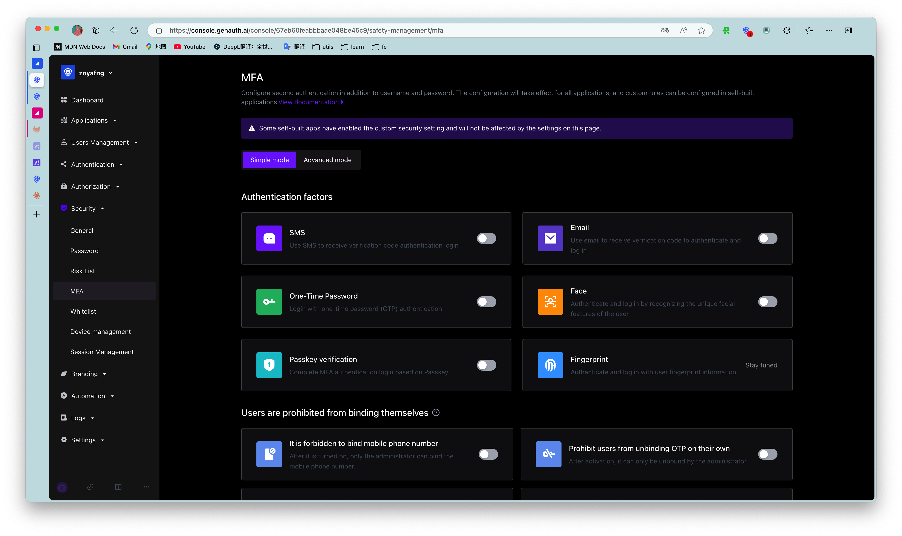

# Multi-factor Authentication Overview

<LastUpdated/>

::: hint-info
For information about the {{$localeConfig.brandName}} user pool version that supports the various benefits of the "Multi-factor Authentication" feature, please check the [Official Website "Pricing" page](https://www.genauth.ai/pricing). If your version does not support this benefit and you want to try it out, you can activate the trial period. For an introduction to the trial period and how to activate it, please check the [Trial Period](/guides/basics/trial/README.md).
:::

Multi-factor Authentication (MFA) is a very simple security practice that can add an extra layer of protection beyond the username and password. After enabling MFA, when a user logs in, in addition to providing a username and password (the first authentication), a second authentication is required. Multi-factor authentication combined will provide higher security protection for your account and resources. You can learn about [What is Multi-factor Authentication](/concepts/mfa.md) here.

You can learn the following MFA authentication information in this section:

- [MFA based on SMS verification code](./sms.md)
- [MFA based on email verification code](./email-code.md)
- [MFA based on one-time password with timestamp algorithm](./totp.md)
- [MFA based on face recognition](./face-recognition.md)
- [Access MFA through SDK](./mfa-sdk.md)
- [MFA policy configuration](./policy-based-mfa-configuration.md)

