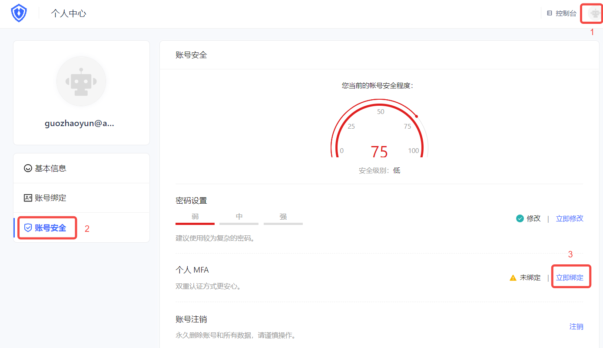

# MFA with one-time password based on timestamp algorithm

<LastUpdated/>

## Overview

Multi-factor authentication (MFA) is a security system that performs secondary identity authentication to verify the legitimacy of an operation. For example, the bank's USB shield requires SMS verification for remote login. This article introduces a one-time password (OTP) multi-factor authentication method consisting of a six-digit password that changes dynamically over time.

## Preparation

Role: Administrator

Before enabling OTP MFA, perform the following preparations:

1. <a :href="`${$themeConfig.consoleDomain}`">Register a {{$localeConfig.brandName}} account</a>.

2. [Create a user pool and application](/guides/basics/authenticate-first-user/use-hosted-login-page.md).

## Enable OTP MFA

Role: Administrator

### Enable application-level OTP MFA

::: hint-info
To configure application-level MFA, you must enable the **Customize security rules for this application** switch in **Applications->Self-built applications->Application details->Advanced configuration** before the **Security management** tab will appear.
::: 

To enable application-level OTP MFA, perform the following steps:

1. Select **Applications->Self-built applications** in the navigation menu on the left side of the console.

2. Select the application for which you want to enable OTP MFA in the list of self-built applications.

3. Go to the application details page, select **Security management**, and enable the **OTP password** switch in the **Multi-factor authentication** module.

### Enable global OTP MFA

To enable global OTP MFA, perform the following steps:

1. Select **Security settings->Multi-factor authentication** in the navigation menu on the left side of the console.

2. Enable the **OTP password** switch in the **Multi-factor authentication** module.

3. Select the applicable identity source in the **Policy Configuration** module and turn off the MFA switch of other irrelevant identity sources.

## Login using OTP MFA

### Experience login

Role: Administrator

To experience OTP MFA, administrators should perform the following steps:

1. Select **User Management->User List** in the navigation menu on the left side of the console, click the **Create User** button to create a user for OTP MFA login by **Username/Mobile Number/Email**.

2. Select **Application->Self-built Application**, click the **Experience Login** button in the upper right corner of the target application details page, and log in with the account created above.

3. Bind OTP.

* Method 1:

        
a. Click **OK** to open the MFA binding scan code window.

b. Download and open Google Authenticator / Microsoft Authenticator APP on your mobile phone (Microsoft Authenticator is used as an example to add MFA below.), click the + button in the upper right corner, select **Other (Google, Facebook, etc.)**, and scan the code to add MFA.

After scanning the code, you can view the newly added MFA in the account list of the APP.

c. Enter the dynamic password displayed on the MFA on the computer, click **Next**, back up the key, check the Save key prompt below, and click **Next** to complete the confirmation binding.

::: hint-info
Be sure to keep the recovery code shown here properly. If you lose your MFA and cannot log in with your MFA password in the future, you can use this key to restore account access.
:::

The system prompts that the authentication is successful.

* Method 2:
        
To bind OTP, follow these steps:

a. Visit `https://<your application domain name>.{{$themeConfig.officeSiteDomain}}` to log in. Then visit `https://<your application domain name>.{{$themeConfig.officeSiteDomain}}/u` and click the avatar in the upper right corner of the page to enter the **Personal Center**.

b. Select **Personal Center->Account Security->Personal MFA**, and click the **Bind Now** button to bind MFA.

c. Download and open Google Authenticator / Microsoft Authenticator APP on your mobile phone (Microsoft Authenticator is used as an example to add MFA below.), click the + button in the upper right corner, select **Other (Google, Facebook, etc.)**, and scan the web console QR code.

After scanning the code, you can view the newly added MFA and the generated dynamic password in the account list of the APP.

d. Click **Next** on the web page and enter the dynamic password.

e. Back up the key, check the Save Key prompt below, click **Next** to complete the confirmation binding, and click **Next**.
    
The prompt is successful.

### User login

Role: Ordinary user

The user's OTP MFA login method is similar to the administrator's login experience. Please refer to the above methods 1 and 2.

If the user has completed the OTP MFA binding, the next time you log in, you can perform the following steps:

1. Visit `https://<your application domain name>.{{$themeConfig.officeSiteDomain}}`. Use the account bound to MFA to log in. After the first identity authentication, you will be prompted to enter the security code for the second authentication.

2. Check the mobile Authenticator APP and enter the dynamic password to complete the second authentication and log in.

## Unbind OTP MFA

Role: Ordinary user

To unbind the MFA binding between Authenticator and the console, perform the following steps:

1. Select **Personal Center->Account Security->Personal MFA**.

2. Click the **Modify Now** button.

3. Click the **Unbind** button in the upper right corner of the **MFA Binding** page that opens, and confirm the unbinding.

The message says that the unbinding is successful.

## Disable OTP MFA

Role: Administrator

To disable OTP MFA, you can disable the function at the application level and globally:

* Disable application-level OTP MFA: Go to the application details, select **Security Management**, and disable the **OTP Password** switch in the **Multi-Factor Authentication** module.

* Disable global OTP MFA: Select **Security Settings->Multi-Factor Authentication**, and disable the **OTP Password** switch in the **Multi-Factor Authentication** module.
