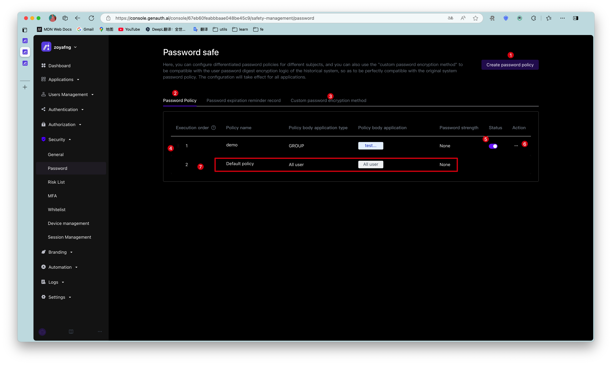

# Password Security

<LastUpdated/>

Path: **Security Settings->Password Security**

::: hint-info
For information about the {{$localeConfig.brandName}} user pool version that supports the various benefits of the "Password Security" function, please check the [Official Website "Pricing" Page](https://www.genauth.ai/pricing). If your version does not support this benefit and you want to try it, you can activate the trial period. For an introduction to the trial period and how to activate it, please check [Trial Period](/guides/basics/trial/README.md).
:::

Passwords are related to the information security of enterprises and users. The system will require users to meet a certain level of complexity when registering or changing passwords.

In addition, enterprises may include different user groups: internal employees, outsourced employees, partners, etc., and different groups require different password rules. {{$localeConfig.brandName}} supports configuring differentiated password policies for different entities, and adjusting the execution priority by moving the policy order up and down. At the same time, it also supports **custom password encryption method** to be compatible with the user password summary encryption logic of the historical system, so as to achieve perfect compatibility with the original system password policy.

::: hint-info
The configuration will take effect on all applications.
:::

<table>
<tr>
<th>Serial number</th>
<th>Element</th>
<th>Description</th>
</tr>

<tr>
<td valign="center">1</td>
<td>Create password policy</td>
<td>
<ul>
<li>Click this button to create a new password policy. </li>
<li>You can create up to 30 password policies (including the default policy); when the upper limit is reached, the button will be grayed out. </li>
</ul></td>
</tr>

<tr>
<td valign="center">2</td>
<td>Password Policy</td>
<td>Show the password policy list, including the system default policy and the policy created by the administrator. </td>
</tr>

<tr>
<td valign="center">3</td>
<td>Custom password encryption method</td>
<td>Compatible with the user password summary encryption logic of the historical system. </td>
</tr>

<tr>
<td valign="center">4</td>
<td>Execution order</td>
<td>Execute password policies from top to bottom. You can adjust the execution order of policies by pressing and holding the icon on the left (visible when the mouse is hovering) and dragging. </td>
</tr>

<tr>
<td valign="center">5</td>
<td>Status</td>
<td>After creating a new password policy, the policy is enabled by default. It can be closed as needed. After closing, the current policy will not be executed. </td>
</tr>

<tr>
<td valign="center">6</td>
<td>Delete</td>
<td>Click the More button in the <b>Operation</b> column to delete the currently selected password policy.  <b>Note:</b> 
<ul>
<li>After deletion, it cannot be restored. Please operate with caution! </li>
<li>If all application subjects of the current policy are deleted, the system will automatically delete the policy. </li>
</ul>
</td>
</tr>

<tr>
<td valign="center">7</td>
<td>Default Policy</td>
<td>
<ul>
<li>The default policy is effective for all user subjects and applies globally. </li>
<li>The password strength is not detected by default. </li>
<li>You can click to enter the policy details to modify <b>password strength</b> and <b>password rotation policy</b>. </li>
<li>The default policy is placed at the bottom of the policy list and cannot be adjusted, closed, or deleted. </li>
</ul>
</td>
</tr>
</table>
