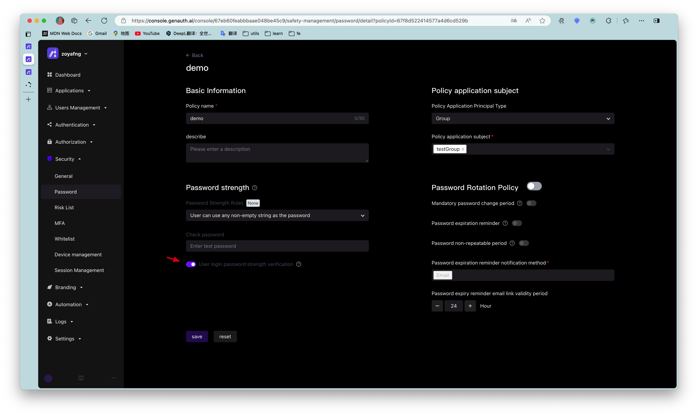
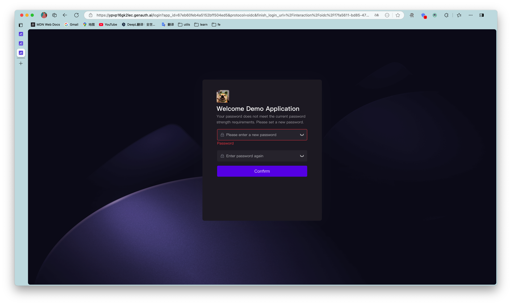
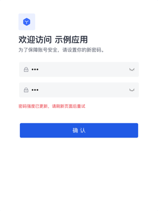

# Password Policy

<LastUpdated/>

To configure a password policy for a subject, perform the following steps:

1. On the **Password Security** page, click the **Create Password Policy** button in the upper right corner of the page.  Open the **Create Password Policy** page.

2. Fill in the **Policy Name** and **Description** in the **Basic Information** module.

::: hint-info
The password policy name must be unique.
**Description** is a maximum of 200 characters.
::: 

3. In the **Policy Application Subject** module, select **Policy Application Subject Type**.

::: hint-info
You can filter subjects by **User**, **Organization** (optional for toE), and **Group**.
::: 

4. Select **Policy Application Subject**.

::: hint-info
* The data sources of **User**, **Organization** (optional for toE) and **Group** come from **User List**, **Organization** (optional for toE) and **User Group Management** in **User Management** respectively.
* Multiple subjects of the same type can be selected.
* If the selected subject is deleted in the data source, the password policy to which the subject belongs will be linked to delete the subject.
:::

5. Select the applicable password strength (**No detection**, **Low strength**, **Medium strength**, **High strength**, **Custom strength**).

::: hint-info
* The password strength set here applies to user registration password, user password reset and user password modification.
* Password strength is not detected by default.
* For custom password strength rules, you need to define a regular expression below and enter a password error prompt.
:::

6. Enter a password in the **Password Detection** field to detect whether the password meets the password strength rules set above.  If it meets the requirements, a green check mark will be displayed after the input box; if it does not meet the requirements, an error message will be displayed after the input box, and the user needs to modify the information according to the message.

7. Turn on the **User login password strength check** switch (off by default).

::: hint-info
After turning it on, when a higher password strength rule is set, log in to an account with a lower password strength and jump to the password modification page.
::: 

::: hint-info
If the administrator increases the password strength when the user is modifying the password, the page will prompt the user to refresh the page and try again.
:::

8. Set password rotation policy (default closed).

* **Forced password change period**: After the selected period, the user will be forced to change the password when logging in.

* **Password expiration reminder**: Send an email reminder to the user once a day during the expiration period until the user successfully changes the password.

::: hint-info
* The user must change the password when logging in.
* Administrators can modify the email template in **Branding->Message Settings**.
:::

* **Password non-repeatable period**: During the selected period, when the user changes or resets the password, the password used in the past cannot be used again.

9. Click **Create**.  The newly created password policy will be displayed at the top of the **Password Security->Password Policy** list.

::: hint-info
* When modifying an existing password policy, the **Save** and **Reset** buttons are below.
* Click **Reset**, and all modified but unsaved configurations will be restored to the state after the last save.
::: 