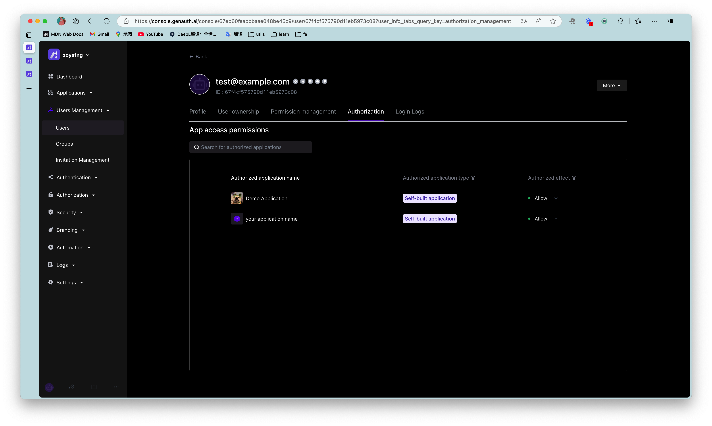

# Control which applications a user can access

<LastUpdated/>

Path: **User Management->User List->User Details->Application Authorization**

You can view all applications that the user can currently access on the **Application Authorization** tab of the user details page:

You can control whether the current user can access an application through the application access permission switch.