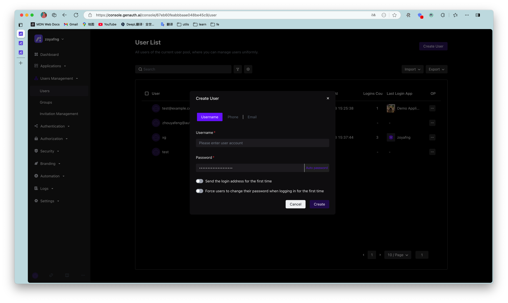

---
meta:
  - name: description
    content: Administrator creates account
---

# Administrator creates account

<LastUpdated/>

The differences and similarities between administrator creates account and user registers account:
- Administrator creates account and is not subject to "prohibit registration" configuration restrictions;
- Administrator creates account and is not subject to "registration whitelist" restrictions;
- Administrator creates mobile phone account and does not need verification code, but user registers by himself;
- The `phoneVerified` field of the mobile phone account created by administrator is `false`, while the field of the user registers by himself is `true`;
- Neither administrator creates account nor user registers by himself and cannot create duplicate email, mobile phone number, username.

Administrator can create user through [console](#Use console to create user) or [SDK](#Use -sdk- to create user).

## Use console to create user

You can manually create account in **User Management** - **User List** of console:

> You can create account by email and mobile phone number.

## Create a user using SDK

<StackSelector snippet="create-user" selectLabel="Select language" :order="['java', 'javascript', 'python', 'csharp']"/>
