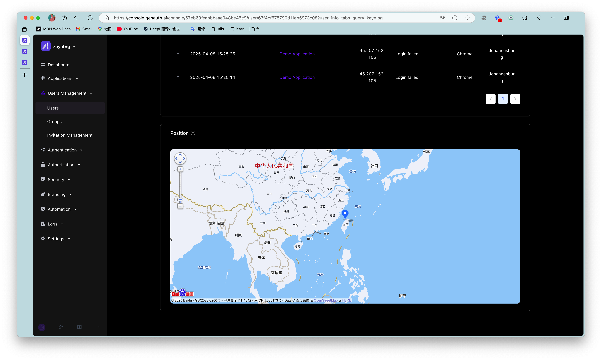

---
meta:
  - name: description
    content: View the user's geographic location
---

# View the user's geographic location

<LastUpdated/>

You can view the user's most recent login location on the **User Details** page:

