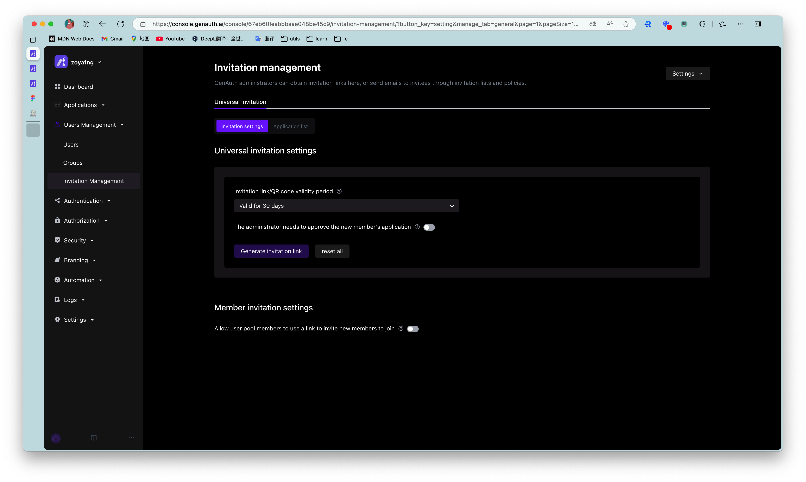
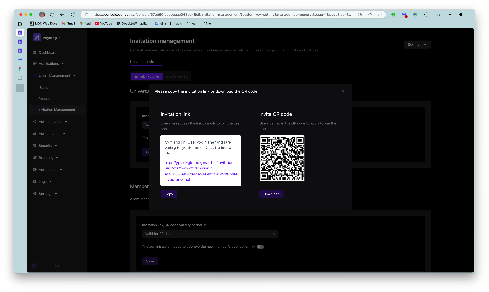
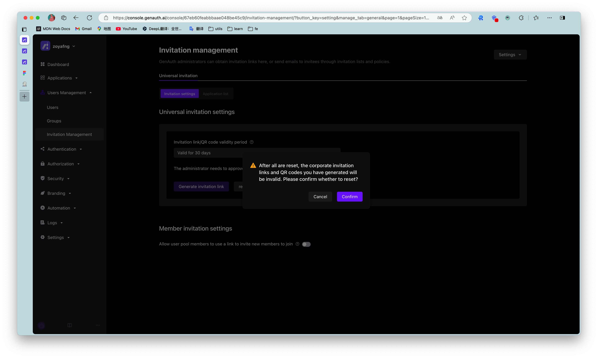
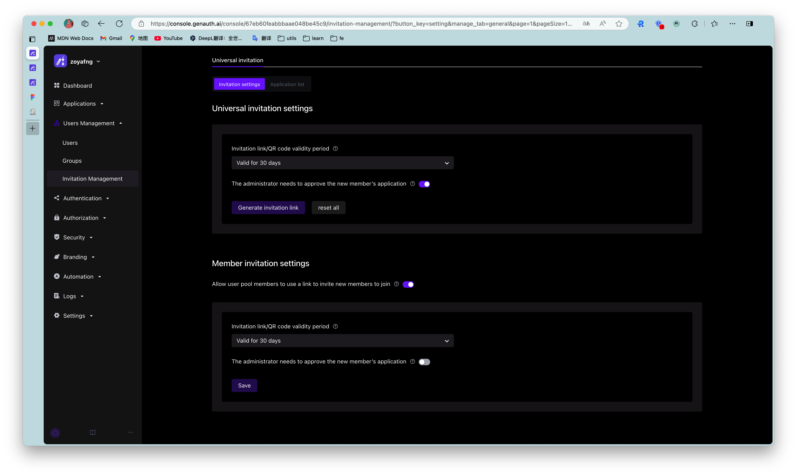
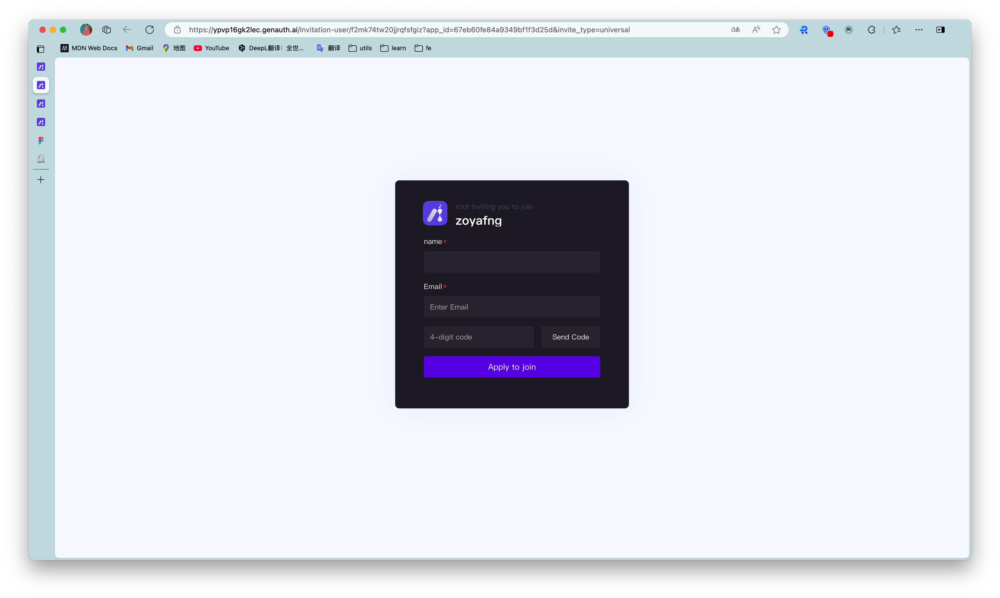
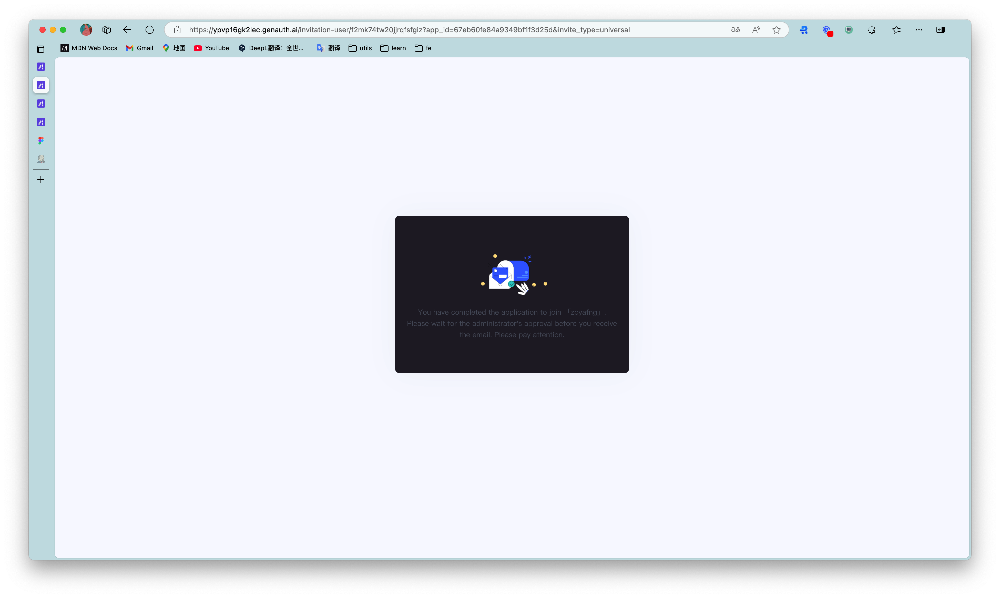
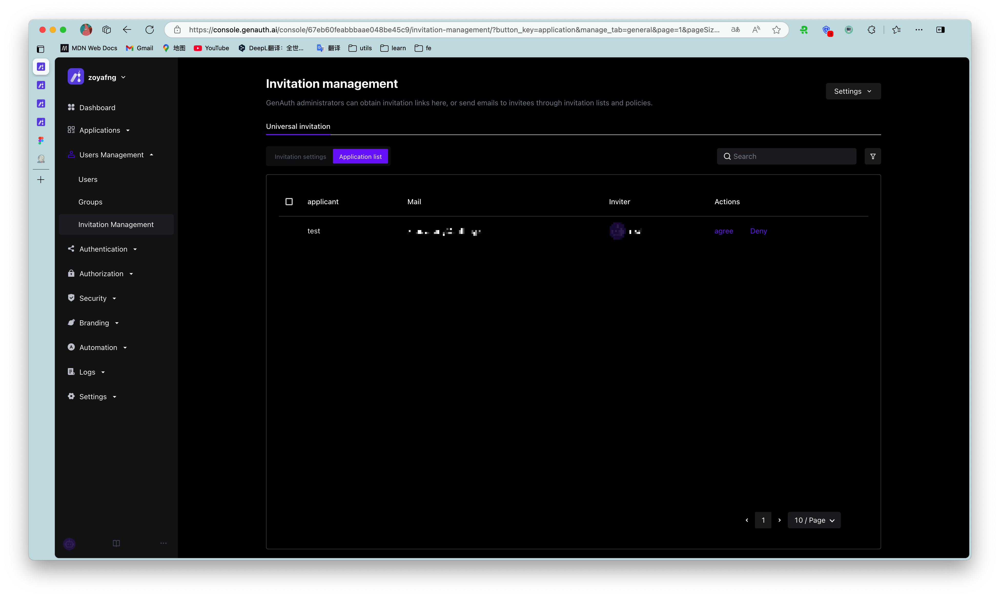

# Invitation Management

::: hint-info
The user invitation function provided by GenAuth supports multiple scenarios and can meet the general invitation capabilities in most SaaS scenarios at home and abroad:

- Offline distribution of invitation links/QR codes, users apply to join by themselves;
  :::

## Overview

1. This update will support administrators to invite new users in the following ways:

- **General invitation**: When the administrator does not know the contact information (email) of the new user, you can generate and copy the invitation link on the "General Invitation" page and send it to the new user. See below for details. And ordinary users in the user pool can also generate and copy invitation links to invite new users;

2. Support the "Quick Query" page to quickly query the status and locate the list of invitees by the name of the invitee;
   Based on GenAuth's existing personal user account system, GenAuth has launched the public account function. This function mainly helps enterprises in complex business and system systems to achieve the ability to access multiple public account resources after personal account authorization login by associating public accounts with personal users, departments, positions, user groups and roles.

## Function details

### General invitation

#### 1. Set up a general invitation link

- Support setting the validity period of the invitation link;
- Support setting the department to which a new user belongs after joining the user pool;
- Support enabling the administrator approval function. After enabling it, a new user can successfully join only after the administrator agrees in the "application list" after submitting the application. If it is closed, it is deemed that the system agrees to the application and you can join directly;

---

- ​​Click "Generate Invitation Link" to generate a link and QR code according to the settings above:
  

---

- ​​After "Reset All", all invitation links generated by the current administrator will be invalid:
  

#### 2. Set up ordinary user invitation links

- After turning it on, you can add buttons and other interactive modes on the business system page for users to generate invitation links;

#### 3. Invitation page

- Click the general invitation link to jump to the page above, where you need to fill in your name and email address to apply to join;
- After submitting the "Application to Join", you will receive a welcome email after approval, which includes: login address, login account, initial password and other information;

#### 4. Application List

- Administrators can go to "Invitation Management-General Invitation-Application List" to approve new members' applications to join;
- The list can view the applicant's name, email address, inviter, approver, approval results, etc.;
