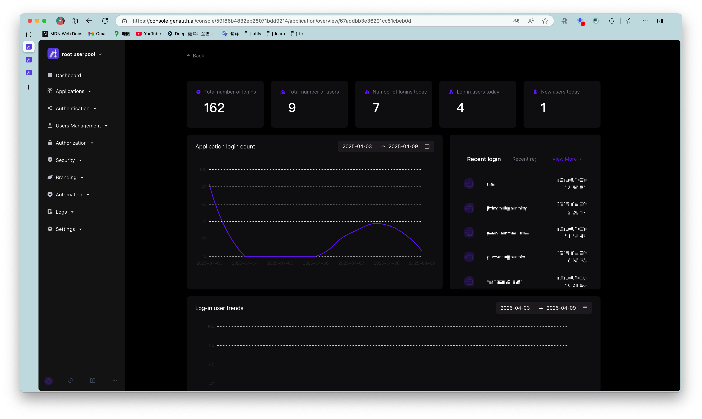
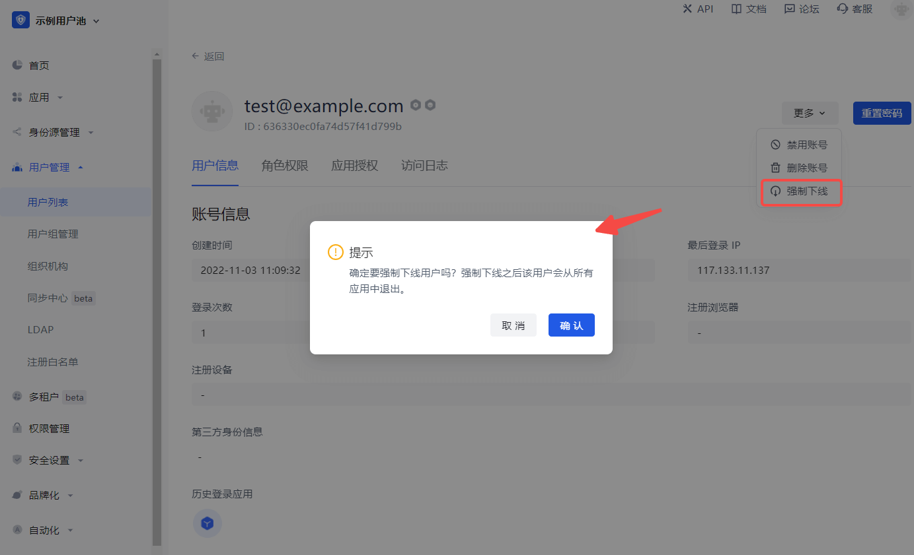

# Manage user login status

<LastUpdated/>

## View currently logged in users

Path: **Application->Self-built application->Application details page**

You can click the **Data Overview** button in the upper right corner of the application details page to view all users currently logged in to the application, as well as their last login time and other information.

## Force offline

Path: **User management->User list->User details page->User information**

You can also click the **More** button in the upper right corner of the **User information** tab to **Force offline** and confirm the offline.

This operation will force the user to exit all applications under this user pool.

