---
meta:
  - name: description
    content: Manage user accounts
---

# Manage user accounts

<LastUpdated/>

Manage user accounts, including forgotten passwords, email verification, changing email addresses bound to mobile numbers, multi-factor authentication, as well as disabling user accounts, binding social logins, and account merging. If you use {{$localeConfig.brandName}}, congratulations, all these features are built-in, and you only need to spend a very short time to complete them quickly.

## Use hosted login page and personal center

{{$localeConfig.brandName}} provides developers with a built-in, beautiful, highly configurable login form, which you can [experience here](https://sample-sso.genauth.ai/) (hereinafter we refer to this login form as `Guard`), the address is `https://<YOUR_DOMAIN>.genauth.ai/`:

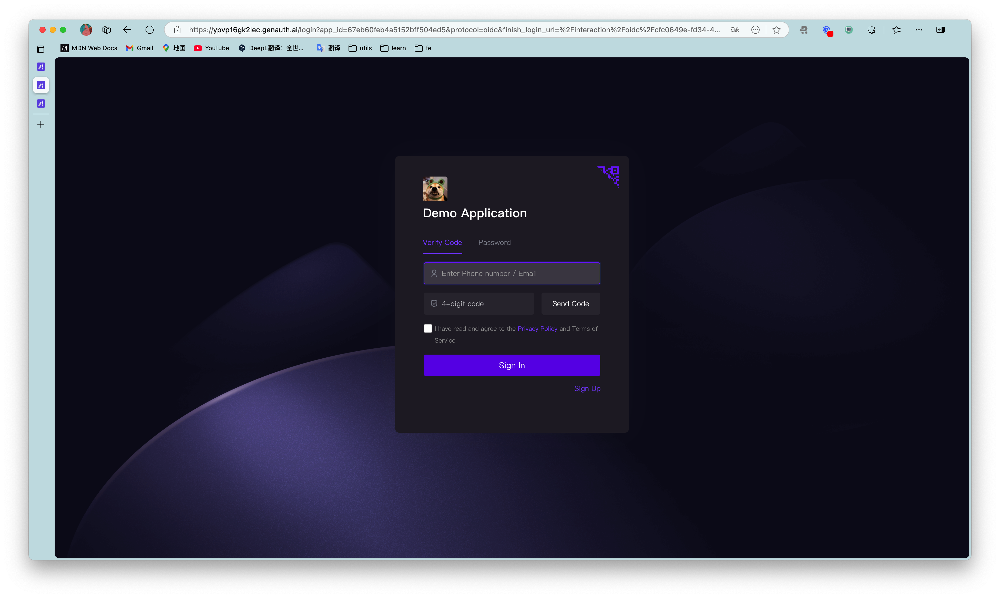

You can perform login registration, forget password, reset email, send SMS verification code, scan code login and other functions.

And a user personal center, you can [experience here](https://sample-sso.genauth.ai/u), the address is `https://<YOUR_DOMAIN>.genauth.ai/u`:

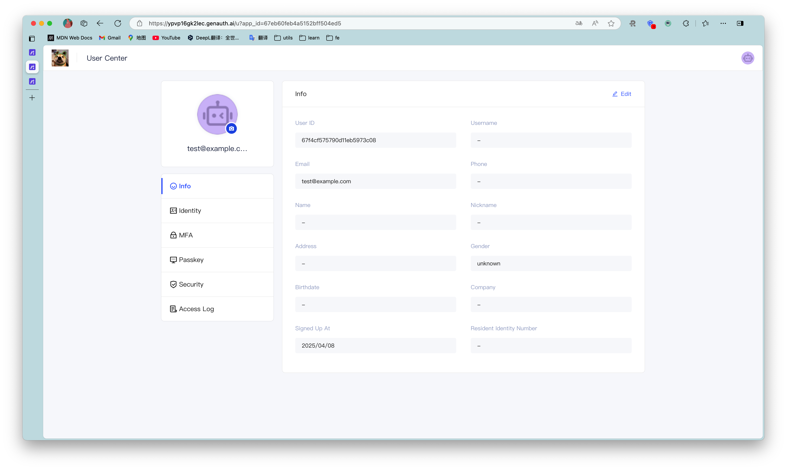

With the hosted login page and personal center, users can complete self-service personal information management.

### Modify account information

{{$localeConfig.brandName}} provides a built-in user personal center page (address: `https://<YOUR_DOMAIN>.genauth.ai/u`), which can complete the modification of user basic information:

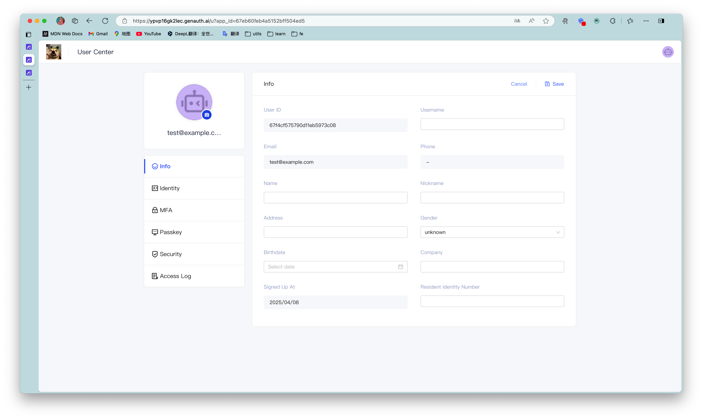

### Modify password

When the user remembers the current password, he can modify the password by verifying the current password:

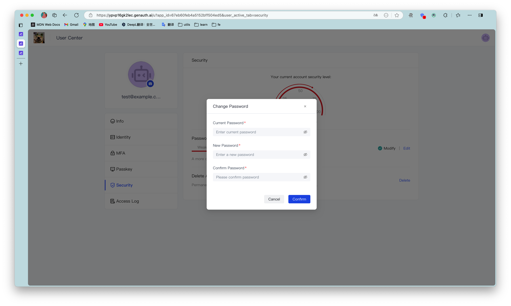

### Forgot password

When the user forgets the current password, he can reset the password through the following process:

Click Forgot password

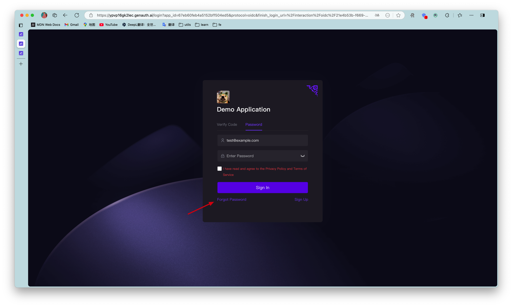

You can choose to use email or mobile phone number for verification:

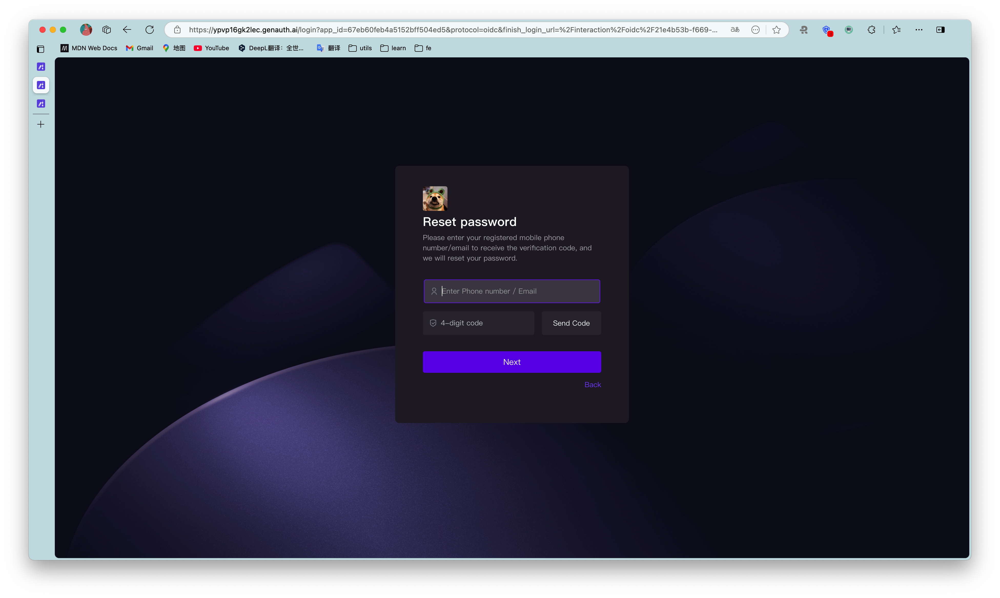

### Bind email and mobile phone number

Terminal users can use the **Account Binding** Tab in the Personal Center Bind and unbind email or phone number in:

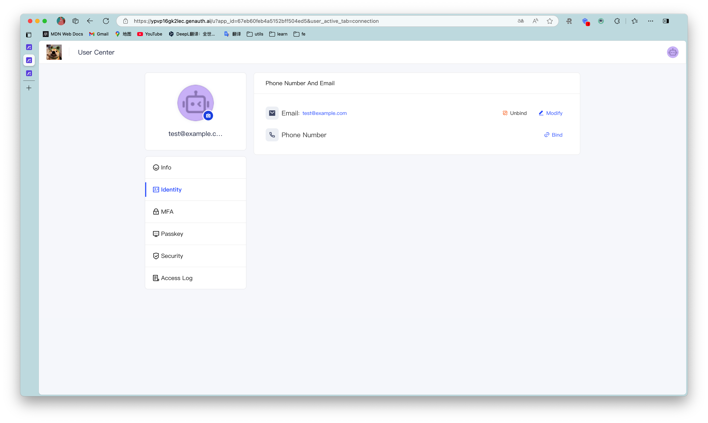

### Bind MFA

End users can bind MFA in the **MFA Bind** Tab in the Personal Center:

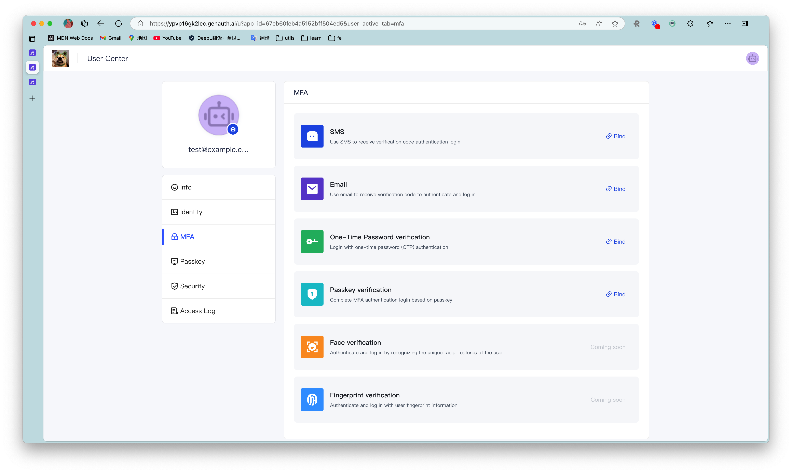

## Use the console

Administrators can use the console to visually manage user accounts.

### Edit user information

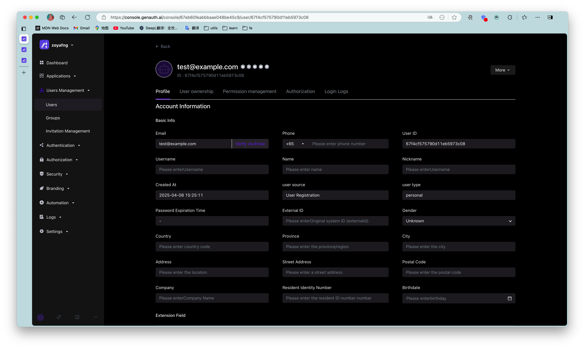

### Disable account

Administrators can disable accounts on the user details page. Disabled accounts will not be able to log in again:

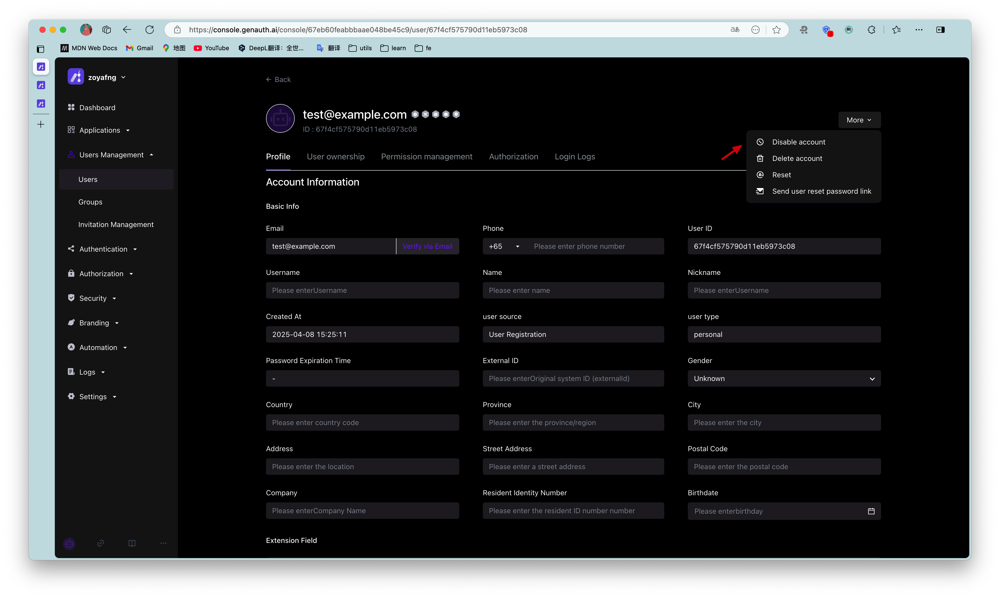

### View raw user information

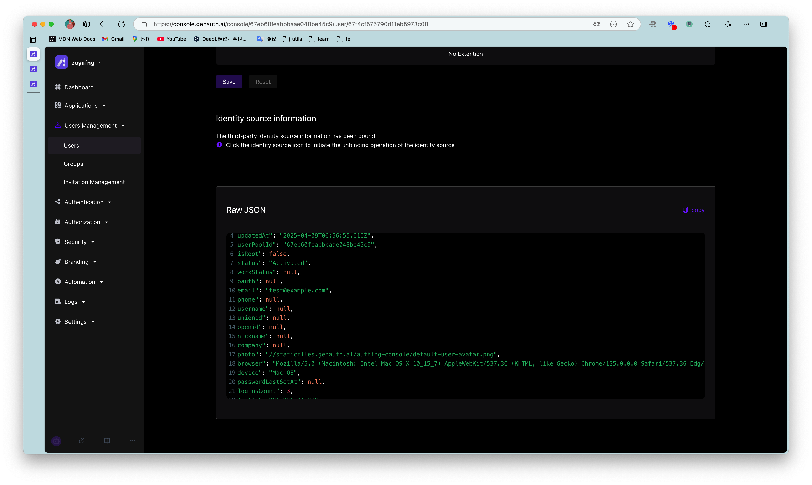

## Use SDK/API

{{$localeConfig.brandName}} provides Authentication SDK/API and Management SDK/API. You can use Authentication API and complete user self-service personal account information management. Use Management SDK/API to manage user information as an administrator. Operations performed as an administrator do not require verification methods such as mobile phone number verification code, email verification code, MFA, etc.

!!!include(common/sdk-list.md)!!!
