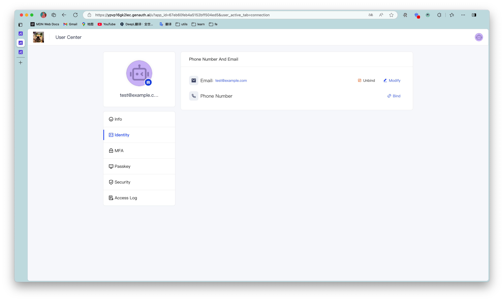
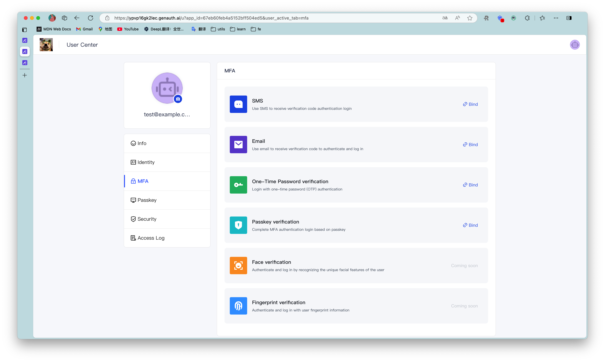

# Enhance Account Security

<LastUpdated/>

The security of user accounts is extremely important. You can enhance the security of user accounts in the following ways.

## Configure a stronger password

You can configure the password strength in the **Security Settings->Password Security** page. After setting the password strength, the system will require all users to register and modify their passwords to meet a certain complexity.

A highly secure password can make the account more secure. It is recommended that users change their passwords regularly.

## Bind a mobile phone number

After binding a mobile phone number, you can use the mobile phone verification code to log in without entering a password, which is safer and more convenient. End users can bind their mobile phone numbers in the application personal center (address is `https://<YOUR_APP_DOMAIN>.genauth.ai/u`), or you can use [SDK](/reference/sdk-for-node/authentication/AuthenticationClient.md#Bind a mobile phone number) to operate.

## Bind personal MFA

After binding personal MFA, users need to perform secondary verification when logging in, which can more effectively protect the user's account security. End users can bind MFA in the application personal center (address is `https://<YOUR_APP_DOMAIN>.genauth.ai/u`), or you can use [SDK](/reference/sdk-for-node/authentication/mfaAuthenticationClient.md) to operate.

