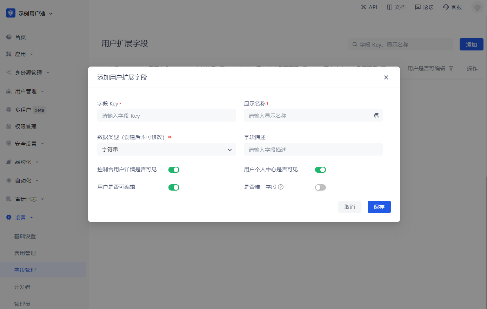
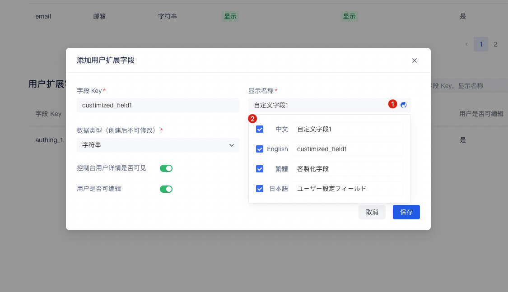
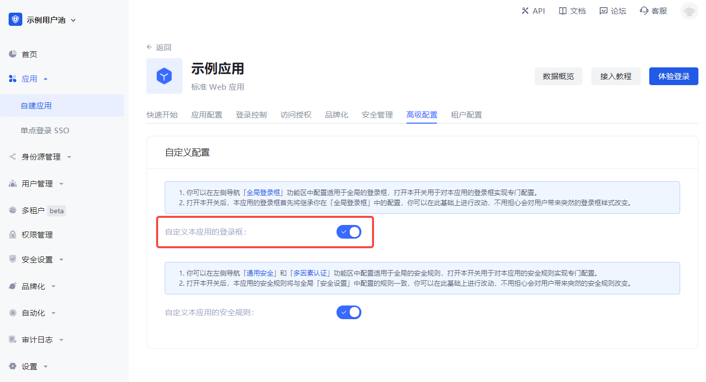
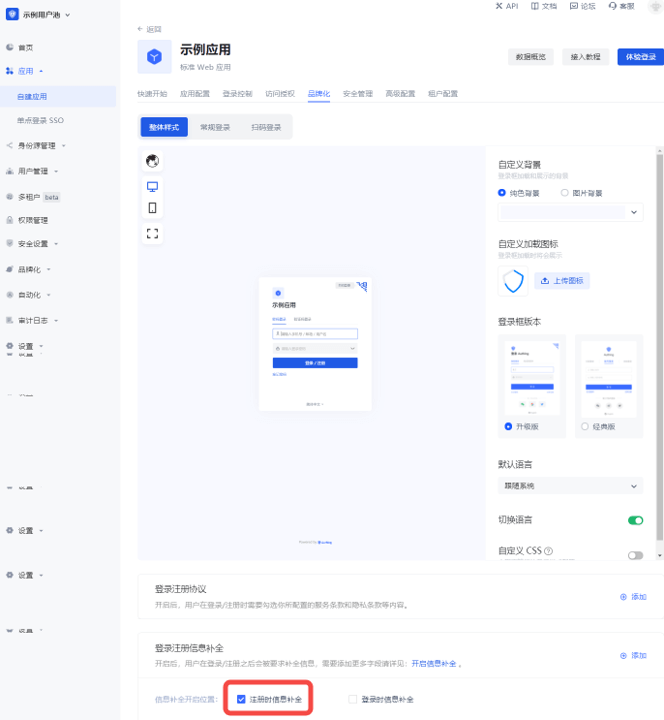
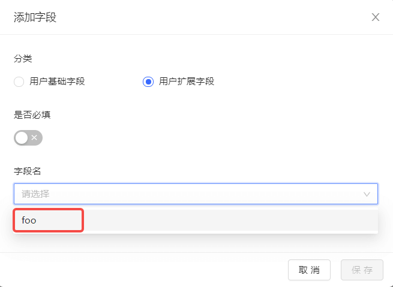
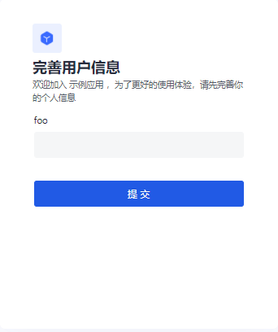
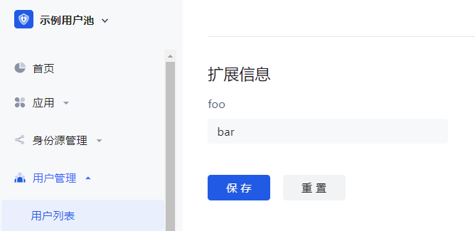

# Manage user custom data

<LastUpdated/>

Path: **Settings->Field Management->User Field Management->User Extended Field**

User custom fields are additional fields that can be added to user objects in addition to [basic user fields](/guides/user/user-profile.md). Developers can store **a small amount** of business-related data by setting custom fields.

## Configure custom user fields

You can define the following types of custom fields:

- String;
- Numeric;
- Date;
- Boolean;
- Enumeration;

1. Create custom extended fields

You can configure custom user fields in the **Add user extended field** window:

    

When naming a newly created custom field, you can edit the display name of the field in multiple languages:

    - Edit directly in the input box under "Display name" to get the default displayed field name
    - Check "Chinese" and edit the field display name in the Chinese environment
    - Check "English" and edit the field display name in the English environment
    - Check "Traditional" and edit the field display name in the Traditional Chinese environment
    - Check "Japanese" and edit the field display name in the Japanese environment

In particular, if the display environment of the field is not included in the range of the above four language environments, the "default displayed field name" you configured will be used for display.
   

2. After configuring custom fields, you can open the registration information completion page of the application and let users complete the information of these custom fields.

    a. In **Application->Self-built application->Application details page->Advanced configuration** tab, turn on the **Customize the login box of this application** switch.

    

    b. Then switch to **Branding** and check the **Complete information during registration** switch in the **Login registration information completion** module.

    

    c. Add custom fields:

    

    d. Click **Save**.

3. Visit the app's login page.  After the user clicks register, he will jump to the following registration information completion page:

    

After the user successfully registers, you can see the custom field value just entered by the user on the user details page:

## Use API & SDK to manage user custom data

!!!include(common/sdk-list.md)!!!

<StackSelector snippet="udf" selectLabel="Select language" :order="['java', 'javascript', 'python', 'csharp', 'swift']"/>