# User Group Management

<LastUpdated/>

Path: **User Management->User Group Management**

Perform operations such as adding, deleting, modifying, and querying a group of users, and assigning authorizations.

## Create a group

Find User Management in the navigation bar and click the corresponding menu to enter the user group page

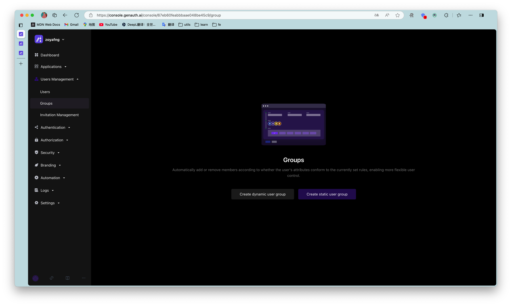

## Fill in group information

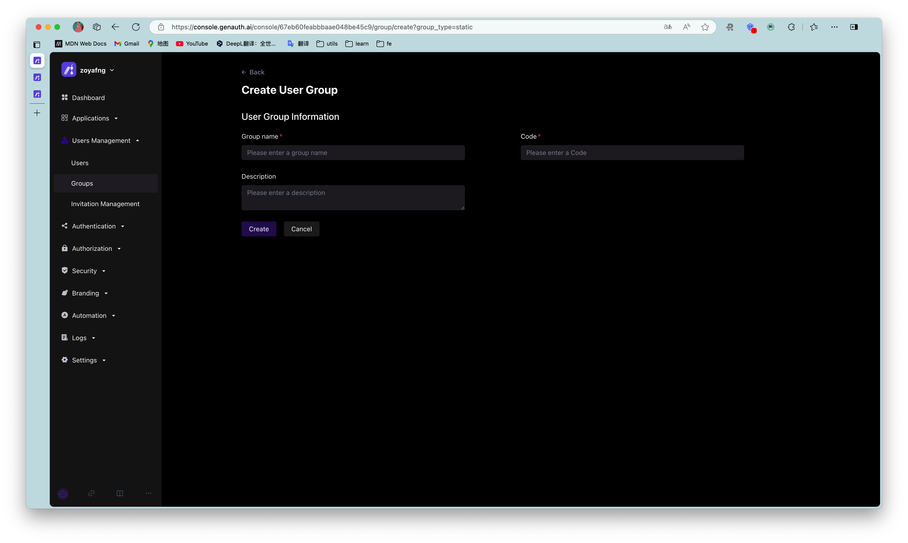

## Group list

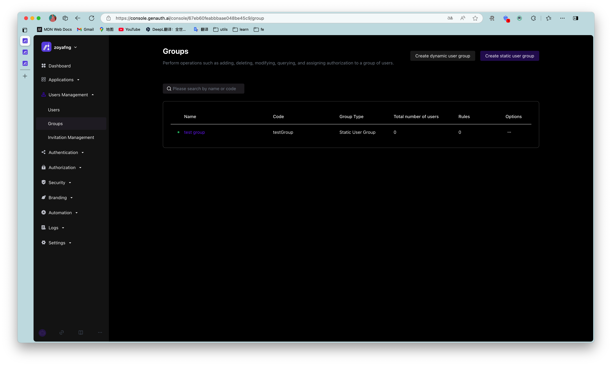

## Group details

1. Click Add Member.

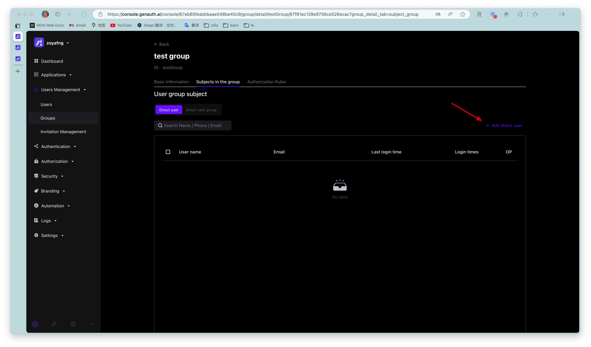

2. Select a member from the pop-up component or search for a member.

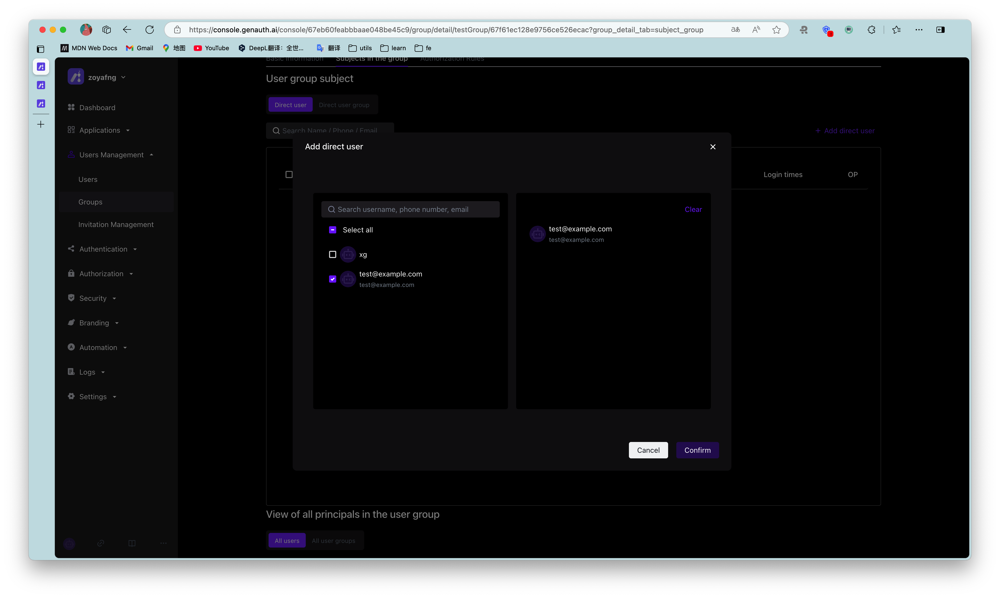

3. Click Confirm to add successfully.

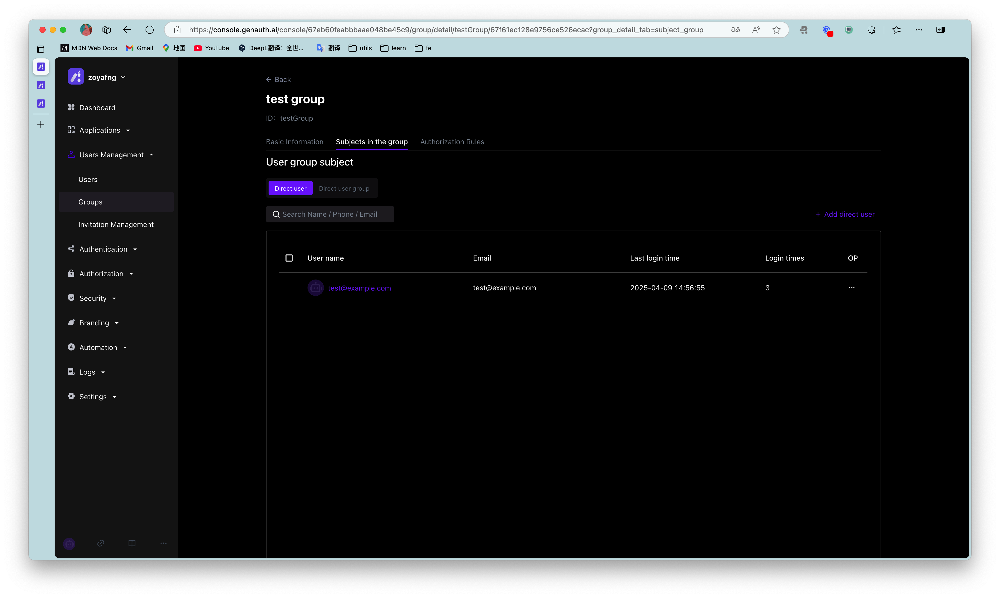

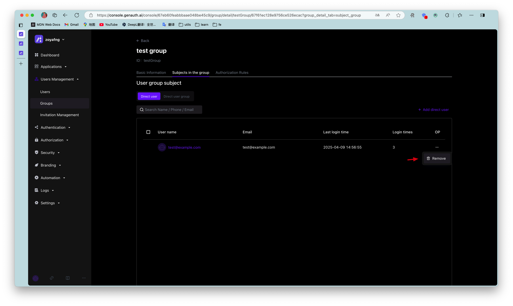

## Assign permissions

To assign permissions to user groups, perform the following steps:

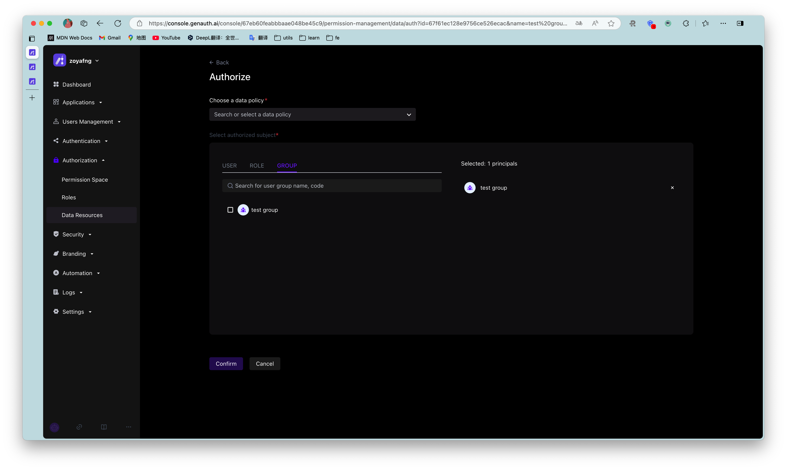

1. Click Add Authorization Rule.

2. Select **Permission Group** in the Authorization component, and specify **Permission Role** and **Resource**.

3. Specify the operation.

4. Add restrictions.

::: hint-info
To add multiple authorization rules to the current user group (specify other **Permission Group** / **Authorization Role** / **Resource** / **Operation** / **Restriction**), click **Add Authorization Rule** below the pop-up window.
:::

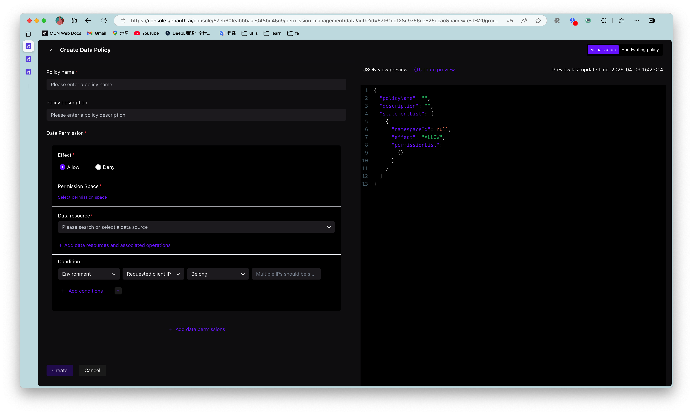

5. Click **OK**.   Authorization is successful.

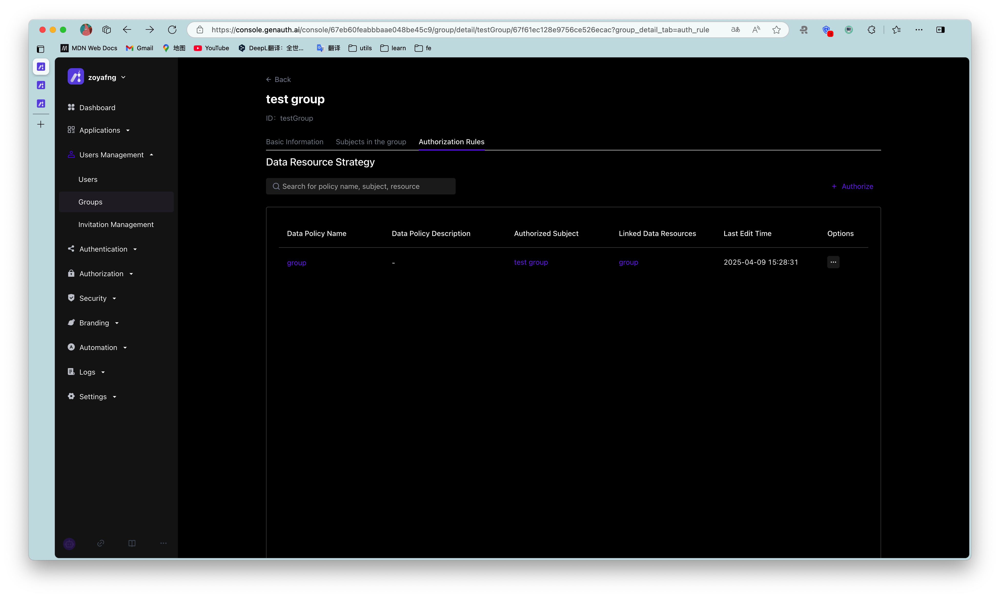

::: hint-info
Click **+** to expand the current authorization rule and display the rule details.
:::

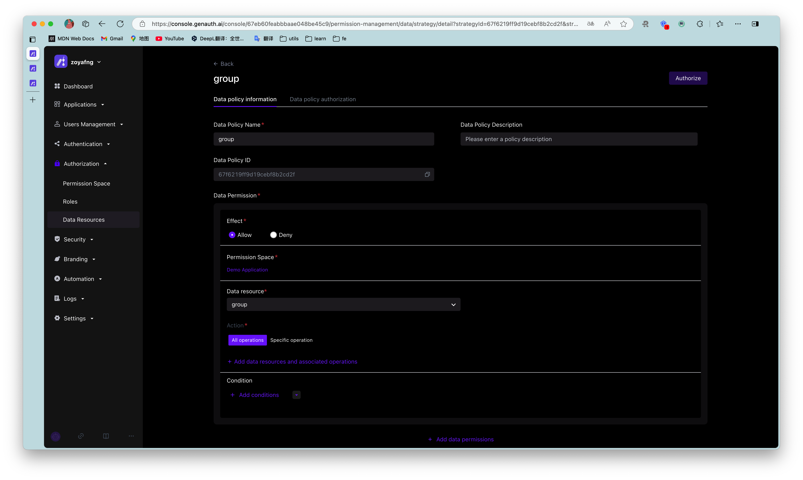

To cancel authorization, click the **Cancel Authorization** button in the **Action** column of the current authorization rule row:

