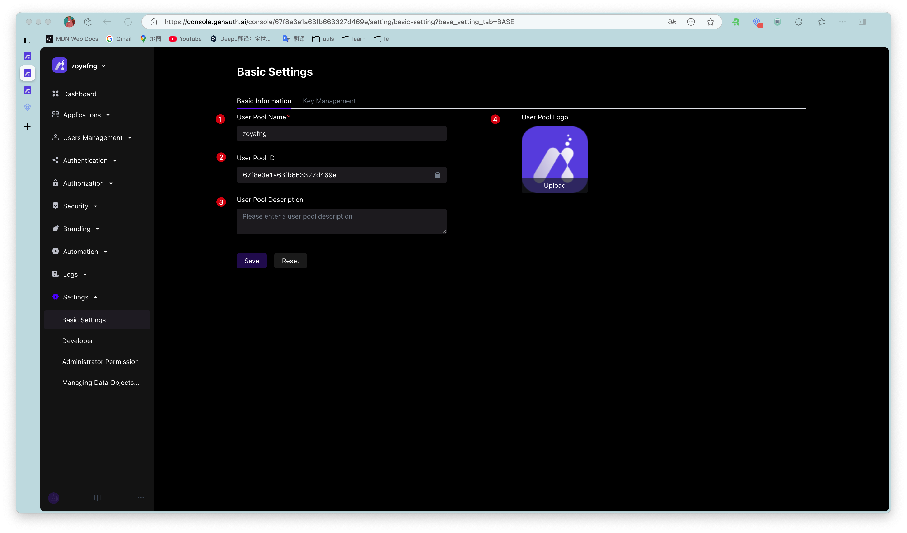
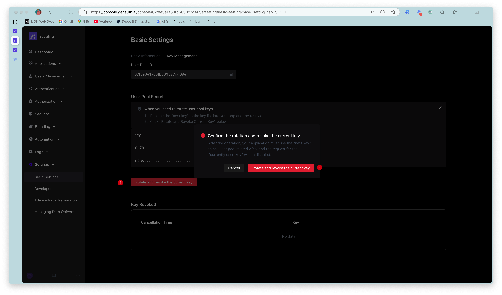
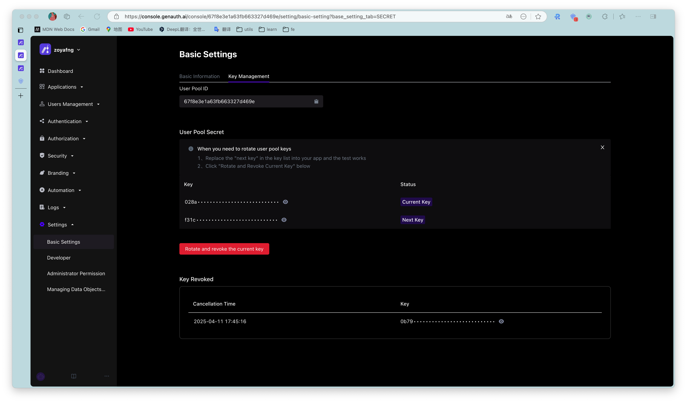

# Basic settings

<LastUpdated/>

::: hint-info
For information about the {{$localeConfig.brandName}} user pool version that supports the various benefits of the "Settings" function, please check the [official website "Pricing" page](https://www.genauth.ai/pricing). If your version does not support this benefit and you want to try it, you can activate the trial period. For an introduction to the trial period and how to activate it, please check [Trial Period](/guides/basics/trial/README.md).
:::

## Basic information

Path: **Settings->Basic Settings->Basic Information**

Administrators can modify the basic information of the user pool, configure the user pool authentication address, delete the user pool, and other operations on the **Basic Information** tab.

​

| Serial number | Field                  | Description                                                                                                                                                                                                                                                                                                                                                                                                                                                                                                                              |
| ------------- | ---------------------- | ---------------------------------------------------------------------------------------------------------------------------------------------------------------------------------------------------------------------------------------------------------------------------------------------------------------------------------------------------------------------------------------------------------------------------------------------------------------------------------------------------------------------------------------- |
| 1             | User pool name         | You can modify the user pool name in this field.                                                                                                                                                                                                                                                                                                                                                                                                                                                                                         |
| 2             | User pool ID           | The system automatically generates the ID when creating a user pool. You can click the copy button after the input box to copy the ID for configuring single sign-on and other scenarios.                                                                                                                                                                                                                                                                                                                                                |
| 3             | User Pool Description  | You can enter a brief user pool description here, which should accurately describe the user pool's business information and purpose of use to distinguish it from other user pools.                                                                                                                                                                                                                                                                                                                                                      |
| 4             | User Pool Logo         | Administrators can click the user pool logo to upload and replace the current system default logo image locally.                                                                                                                                                                                                                                                                                                                                                                                                                         |

## Key Management

Path: **Settings->Basic Settings->Key Management**

The user pool key can be used in multiple scenarios such as using tickets to exchange for user information. You can obtain the **User Pool ID** (`UserPoolId`) and **User Pool Key** (`UserPool Secret`) on the **Key Management** page of the console.

​

One user pool ID automatically generates two corresponding user pool keys:

- **Current key**: It is the key provided to customers for online use requests.

- **Next key**: It is a backup key automatically created in advance when customers are ready to change the key.

Currently, the user pool key of {{$localeConfig.brandName}} supports refresh rotation. To refresh and rotate the user pool key, perform the following steps:

1. Click the **Rotate and revoke current key** button.

2. Check the prompt information in the pop-up window and click **Rotate and revoke current key** to confirm.

​

3. The prompt "Rotation key successful" will be displayed, **Current key** will be disabled and enter the **Revoked keys** list, the status of **Next key** will be changed to **Current key**, and a new **Next key** will be automatically created.

​
