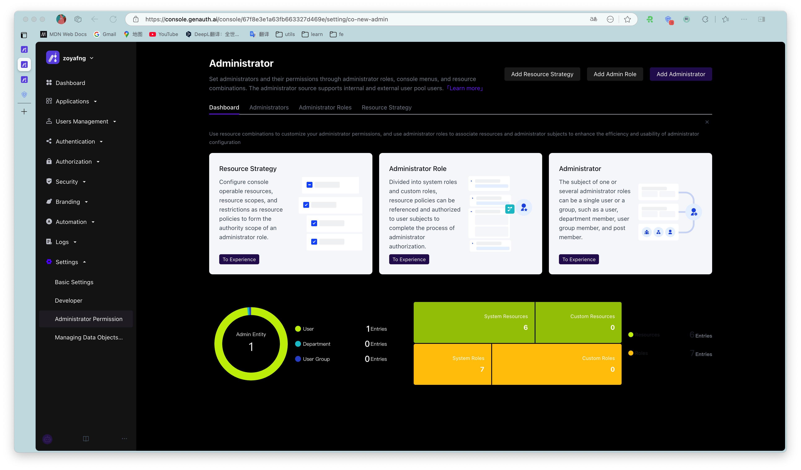
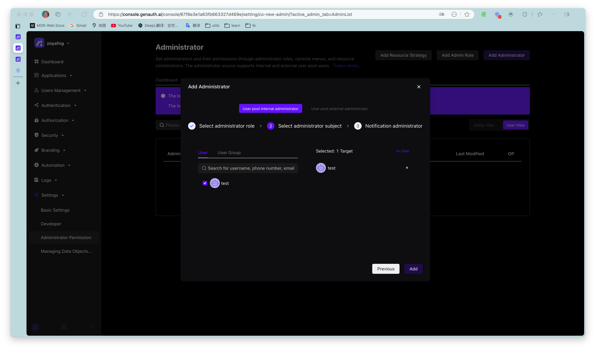
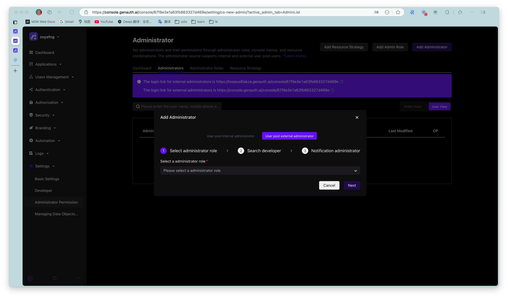

# Administrators

<LastUpdated/>

Path: **Settings->Administrators**

## Administrator sources

There are two sources of administrators: external administrators (including the owner of the user pool and its collaborative administrators) and internal administrators.

All external administrators are concentrated in the {{$localeConfig.brandName}} official user pool as the owners of their respective user pools. An external administrator A can authorize the user pool resources he is responsible for to B, the owner of another user pool in the {{$localeConfig.brandName}} official user pool, to assist A in managing his user pool. The authorized owner B will see the user pool that A is responsible for in the user pool list of the {{$localeConfig.brandName}} official user pool.

External administrator A can also designate a user in his user pool as an internal administrator and assign permissions to him.

## Administrator level

According to the permission level, administrators can be divided into user pool-level administrators and application-level administrators. All internal and external administrators can be either user pool-level administrators or application-level administrators.

::: img-description Administrator list
:::

::: img-description Add internal administrator
:::

::: img-description Invite external administrator
:::

