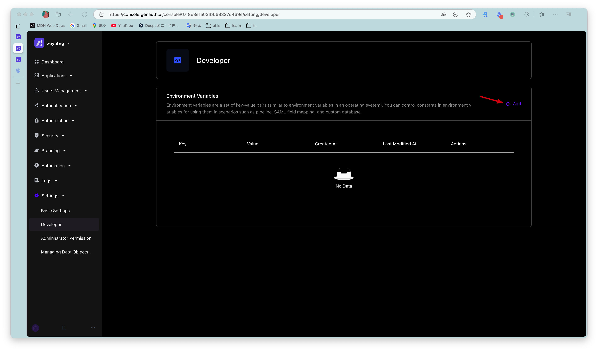

# Developer

<LastUpdated/>

Path: **Settings->Developer**

Developers can configure environment variables. Environment variables are a set of key-value pairs (similar to operating system environment variables). You can manage some constant values ​​in environment variables for use in scenarios such as [Pipeline](/guides/pipeline/README.md), [SAML field mapping](/guides/connections/enterprise/saml/README.md), and [custom data](/guides/user/user-defined-field/README.md).

On the **Developer** page, click the **Add** button to add environment variables.

