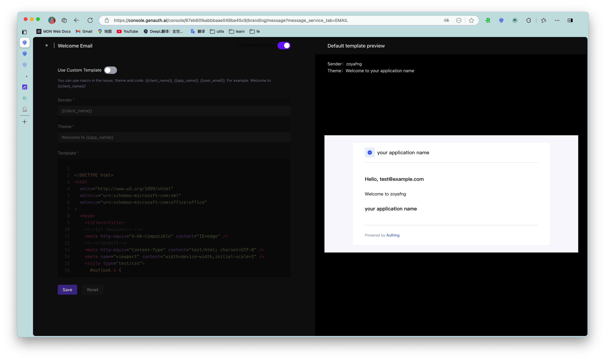

# Configure email service and template

<LastUpdated/>

::: hint-info
For information about the {{$localeConfig.brandName}} user pool version that supports the various benefits of the "Message Settings" function, please check the [Official Website "Pricing" page](https://www.genauth.ai/pricing). If your version does not support this benefit and you want to try it, you can activate the trial period. For an introduction to the trial period and how to activate it, please check [Trial Period](/guides/basics/trial/README.md).
:::

Email is an email sending service provided by GenAuth for users who register using "email". After entering any application, click the button as shown below to enter the email management panel:


## Manage email templates

Six types of email templates can be configured in the email template, namely:

1. **Welcome email** - This email will be sent if the user registers using an email address
2. **Reset password confirmation** - This email will be sent every time the user successfully resets the password.
3. **Verification email** - When the user registers with an email address, a verification email will be sent to the user to verify the email address. The user can complete the verification by clicking the link in the email address.
4. **Modify bound email** - This email will be sent every time the user needs to modify the bound email address and send a verification code.
5. **Reset password** - Every time the user forgets the password, the system will send this password reset email, and a verification code will be attached to the email. The user can reset the password after submitting the verification code and new password.
6. **Change password** - Every time the user requests to change the password, this email will be sent, and a verification code will be attached to the email. The user needs to fill in this verification code to complete the password change.

As shown in the figure below:



### Email macro command

Macros are used to generate some dynamic content, such as:

```html
<div style="padding: 35px;">
  <table
    cellpadding="0"
    align="center"
    style="width: 600px; margin: 0px auto; text-align: left; position: relative; border-top-left-radius: 5px; border-top-right-radius: 5px; border-bottom-right-radius: 5px; border-bottom-left-radius: 5px; font-size: 14px; font-family:微软雅黑, 黑体; line-height: 1.5; box-shadow: rgb(153, 153, 153) 0px 0px 5px; border-collapse: collapse; background-position: initial initial; background-repeat: initial initial;background:#fff;"
  >
    <tbody>
      <tr>
        <th
          valign="middle"
          style="height: 25px; line-height: 25px; padding: 15px 35px; border-bottom-color: rgba(18, 24, 37, 0.87); background-color: #484f60; border-bottom-color: #C46200; background-color: #484f60; border-top-left-radius: 5px; border-top-right-radius: 5px; border-bottom-right-radius: 0px; border-bottom-left-radius: 0px;"
        >
          <font face="微软雅黑" size="5" style="color: rgb(255, 255, 255); "
            >{{app_name}}
          </font>
        </th>
      </tr>
      <tr>
        <td>
          <div style="padding:25px 35px 40px; background-color:#fff;">
            <h2 style="margin: 5px 0px; ">
              <font color="#333333" style="line-height: 20px; "
                ><font style="line-height: 22px; " size="4"
                  >Hi，{{user_email}}</font
                ></font
              >
            </h2>
            <p>Welcome to {{app_name}}</p>
            <p>{{app_description}}</p>
            <p align="right">{{app_name}} 团队</p>
            <p align="right">{{TIME}}</p>
          </div>
        </td>
      </tr>
    </tbody>
  </table>
</div>
```

In this email, <span v-pre>{{app_name}}</span>, <span v-pre>{{app_description}}</span>, <span v-pre>{{TIME}}</span>, <span v-pre>{{user_email}}</span> are all macro commands. After parsing this email in GenAuth, the result will be similar to the following:


All currently supported macro commands are listed in the following table:

| Macro Command                                  | Function                                               |
| :--------------------------------------------- | :----------------------------------------------------- |
| <span v-pre>{{subject_name}}</span>            | Email Subject                                          |
| <span v-pre>{{client_name}}</span>             | Sender                                                 |
| <span v-pre>{{app_name}}</span>                | GenAuth Application Name                               |
| <span v-pre>{{app_description}}</span>         | GenAuth Application Description                        |
| <span v-pre>{{app_logo}}</span>                | GenAuth Application LOGO                               |
| <span v-pre>{{user_email}}</span>              | User Email                                             |
| <span v-pre>{{user_display_name}}</span>       | User Display Name                                      |
| <span v-pre>{{user_name}}</span>               | User name                                              |
| <span v-pre>{{username}}</span>                | User name                                              |
| <span v-pre>{{password}}</span>                | User login password                                    |
| <span v-pre>{{app_domain}}</span>              | Application login address                              |
| <span v-pre>{{invite_link}}</span>             | Invite link address when inviting users                |
| <span v-pre>{{inviter_name}}</span>            | Inviter name when inviting users                       |
| <span v-pre>{{verify_code}}</span>             | Verification code when sending email verification code |
| <span v-pre>{{verify_link}}</span>             | Email verification address                             |
| <span v-pre>{{expires_in}}</span>              | Email verification address validity period             |
| <span v-pre>{{password_effective_time}}</span> | Password effective time                                |
| <span v-pre>{{update_password_link}}</span>    | Password change link address                           |
| <span v-pre>{{email_effective_time}}</span>    | Email effective time                                   |
| <span v-pre>{{login_url}}</span>               | New account login address                              |
| <span v-pre>{{tenant_name}}</span>             | Tenant name                                            |
| <span v-pre>{{tenant_logo}}</span>             | Tenant LOGO                                            |
| <span v-pre>{{tenant_domain}}</span>           | Tenant domain name                                     |
| <span v-pre>{{host_url}}</span>                | Tenant management address                              |
| <span v-pre>{{admin_name}}</span>              | Administrator name                                     |
| <span v-pre>{{userpool_name}}</span>           | User pool name                                         |
| <span v-pre>{{userpool_logo}}</span>           | User pool LOGO                                         |
| <span v-pre>{{ip}}</span>                      | User login IP                                          |
| <span v-pre>{{country}}</span>                 | User login country                                     |
| <span v-pre>{{province}}</span>                | User login province                                    |
| <span v-pre>{{city}}</span>                    | User login city                                        |
| <span v-pre>{{datetime}}</span>                | User login time                                        |
| <span v-pre>{{userPoolName}}</span>            | User pool name                                         |
| <span v-pre>{{workflowName}}</span>            | Workflow name                                          |
| <span v-pre>{{errorTime}}</span>               | Workflow execution error time                          |
| <span v-pre>{{taskName}}</span>                | Workflow task name                                     |
| <span v-pre>{{workflowExecuteLogUrl}}</span>   | Workflow execution log address                         |
| <span v-pre>{{errorReason}}</span>             | Workflow execution failure reason                      |
| <span v-pre>{{workflowInstanceId}}</span>      | Workflow execution ID                                  |
| <span v-pre>{{failedCount}}</span>             | Workflow execution failed error data count             |

## Configure third-party mail service

Our built-in mail sending server uses Alibaba Cloud Enterprise Mailbox. If you want to customize the mail server, you can set it on this page:

<StackSelector snippet="config-email-provider" selectLabel="Select email provider" :order="['mxhichina', 'exmail', 'sendgrid', 'smtp']"/>
