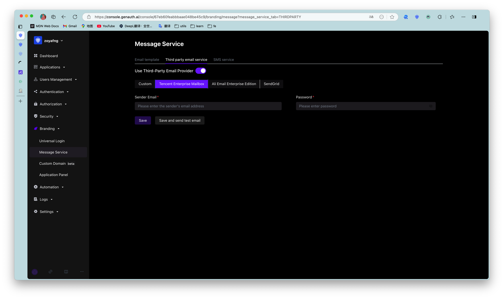
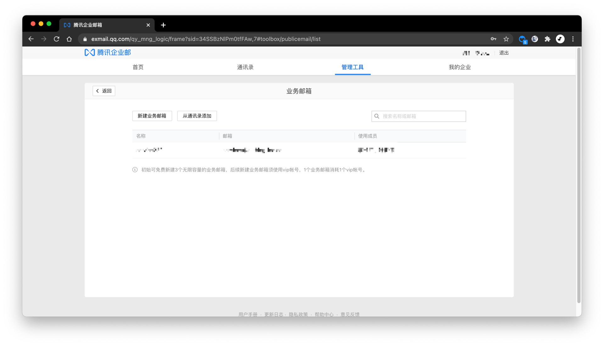

You can configure the [Tencent Enterprise Mailbox](https://exmail.qq.com/) email service in **Settings**-**Message Service** of the console:

You need to configure the business mailbox in **Management Tools** - **Manage Email Account** - **Business Mailbox** of the Tencent Enterprise Mailbox console, as shown below:

You need to fill in the following information:

- Sender's Email: The email address of the Tencent Enterprise Mailbox business mailbox;
- Password: The password of the business mailbox.

