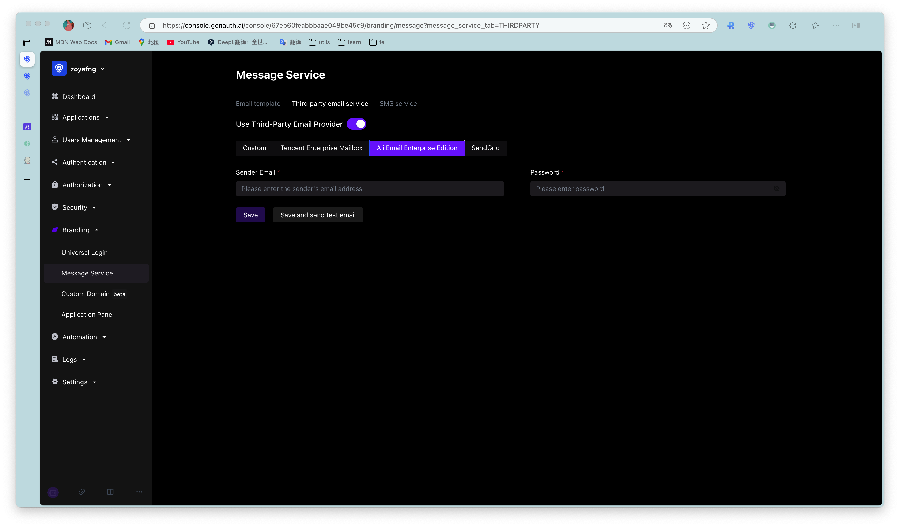

You can configure the [AliMail Enterprise Edition](https://alimail.console.aliyun.com/) email service in the console's **Settings**-**Message Service**:

You need to fill in the following information:

- Sender's email address: The email address of the sender of the Alibaba Cloud Enterprise Email;
- Password: The password of this email address.

