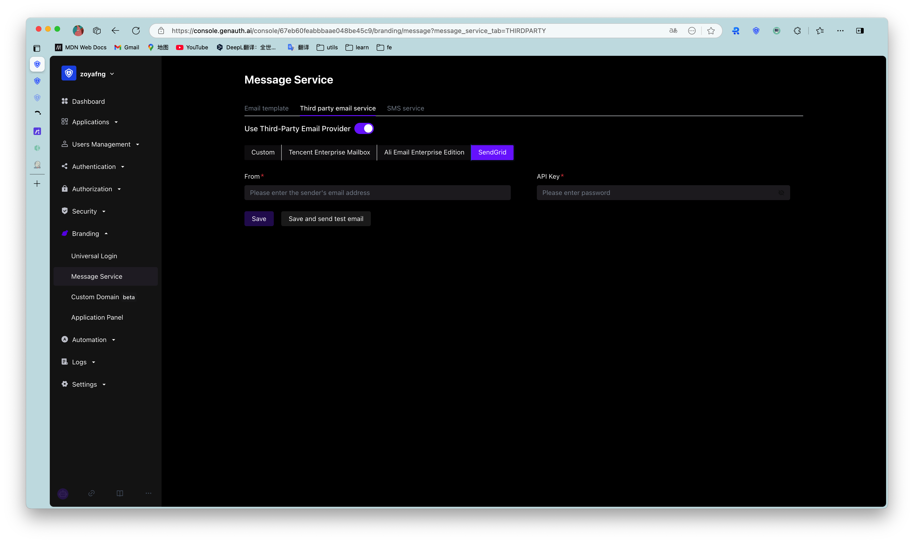

You can configure the [SendGrid email service](https://sendgrid.com/) in **Settings**-**Message Service** in the console:

You need to fill in the following information:

- From: You need to perform [Single Sender Verification](https://sendgrid.com/docs/ui/sending-email/sender-verification/) or [Domain Authentication](https://sendgrid.com/docs/ui/account-and-settings/how-to-set-up-domain-authentication/) verification first;
- API Key: You can create or obtain an API Key in **Settings** - **API Keys** in the [SendGrid console](https://app.sendgrid.com/settings/api_keys).

