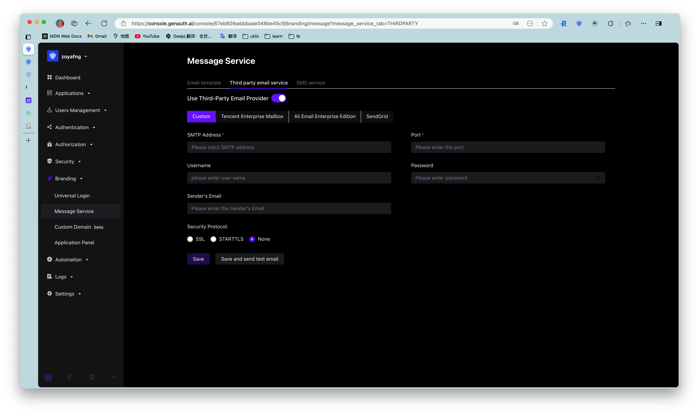

You can configure [SMTP mail service](https://en.wikipedia.org/wiki/Simple_Mail_Transfer_Protocol) in **Settings**-**Message Service** of the console:

You need to fill in the following information:

- SMTP address: SMTP server address, please contact your mail server administrator to obtain it;
- Port: SMTP server port, please contact your mail server administrator to obtain it;
- Security verification: Choose whether to enable SSL;
- Username: SMTP sender email address;
- Password: SMTP sender email password;

