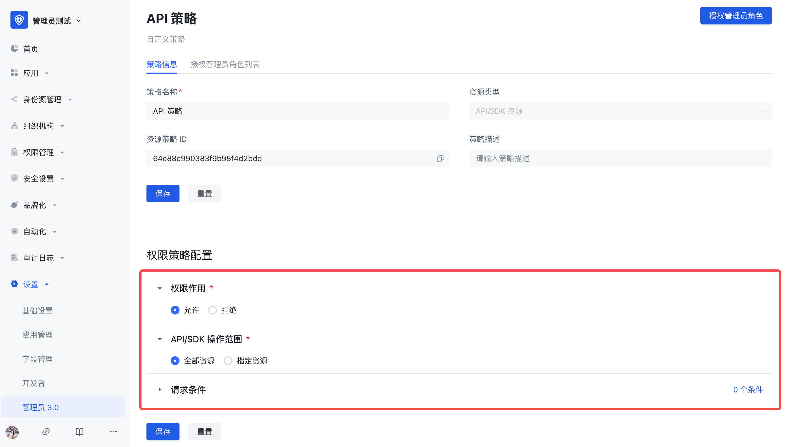

# Administrator Permissions Documentation

​ GenAuth's new version of administrator permissions can provide administrators with flexible and more granular permission management capabilities, supporting out-of-the-box administrator roles and policies.

## Concept Explanation

| Concept | Explanation |
| ---------- | :-------------------------------------------------------------------------------------------------------------------------------------------------------------------------------------------------------------------------------------------------------------------------------------------------------------------------------------------------------------------------------------------------------------------------------------------------------------------------------------------------------------------------------------------------------------------------------------------------------------------------------------------------------------------------------------------------------------------------------------------------------------------------------------------------------------------------------------------------------------------------------------------------------------------------------------------------------------------------------------------------------------------------------------------------------------------------------------------------------------------------------- |
| Administrator | Administrator: is a general term for a class of subjects with administrator roles.  After users and user groups are granted administrator roles as subjects, they become administrators in the user pool, so this class of subjects is collectively referred to as administrators. |
| Administrator role | Administrator role: The administrator role is a bridge connecting users and resources. By associating resources with administrator roles and then granting administrator roles to subjects such as users and organizational departments, role-based permission management can be achieved. Enterprises can assign permissions based on administrator roles, which helps administrators perform their duties and greatly reduces the cost of permission management and enterprise management.  1. System administrator role GenAuth has three built-in system administrator roles, namely: **super administrator** (usually refers to the creator of the user pool, the only subject), **application administrator**, and system organization administrator.  - Super administrators have all permissions in the GenAuth console, while other system administrator roles have partial permissions.  - Super administrators can create **custom administrator roles**, such as "Organizational Structure Administrator", "Audit Log Administrator", etc. Administrators in the same role have the same permissions.  - The super administrator role is preset by the system. You do not need to create it yourself. You can directly add members as super administrators.   2. Custom Administrator Roles Super administrators can create custom administrator roles, grant partial management backend permissions to each role, and add administrator subjects to each role. |
| Internal Administrator | Users in the current user pool who are granted the administrator role become internal administrators. |
| External Administrator | Users who have registered GenAuth and are not in the current user pool become external administrators after being granted the administrator role. |
| Resource Strategy | Console menu resources or API/SDK resources are packaged and combined with certain conditions to become resource strategies. |

## Typical usage scenarios

### Scenario 1

Super administrators can allocate resources and permissions based on user roles or functions to ensure that only authorized personnel have permission to operate, so that administrators can perform their duties and maintain different resources.

1. Organizational structure administrators have the authority to manage users and organizational structures in the user pool. Through the organizational structure administrator role, permission management capabilities such as creating new organizations, editing department information, and deleting departments can be implemented to achieve organizational structure adjustment, department setting and management; permission management capabilities such as setting member entry, user affiliation, and removing users can be implemented.
2. Application administrators have the authority to manage applications and application access control in the user pool. Application administrators can control user access levels and functions to ensure that only authorized personnel can access the system.
3. Security-related administrators can set password security policies, login and registration security rules, application access control measures, etc. to protect the system from malicious attacks and unauthorized access. Administrator accounts can monitor and detect potential security threats and take necessary measures to deal with and respond to emergencies.

### Scenario 2

In addition to the menu module permission management that can be implemented in scenario 1, more fine-grained decentralized management can also be performed on specific data resource scopes.

1. Super administrators can assign different organizational departments to organizational administrators to implement a one-department-one-administrator management model.
2. Super administrators can assign different applications to application administrators to implement a one-application-one-administrator management model.

### Scenario 3

The new version of the administrator is not only limited to the permission allocation and management of the super administrator, but also supports collaborative administrators to continue to authorize their own permissions, achieving a layer-by-layer authorization effect, and realizing flexible and rigorous permission management capabilities. The user journey is shown in the figure:

## Super Administrator Configuration Process

### Step 1: Select/Create a Suitable Administrator Role

1. Differentiate Scenarios

​ Scenario 1:

​ If the system administrator role can meet the requirements, jump to step 4.

​ Scenario 2:

​ If the system role cannot meet the requirements, you need to create a custom administrator role.

2. Create a custom administrator role

3. Edit the custom administrator role

Next, you can add a subject and associated policies to the custom administrator role.

### Step 2: Create a resource policy

1. Differentiate Scenarios

Scenario 1:

If the system built-in policy can meet the requirements, or a policy has been created before, then you need to associate the existing policy with the administrator role and jump to step 3.

Scenario 2:

If the system built-in policy cannot meet the requirements, or if no policy has been created before, proceed to the next step.

2. Create a policy

   

When creating a policy, you must fill in the resource policy name and resource type.

Resource type: console menu resource or API/SDK resource. You can select the appropriate resource type according to the actual administrator permission management requirement scenario. Different resource types reflect different resource permission management methods.

   

3. Edit the policy

On the policy details page, the policy configuration pages corresponding to different resource types are also different.

3.1 Resource type is **Console menu**

​ There are six configuration items in the permission policy configuration:

- Permission effect
- Menu
- Operations on resource tables
- Resource scope
- Operations on resource scope
- Request conditions

  3.2 Resource type is **API/SDK**

​ There are also five configuration items in the permission policy configuration: permission effect, API/SDK operation scope, request conditions, and the configuration process is consistent with the menu type policy.

### Step 3: Authorize the policy to the administrator role

​ There are two ways to authorize the policy to the administrator role, see below for details:

1. Click [Authorize Administrator Role] in the policy details page

   

​ Supports multiple selection of administrator roles. In the policy details page-authorized administrator role list, you can view, edit, and remove the administrator roles authorized by the policy.

2. In the administrator role details page, add a resource policy

   

   

​ Supports multiple selection of policies. In the administrator role details page-associated policy list, you can view, edit, and remove associated policies.

### Step 4: Assign roles to users and other subjects

​ There are two ways to assign roles to administrator subjects, see below for details:

1. Add administrators through the public button in the upper right corner of the administrator, and send notifications to users with contact information. 

   

   

   

2. In the administrator role details page, click Add Subject, which supports batch addition of multiple selected users or user groups. 

   

## Collaboration Administrator User Journey

1. Receive notification of being added as a collaboration administrator;
2. Log in to the user pool console and enter the authorized menu for configuration and management;
3. If the co-administrator is authorized to the administrator authority menu, the collaboration administrator can continue to further assign the authority he has to other collaboration administrators. 
