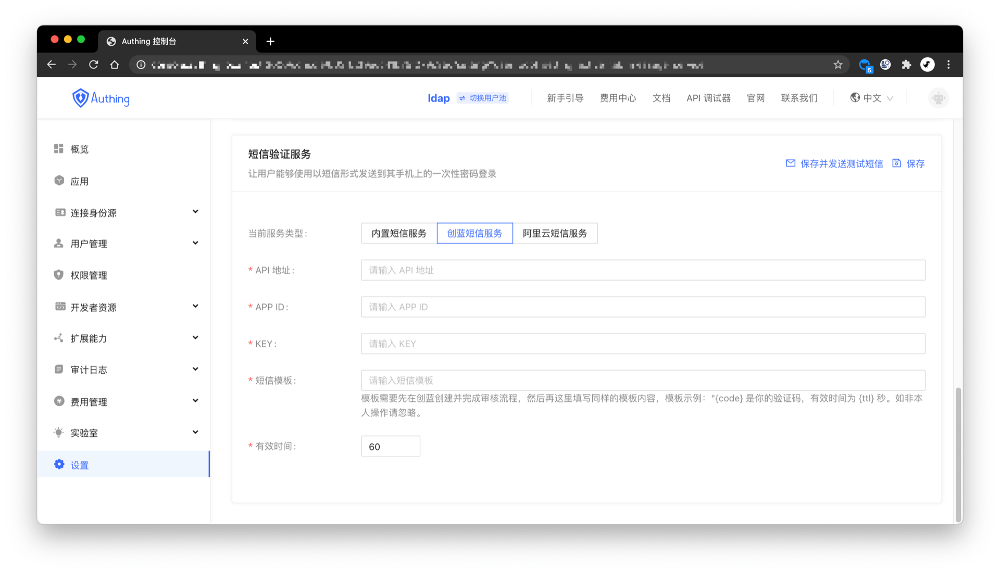

You can configure [Chuanglan 253 SMS Service](https://253.com) in **Settings->Message Service** of the console:

> For the official documentation of Chuanglan SMS Service, please see [Chuanglan SMS Service: Domestic SMS - Same Content Group Sending Interface](https://zz.253.com/api_doc/guo-nei-duan-xin/dan-fa-qun-fa-jie-kou.html).

- **API Address**: API address of Chuanglan 253 SMS Service, in the format of "http://xxx/msg/send/json", you need to log in to the Chuanglan console to obtain the full domain name.
- **APP ID**: API interface information account, which needs to be obtained in the management background.
- **KEY**: API interface information password, which needs to be obtained in the management background.
- **SMS Template**: The template needs to be created and the review process needs to be completed in Chuanglan, and then the same template content can be filled in here. Template example: "{code} is your verification code, valid for {ttl} seconds. Please ignore if it is not your own operation".
- **Validity time**: The validity period of the SMS verification code will replace the `ttl` in the SMS template.

After configuration, you can click **Save and send test SMS** in the upper left corner to test.